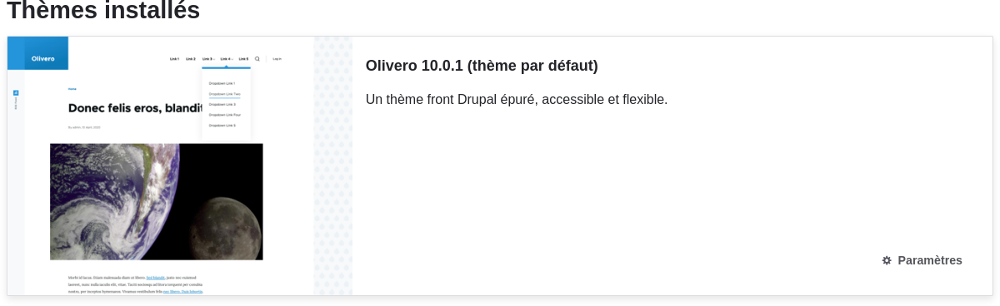
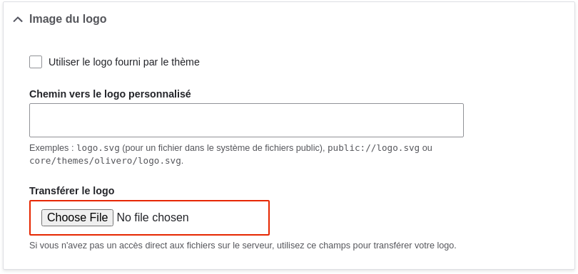
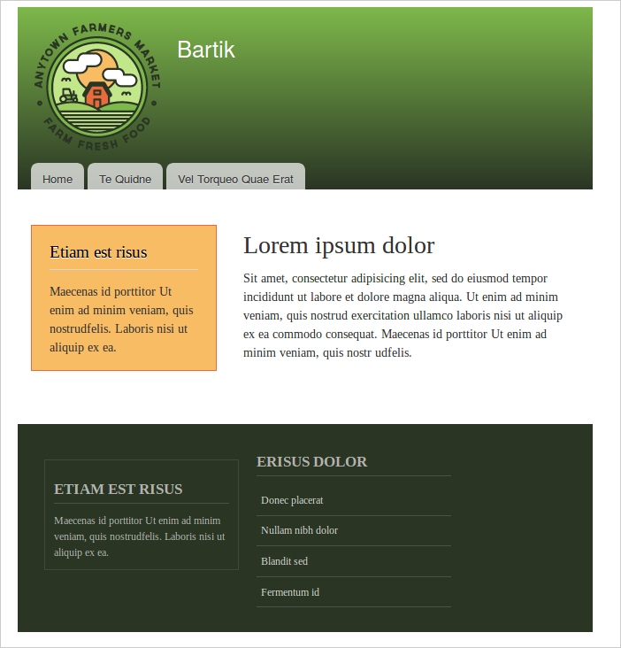
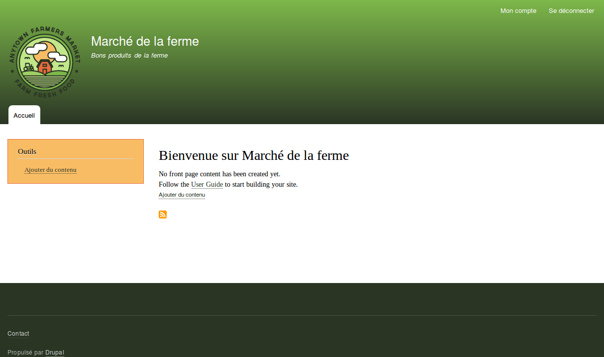

[[config-theme]]

=== Configurer le thème

[role="summary"]
Comment modifier les paramètres du thème pour mettre à jour le schéma de
couleurs et ajouter un logo.

(((Thème,configurer)))
(((Thème Olivero,configurer)))
(((Color scheme,configurer)))
(((Image du logo,configurer)))

==== Objectif

Modifier les paramètres du thème du cœur par défaut Olivero pour changer le
schéma de couleurs et ajouter un logo.

==== Prérequis

<<understanding-themes>>

//==== Prérequis du site

==== Étapes

. Dans le menu d'administration _Gérer_, naviguer dans _Apparence_
(_admin/appearance_).

. Sous _Thèmes installés_, vous trouverez Olivero listé comme votre thème
par défaut. Sous _Olivero (thème par défaut)_, cliquer sur _Paramètres_.
+
--
// Olivero section of admin/appearance.

--

. Sous _Image du logo_, décocher _Utiliser le logo fourni par le thème_.
+
--
// Logo upload section of admin/appearance/settings/olivero.

--

. Sous _Envoyer le logo_, trouver un fichier de logo et le télécharger sur votre
site. Note : Vous pouvez aussi définir un logo universel pour tous les thèmes
dans _Apparence_ > _Paramètres_ (_admin/appearance/settings_). Un logo
personnalisé pour votre thème surchargera le logo universel.
+
Une fois sélectionné le fichier que vous voudriez transférer, vous verrez le nom
du fichier à côté du bouton _Choisir un fichier_ ou _Naviguer_ de votre
navigateur.

. Sous _Utilitaires d'Olivero_, vous pouvez choisir d'utiliser une palette de
couleurs différente pour ce thème. Vous avez le choix entre une liste de
palettes de couleurs existantes, ou saisir une couleur et laisser le logiciel
générer une nouvelle palette se basant sur cette couleur.

Vous pouvez par exemple utiliser la couleur personnalisée suivante :
+
[width="100%",frame="topbot",options="header"]
|================================
|Champ | Couleur
|Couleur de base| #7db84a (vert)
|================================
+
Note : vous pouvez aussi sélectionner une couleur de votre choix en cliquant sur
l'espace de couleurs sur la droite. Les codes de couleurs hexadécimaux seront
ajoutés pour vous.

. Afin d'enregistrer vos changements et voir les couleurs mises à jour et le
logo sur votre site, cliquer sur _Enregistrer la configuration_ en bas de page.
+
Note : Sous _Schéma de couleurs_, il y a une section _Aperçu_ qui montre un
exemple de ce à quoi votre site ressemblera avec les nouveaux paramètres.
+
--
// Preview section of admin/appearance/settings/Olivero.

--

. Cliquer sur _Retour au site_ dans la barre d'outils pour vérifier que vous avez
mis à jour les paramètres du thème du cœur Olivero pour votre site.
+
--
// Home page after theme settings are finished.

--

==== Améliorer votre compréhension

* <<extend-theme-find>>

* <<extend-theme-install>>

* Si vous ne voyez pas les effets des modifications sur votre site, vous
pourriez devoir vider les caches. Voir <<prevent-cache-clear>>.

//==== Concepts liés

==== Vidéos (en anglais)

// Video from Drupalize.Me.
video::https://www.youtube-nocookie.com/embed/CEi3i1YGOs0[title="Configuring the Theme"]

//==== Pour aller plus loin

*Attributions*

Écrit et modifié par https://www.drupal.org/u/AnnGreazel[Ann Greazel],
https://www.drupal.org/u/mndonx[Amanda Luker] de
https://www.advomatic.com/[Advomatic],
https://www.drupal.org/u/jerseycheese[Jack Haas] et
https://www.drupal.org/u/eojthebrave[Joe Shindelar] de
https://drupalize.me[Drupalize.Me].
Traduit par https://www.drupal.org/u/vanessakovalsky[Vanessa Kovalsky] et
https://www.drupal.org/u/fmb[Felip Manyer i Ballester].
