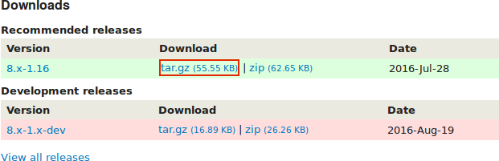
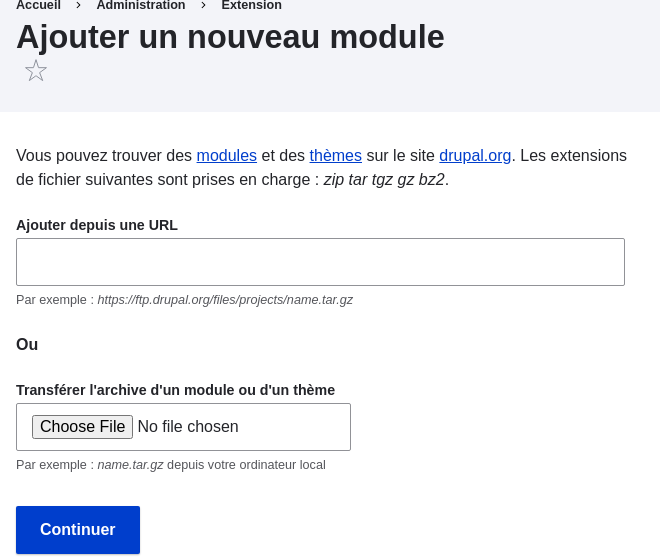

[[extend-module-install]]

=== Télécharger et installer un module depuis _Drupal.org_

[role="summary"]
Comment télécharger et installer un module depuis Drupal.org.

(((Module,télécharger)))
(((Module,installer)))
(((Module,activé)))
(((Module,contribué)))
(((Module,personnalisé)))
(((Télécharger,module)))
(((Installer,module)))
(((Activer,module)))
(((Module contribué,télécharger)))
(((Module contribué,installer)))
(((Fonctionnalité,étendre)))
(((Outil Drush,utiliser pour installer un module)))
(((Module Admin Toolbar,télécharger)))
(((Module Admin Toolbar,installer)))
(((Module,Admin Toolbar)))
(((Site web Drupal.org,télécharger et installer un module depuis)))

==== Objectif

Télécharger et installer le
https://www.drupal.org/project/admin_toolbar[module contribué Admin Toolbar],
qui permet de naviguer facilement dans le menu d'administration du site web.

==== Prérequis

* <<understanding-modules>>
* <<extend-module-find>>
* <<install-tools>>

==== Prérequis du site

Composer doit être installé pour télécharger des modules. Si vous voulez
utiliser Drush, procéder tout d'abord à son installation. Consulter
<<install-tools>>.

==== Étapes

Pour installer un module contribué, commencer par le télécharger avec Composer.
Ensuite, l'installer en utilisant soit l'interface d'administration, soit Drush.
Si vous installez un module personnalisé plutôt qu'un module contribué, qui n'est
pas disponible via Composer, passer ces étapes concernant le téléchargement du
module, et se référer à <<extend-manual-install>>. Revenir alors ici et suivre
les étapes pour installer le module, en utilisant soit l'interface
d'administration, soit Drush.

===== Télécharger le module contribué avec Composer

. Sur la page du projet _Admin toolbar_ sur drupal .org
(_https://www.drupal.org/project/admin_toolbar_), dérouler la page jusqu'à la
section _Releases_ (versions) en bas de page.

. Copier la commande Composer fournie correspondant à la version du module que
vous souhaitez installer.
+
--
// Releases section of the Admin Toolbar project page on Drupal.org.

--

. Vous pouvez autrement taper la commande suivante (en remplaçant le nom
machine du module et la version souhaitée) :
+
----
composer require 'drupal/admin_toolbar:^3.5'
----

. En ligne de commande, se placer dans le répertoire racine du projet. Coller la
commande Composer et l'exécuter.

. Vous devriez voir un message indiquant que le module a été téléchargé avec
succès.

===== Installer le module depuis l'interface d'administration

. Dans le menu d'administration _Gérér_, naviguer vers _Extension_
(_admin/modules_). La page _Extension_ apparaît.

. Localiser le module _Admin toolbar_ et le cocher.
+
--
// Extend page showing Admin Toolbar module checked.

--

. Cliquer sur _Installer_ pour activer le nouveau module.

===== Installer le module en utilisant Drush

. Exécuter la commande Drush suivante, en donnant le nom du projet en paramètre (par exemple,
`admin_toobar`) :
+
----
drush pm:enable admin_toolbar
----

. Suivre les instructions à l'écran.

==== Pour approfondir

* Vérifier que le
https://www.drupal.org/project/admin_toolbar[module contribué Admin Toolbar]
fonctionne en naviguant dans le menu dans la section d'administration.

* Installer et configurer le
https://www.drupal.org/project/pathauto[module contribué Pathauto] pour que les
pages de contenu de votre site aient des URL agréables par défaut. Consulter
<<content-paths>> pour en savoir plus sur les URL.

* Si vous ne voyez pas d'effet de ces modifications sur votre site, il pourrait
être nécessaire de vider le cache. Consulter <<prevent-cache-clear>>.

//==== Related concepts

==== Vidéos (en anglais)

// Video from Drupalize.Me.
video::https://www.youtube-nocookie.com/embed/vx9nWJE1Kbk[title="Downloading and Installing a Module from Drupal.org"]

==== Pour aller plus loin (en anglais)

* https://www.drupal.org/docs/extending-drupal/installing-drupal-modules[Page de documentation de la communauté sur _Drupal.org_ "Installing Drupal modules"]
* https://www.drupal.org/download[Page "Download and Extend" sur _Drupal.org_]
* https://www.drupal.org/project/admin_toolbar[Module Admin Toolbar sur _Drupal.org_]

*Attributions*

Écrit et modifié par https://www.drupal.org/u/batigolix[Boris Doesborg],
https://www.drupal.org/u/eojthebrave[Joe Shindelar] de
https://drupalize.me[Drupalize.Me], et
https://www.drupal.org/u/jhodgdon[Jennifer Hodgdon]. Traduit par
https://www.drupal.org/u/fmb[Felip Manyer i Ballester].
