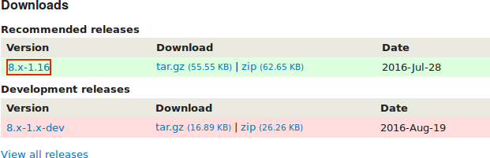
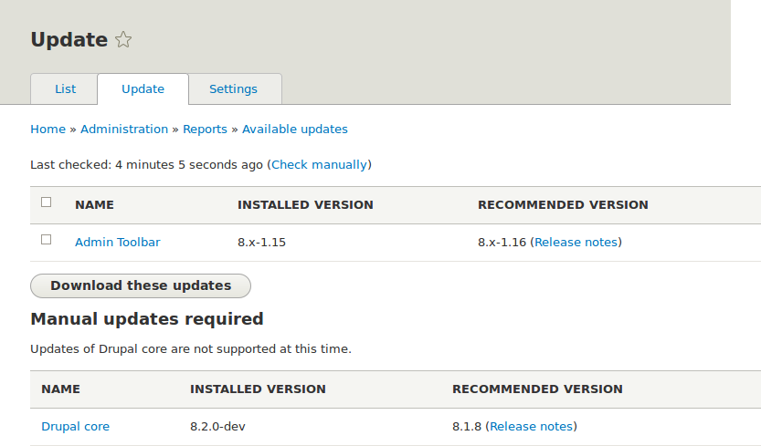

[[security-update-module]]

=== Mettre à jour un module

[role="summary"]
Comment mettre à jour un module contribué via Composer, l’interface
d’administration et le script de mise à jour de la base de données.

(((Module,mise à jour)))
(((Mise à jour de sécurité,application)))
(((Module contribué,mise à jour)))

==== Objectif

Mettre à jour un module contribué et lancer le script de _Mise à jour de la base
de données_.

==== Prérequis

* <<security-concept>>
* <<security-cron-concept>>

==== Prérequis du site

* Un module contribué a été installé et une mise à jour est disponible pour lui.
Consulter <<extend-module-install>> et <<security-announce>>.

* Si votre site est en ligne, vous devriez tester ce processus dans un
environnement de développement avant de l'exécuter sur votre site en production.
Consulter <<install-dev-making>>.

* Vous avez créé une sauvegarde complète du site. Consulter <<prevent-backups>>.

* Si vous souhaitez utiliser l'interface utilisateur pour vérifier la présence
de mises à jour, le module Update Manager du cœur doit être installé. Voir
<<config-install>> pour des instructions sur l'installation de modules du cœur.

==== Étapes

Avant de commencer, vérifier les instructions de mise à jour propres au module.
Lisez et assurez-vous de comprendre tous les prérequis propres au module avant
de procéder aux mises à jour. Pour trouver des instructions, consulter le lien
_Lire la documentation_ de la page du projet du module.

Pour consulter des instructions supplémentaires, après avoir téléchargé les
fichiers mis à jour, consulter les fichiers _README.txt_, _INSTALL.txt_ et
_UPGRADE.txt_ fournis avec les fichiers d'installation du module. Consulter
également les notes de version sur la page du projet en cliquant sur le numéro
de la version que vous téléchargez.

// Downloads section of the Admin Toolbar project page on drupal.org.

Mettre à jour un module suppose de mettre d'abord le site en mode de
maintenance, d'obtenir les nouveaux fichiers de code, d'appliquer les mises à
jour de la base requises, et enfin de sortir le site du mode de maintenance.

Vous pouvez mettre le code d'un module contribué à jour en utilisant Composer.
Si vous utilisez un module personnalisé plutôt qu'un module contribué, récupérer
les nouveaux fichiers du module, puis poursuivre les instructions relatives aux
mises à jour de la base par l'interface d'administration ci-dessous.

Cela suppose que vous utilisez Composer pour gérer les fichiers de votre site ;
consulter <<install-composer>>.

===== Mettre à jour un module contribué avec Composer.

. Mettre votre site en mode de maintenance. Consulter <<extend-maintenance>>.

. Dans le menu d'administration _Gérer_, naviguer vers _Rapports_ > _Mises à
jour disponibles_ > _Mettre à jour_ (_admin/reports/updates/updates_).

. Rechercher et vérifier le module dans la liste. Cliquer sur _Télécharger ces
mises à jour_ après avoir sélectionné le module.
+
--
// Update page for theme (admin/reports/updates/update).

--

. Déterminer le nom machine du projet que vous voulez mettre à jour. Pour les
modules contribués et les thèmes, il s'agit de la dernière partie de l'URL de la
page du projet ; par exemple, pour le module Geofield, à l'adresse
https://www.drupal.org/project/geofield, le nom machine est +geofield+.

. Si vous voulez mettre à jour vers la dernière version stable, utiliser la
commande suivante, en remplaçant le nom machine du projet à mettre à jour :
+
----
composer update drupal/geofield --with-dependencies
----
+
Pour apprendre comment télécharger une version spécifique, consulter
<<install-composer>>.

. Après avoir obtenu les nouveaux fichiers du module, ouvrir la page des mises à
jour de la base en tapant l'URL _example.com/update.php_ dans votre navigateur.

. Cliquer sur _Continuer_ pour lancer les mises à jour. Les scripts de mise à
jour de la base seront lancés.

. Cliquer sur _Pages d'administration_ pour retourner à la section d'administration de votre site.

. Sortir votre site du mode de maintenance. Consulter <<extend-maintenance>>.

. Vider le cache (se référer à <<prevent-cache-clear>>).

==== Améliorer votre compréhension

* Une fois les mises à jour terminées, consulter le journal du site (se référer
à <<prevent-log>>) pour vérifier s'il y a des erreurs.

* <<security-update-theme>>

//==== Related concepts

==== Vidéos (en anglais)

// Video from Drupalize.Me.
video::https://www.youtube-nocookie.com/embed/ZYFJ_OJaK4M[title="Updating a Module"]

// ==== Pour aller plus loin (en anglais)

*Attributions*

Adapté par https://www.drupal.org/u/batigolix[Boris Doesborgh],
https://www.drupal.org/u/hey_germano[Sarah German] de
https://www.advomatic.com[Advomatic] et https://www.drupal.org/u/eojthebrave[Joe
Shindelar] de https://drupalize.me[Drupalize.Me] à partir de
https://www.drupal.org/docs/7/update/updating-modules["Update modules"],
copyright 2000-copyright_upper_year contributeurs individuels à la
https://www.drupal.org/documentation[documentation de la communauté Drupal].
Traduit par https://www.drupal.org/u/ohmdesbois[Thierry Jarrige],
https://www.drupal.org/u/duaelfr[Édouard Cunibil],
https://www.drupal.org/u/pomliane[Francis Pomliane] et
https://www.drupal.org/u/fmb[Felip Manyer i Ballester].
