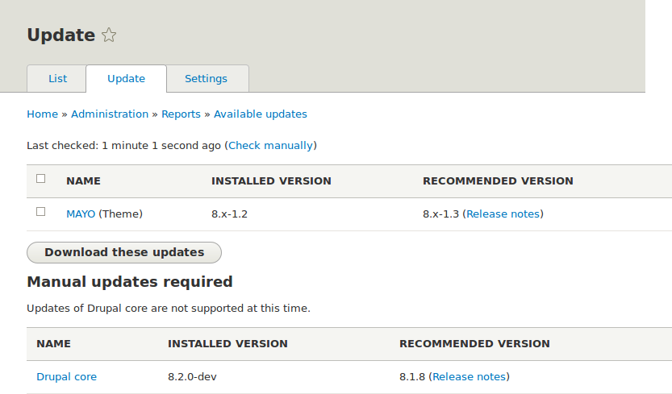

[[security-update-theme]]

=== Mettre un thème à jour

[role="summary"]
Comment mettre à jour un thème contribué en utilisant Composer et l'interface
d'administration et en exécutant le script de mises à jour de la base.

(((Thème,mettre à jour)))
(((Mise à jour de sécurité,appliquer)))
(((Thème contribué,mettre à jour)))

==== Objectif

Mettre à jour un thème contribué sur votre site et lancer le script _Mises à
jour de la base de données_.

==== Prérequis

* <<security-concept>>
* <<security-cron-concept>>

==== Prérequis du site

* Un thème contribué a été installé et dispose d'une mise à jour. Consulter
<<extend-theme-install>> et <<security-announce>>.

* Si votre site est en production, vous devriez tester ce processus dans un
environnement de développement avant de l'exécuter sur votre site de production.
Consulter <<install-dev-making>>.

* Vous avez réalisé une sauvegarde complète de votre site. Consulter
<<prevent-backups>>.

* Si vous voulez utiliser l'interface utilisateur pour vérifier la présence de
mises à jour, le module du cœur Update Manager doit être installée. Consulter
<<config-install>> pour des instructions sur l'installation de modules du cœur.

==== Étapes
Mettre à jour un thème contribué suppose de mettre d'abord le site en mode de
maintenance, d'obtenir les nouveaux fichiers de code, d'appliquer les mises à
jour de la base requises, et enfin de sortir le site du mode de maintenance.

Vous pouvez mettre le code d'un thème contribué à jour en utilisant Composer.
Si vous utilisez un thème personnalisé plutôt qu'un thème contribué, récupérer
les nouveaux fichiers du thème, puis poursuivre les instructions relatives aux
mises à jour de la base par l'interface d'administration ci-dessous.

Cela suppose que vous utilisez Composer pour gérer les fichiers de votre site ;
consulter <<install-composer>>.

===== Mettre un thème contribué à jour avec Composer

. Mettre votre site en mode maintenance. Consulter <<extend-maintenance>>.

. Dans le menu d'administration _Gérer_, naviguer vers _Rapports_ > _Mises à
jour disponibles_ > _Mettre à jour_ (_admin/reports/updates/update_).

. Trouver les thèmes dans la liste qui nécessitent une mise à jour.
+
--
// Update page for theme (admin/reports/updates/update).

--

. Déterminer le nom machine du projet que vous voulez mettre à jour. Pour les
modules contribués et les thèmes, il s'agit de la dernière partie de l'URL de la
page du projet ; par exemple, pour le thème Honey, à l'adresse
https://www.drupal.org/project/honey, le nom machine est +honey+.

. Si vous voulez mettre à jour vers la dernière version stable, utiliser la
commande suivante, en remplaçant le nom machine du projet à mettre à jour :
+
----
composer update drupal/geofield --with-dependencies
----
+
Pour apprendre comment télécharger une version spécifique, consulter
<<install-composer>>.

. Après avoir obtenu les nouveaux fichiers du thème, ouvrir la page des mises à
jour de la base en tapant l'URL _example.com/update.php_ dans votre navigateur.

. Cliquer sur _Continuer_ pour lancer les mises à jour. Les scripts de mise à
jour de la base seront lancés.

. Cliquer sur _Pages d'administration_ pour retourner à la section d'administration de votre site.

. Sortir votre site du mode de maintenance. Consulter <<extend-maintenance>>.

. Vider le cache (se référer à <<prevent-cache-clear>>).

==== Pour approfondir

* Examiner le journal du site (consulter <<prevent-log>>) une fois les mises
à jour achevées, pour voir s'il y a eu des erreurs.

* <<security-update-module>>

// ==== Related concepts

==== Vidéos (en anglais)

// Video from Drupalize.Me.
video::https://www.youtube-nocookie.com/embed/elVnWoaQMkk[title="Updating a Theme"]

// ==== Additional resources

*Attributions*

Écrit par https://www.drupal.org/u/batigolix[Boris Doesborg] et
https://www.drupal.org/u/eojthebrave[Joe Shindelar] de
https://drupalize.me[Drupalize.Me]. Traduit par
https://www.drupal.org/u/fmb[Felip Manyer i Ballester].
