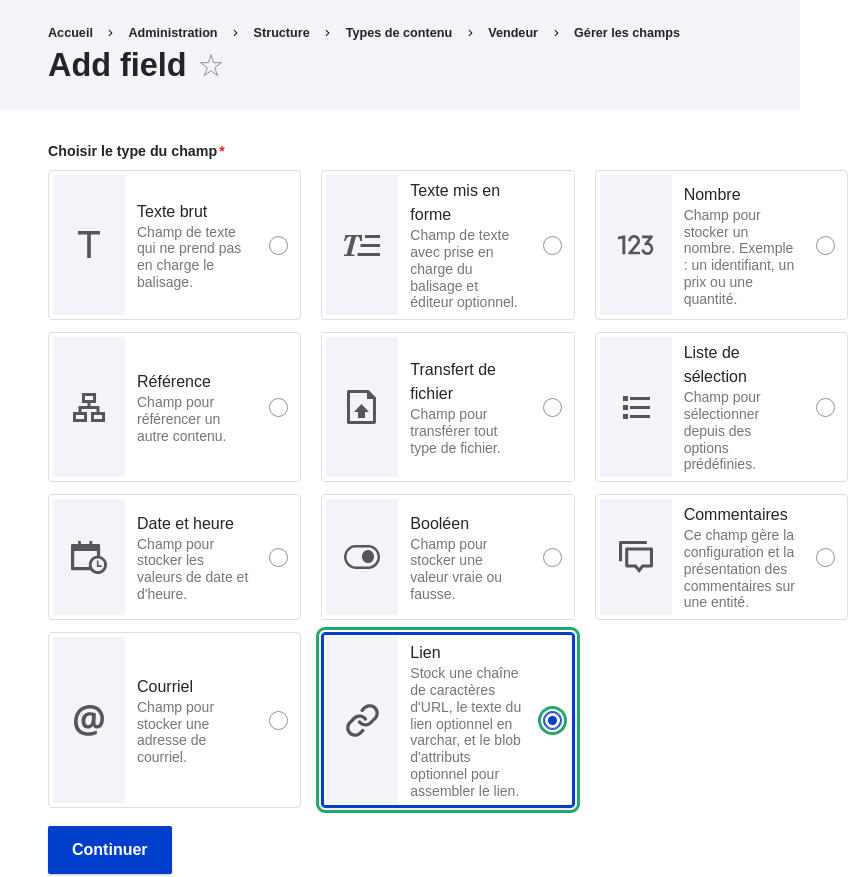
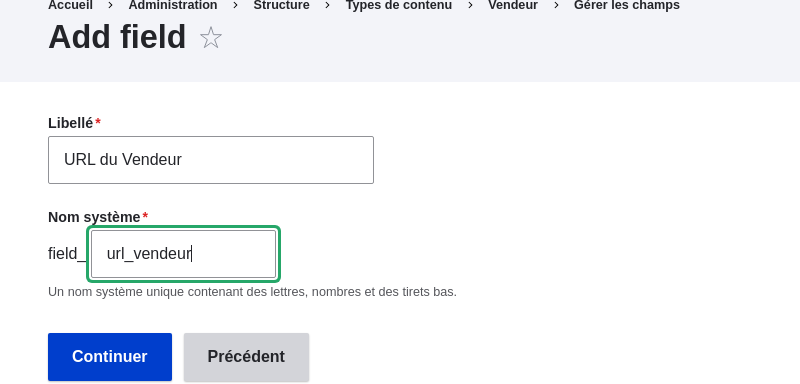
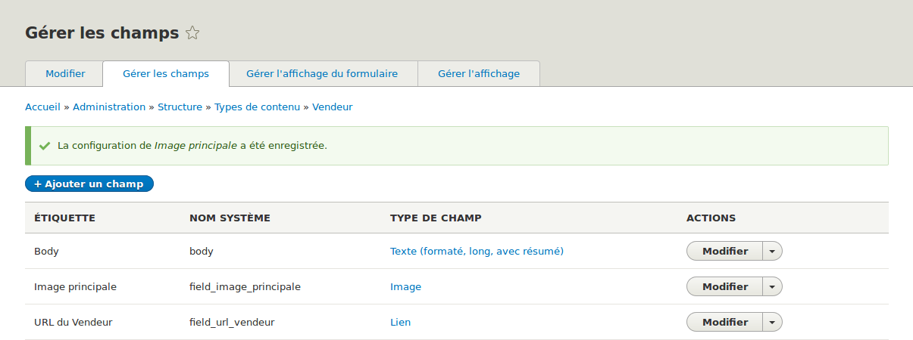
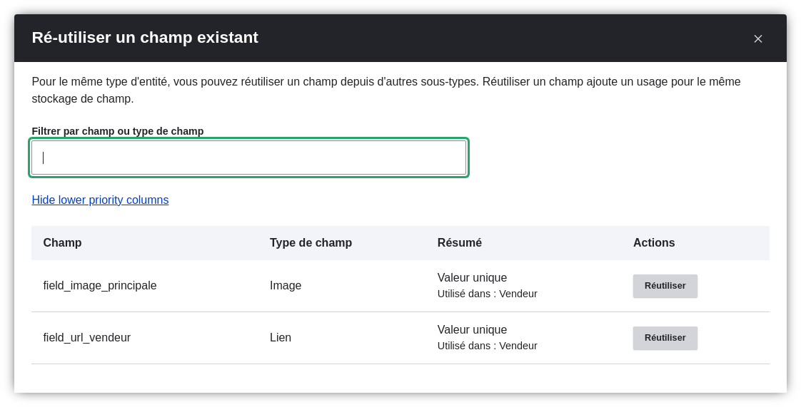

[[structure-fields]]

=== Ajouter des champs de base à un type de contenu

[role="summary"]
Comment ajouter des champs à un type de contenu.

(((Type de contenu,y ajouter un champ)))
(((Champ,ajouter à un type de contenu)))
(((Champ image,ajouter)))
(((Champ URL,ajouter)))

==== Objectif

Ajouter un champ lien et un champ image au type de contenu Vendeur.

==== Prérequis

<<planning-data-types>>

==== Prérequis du site

Le type de contenu Vendeur doit exister. Consulter <<structure-content-type>>.

==== Étapes

Ajouter les champs URL du vendeur et image principale au type de contenu Vendeur.

. Dans le menu d'administration _Gérer_, aller dans _Structure_ > _Types de
contenu_ (_admin/structure/types_). Puis cliquer sur _Gérer les champs_ dans la
liste déroulante du type de contenu Vendeur. La page _Gérer les champs_
apparaît. De là, vous pouvez soit créer un nouveau champ pour le type de
contenu, soit réutiliser un champ existant. Noter que les noms et descriptions
des types de contenu et champs fournis par votre profil d'installation sont
affichés en anglais sur ces pages ; consulter <<language-concept>> pour une
explication.

. Cliquer sur _Ajouter champ_. La page _Ajouter un champ_ apparaît.
+
--
// Initial page for admin/structure/types/manage/vendor/fields/add-field.

--

. Choisir le type de champ _Lien_ dans les options _Choisir un type de champ_.
Cliquer sur _Continuer_. La page _Ajouter un champ apparaît. Elle contient un
champ permettant de configurer l'étiquette du champ.

. Remplir les champs commme indiqué ci-dessous.
+
[width="100%",frame="topbot",options="header"]
|================================
| Nom du champ | Explication | Valeur
| Étiquette | Étiquette visible sur les pages d'administration | URL du vendeur
| Choisir un type de champ | Type de champ | Lien
|================================
+
Un nom système est automatiquement généré, basé sur la valeur de l'_Étiquette_.
Cliquer sur _Modifier_ si vous souhaitez surcharger la valeur par défaut.
+
--
// Second page for admin/structure/types/manage/vendor/fields/add-field.

--

. Cliquer sur _Continuer_. La page URL du vendeur apparaît, qui
vous permet de configurer le champ. Remplir les champs comme
indiqué ci-dessous.
+
[width="100%",frame="topbot",options="header"]
|================================
| Nom du champ | Explication | Valeur
| Étiquette  | Étiquette visible dans le formulaire de contenu | URL du vendeur
| Nombre de valeurs autorisé | Le nombre de valeurs qui peuvent être saisies | Limité, 1
| Texte d'aide | L'instruction affichée sous le champ | (laisser vide)
| Champ requis | Si le champ est requis ou non | Décoché
| Type de lien autorisé | Le type de liens qui peuvent être saisis | Liens externes seulement
| Autoriser le texte du lien | Si un texte de lien peut être saisi | Désactivé
|================================
+
--
// Field settings page for adding vendor URL field.
image:images/structure-fields-vendor-url.png["Page de configuration du champ URL
du vendeur",width="100%"]
--

. Cliquer sur _Enregistrer les paramètres_. L'URL du vendeur a été ajoutée au
type de contenu. Continuer en créant le champ image principale.

. Cliquer sur _Créer un nouveau champ_. La page _Ajouter un champ_ apparaît.

. Choisir le type de champ _Transfert de fichier_ depuis les options _Choisir un
type de champ_. La page _Ajouter un champ apparaît. Elle contient un formulaire
pour configurer l'étiquette du champ.

. Certains champs nécessitent la sélection d'un sous-type. Remplir les champs
commme indiqué ci-dessous.
+
[width="100%",frame="topbot",options="header"]
|================================
| Nom du champ | Explication | Valeur
| Étiquette | Étiquette visible sur les pages d'administration | Image principale
| Choisir une option ci-dessous | Sous-type de champ | Image
|================================

. Cliquer sur _Continuer_. La page paramètres de Main image pour Vendeur
apparaît. Remplir les champs comme indiqué ci-dessous.
+
[width="100%",frame="topbot",options="header"]
|================================
| Nom du champ | Explication | Valeur
| Étiquette  | Étiquette visible dans le formulaire de contenu | Image principale
| Nombre de valeurs autorisées | Le nombre de valeurs qui peuvent être saisies. | Limité, 1
| Image par défaut | Vous pouvez configurer ici une image par défaut. Elle sera utilisée lorsque vous ne fournissez pas d'image lorsque vous créez un élément de contenu Vendeur. | (laisser vide)
| Texte d'aide | Les instructions affichées sous le champ | (laisser vide)
| Champ requis | Si le champ est requis ou non | Coché
| Extensions de fichier autorisées | Le type des images qui peuvent être téléchargées | png, gif, jpg, jpeg
| Répertoire du fichier | Le répertoire où les fichiers seront stockés. En
fournissant une valeur pour le repertoire de fichier, vous vous assurez que
toutes les images envoyées via le champ Image principale seront rassemblées au même endroit. | vendeurs
| Résolution minimum de l'image | La résolution minimum des images envoyées | 600 x 600
| Taille maximale de transfert | La taille maximum du fichier de l'image envoyée | 5 MB
| Activer le champ alt | Si un texte alternatif peut être saisi | Coché
| Champ alt requis | Si le texte alternatif est requis | Coché
|================================
+
--
// Field settings page for adding main image field.
image:images/structure-fields-main-img.png["Page de configuration du champ image
principale",width="100%"]
--

. Cliquer sur _Enregistrer les paramètres_. L'image principale a été ajoutée au
type de contenu.
+
--
// Manage fields page for Vendor, showing two new fields.

--

. Ajouter un champ Image principale au type de contenu Recette, en utilisant les
mêmes étapes. Commencer par aller à la page de _Gérer les champs_ du type de
contenu Recette. Utiliser ensuite le bouton _Réutiliser_ qui correspond au champ
Image principale dans le tableau. Aller directement à l'étape 7 et suivre les
étapes restantes.
+
--
// Modal dialog with list of fields to re-use.

--

. Créer deux contenus de type Vendeur (consulter <<content-create>>) appelés
"Ferme Joyeuse" et "Doux miel". Assurez vous d'inclure des images et des URL.

==== Améliorer votre compréhension

* <<structure-image-styles>>
* <<structure-content-display>>
* <<structure-form-editing>>

// ==== Concepts liés

==== Vidéos (en anglais)

// Video from Drupalize.Me.
video::https://www.youtube-nocookie.com/embed/CZpfR9WbVcQ[title="Adding Basic Fields to a Content Type"]

==== Pour aller plus loin

https://www.drupal.org/docs/7/nodes-content-types-and-fields/add-a-field-to-a-content-type[Page
de documentation de la communauté sur _Drupal.org_ "Add a field to a content type"]

*Attributions*

Écrit par https://www.drupal.org/u/sree[Sree Veturi],
https://www.drupal.org/u/batigolix[Boris Doesborg] et
https://www.drupal.org/u/eojthebrave[Joe Shindelar] de
https://drupalize.me[Drupalize.Me].
Traduit par https://www.drupal.org/u/vanessakovalsky[Vanessa Kovalsky] et
https://www.drupal.org/u/fmb[Felip Manyer i Ballester].
