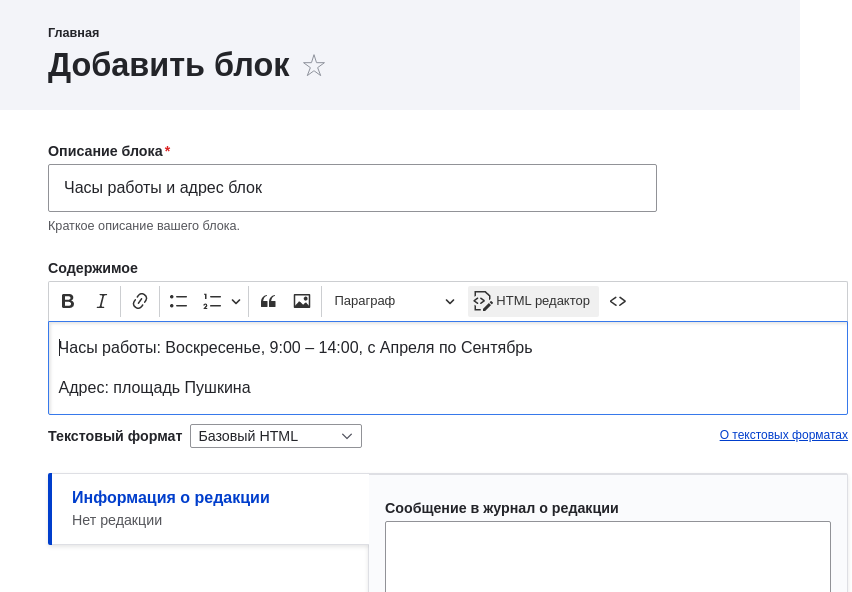

[[block-create-custom]]

=== Создание пользовательского блока

[role="summary"]
Как создать пользовательский блок.

(((Блок,создание)))
(((Пользовательский блок,создание)))

==== Цель

Создать блок отображающий часы работы и адрес городской ярмарки.

==== Необходимые знания

* <<block-concept>>
* <<block-regions>>

// ==== Site prerequisites

==== Шаги

. В административном меню _Управление_ перейдите в _Контент_ > _Блоки_ (_admin/content/block_).

. Нажмите _Добавить блок контента_. Появится страница _Добавить блок контента_.

. Заполните поля, как показано ниже.
+
[width="100%",frame="topbot",options="header"]
|================================
|Имя поля |Объяснение |Примерное значение
|Описание блока |Имя блока, которое показывается администратору |Часы работы и адрес блок
|Содержимое |Контент блока, который отображается для пользователей |Открыто: Воскресенье, 9:00 -
14:00, с апреля по сентябрь Адрес: пл. Пушкина,
центр города N.
|================================
+
--
// Страница добавления блока (block/add).

--

. Нажмите _Сохранить_. Появится сообщение о сохранении блока.

==== Расширьте понимание

* Чтобы редактировать содержимое пользовательского блока, в меню _Управление_
перейдите в _Контент_ > _Блоки_
(_admin/content/block_). Найдите блок в списке и нажмите
_Редактировать_, чтобы внести изменения.

* Разместите созданный блок в боковой колонке. Подробности см. в <<block-place>>.

//==== Related concepts

==== Видео

// Video from Drupalize.Me.
video::https://www.youtube-nocookie.com/embed/sI2wrbn3cPg[title="Creating a Custom Block"]
video::https://drupalbook.org/ru/drupal/26-block-regiony-i-bloki[title="Регионы и блоки"]

==== Дополнительные материалы

https://www.drupal.org/docs/core-modules-and-themes/core-modules/block-module/managing-blocks[_Drupal.org_ страница документации сообщества "Managing blocks"]
https://drupalbook.org/ru/drupal/26-block-regiony-i-bloki[_DrupalBook.org_ страница "2.6. Block - Регионы и блоки"]

*Авторы*

Адаптировано https://www.drupal.org/u/jredding[Jacob Redding] и
https://www.drupal.org/u/batigolix[Boris Doesborg] из
https://www.drupal.org/docs/core-modules-and-themes/core-modules/block-module/managing-blocks[Managing blocks], авторские права 2000-copyright_upper_year за отдельными участниками
https://www.drupal.org/documentation[Drupal Community Documentation].

Переведено https://www.drupal.org/u/levmyshkin[Абраменко Иван] из https://drupalbook.org/ru[DrupalBook].
