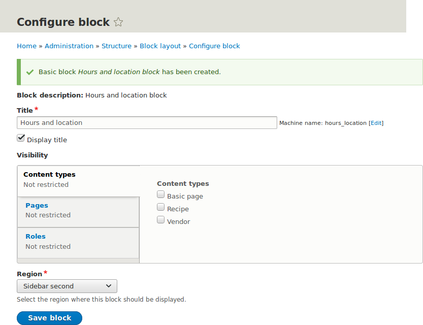
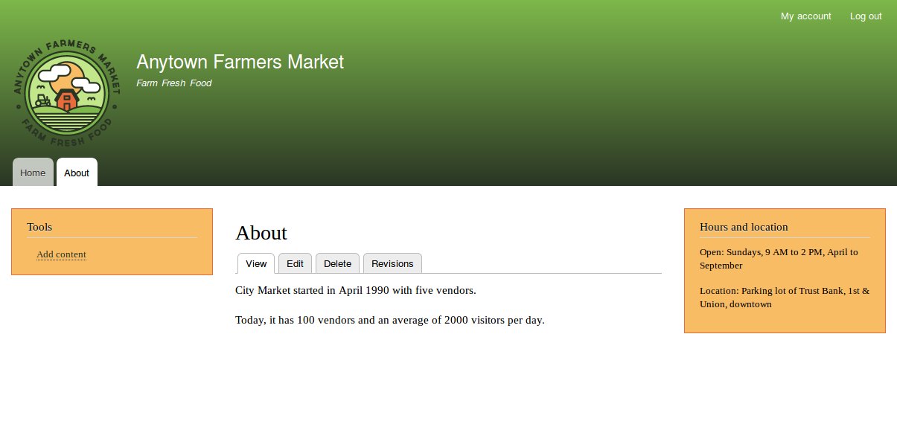

[[block-place]]

=== Расположение блока в Регионе

[role="summary"]
Как разместить блок в регионе.

(((Блок,расположение в регионе)))
(((Регион,размещение блока)))

==== Цель

Разместить блок «Часы работы и адрес» в боковой колонке сайта.

==== Необходимые знания

<<block-concept>>

==== Требования к сайту

* Базовая тема Olivero должна быть установлена и назначена по умолчанию. Смотрите
<<config-theme>>.

* Блок «Часы работы и адрес» должен существовать. Смотрите <<block-create-custom>>.

==== Шаги

. В административном меню _Управление_ перейдите в _Структура_ > _Схема блоков_
(_admin/structure/block_). Откроется страница _Схема блоков_ со списком регионов темы.

. Убедитесь, что на дополнительной вкладке выбрана базовая тема Olivero. Размещение
блоков задаётся отдельно для каждой темы.

. Найдите регион _Sidebar_ в списке и нажмите _Разместить блок_ рядом
с ним. Появится окно _Разместить блок_ со списком всех блоков.

. Найдите блок «Часы работы и адрес» и нажмите _Разместить блок_ рядом
с ним. Появится окно _Настройка блока_. Заполните поля как показано ниже.
+
[width="100%",frame="topbot",options="header"]
|================================
|Название поля |Пояснение |Пример значения
|Заголовок |Заголовок, отображаемый для блока |Часы работы и адрес
|Отображать заголовок |Показывать ли заголовок вместе с блоком |Отмечено
|Регион |В каком регионе темы отображать блок |Sidebar second
|================================
+
Вы также можете скрывать или показывать блок на отдельных страницах. Для сайта
городского рынка эти параметры не задаются, потому что блок должен быть виден везде.
+
--
// Страница настройки пользовательского блока на боковой панели.

--

. Нажмите _Сохранить блок_. Появится страница _Схема блоков_. Вы можете перетаскивать
ручки-перекрестья блоков, чтобы изменить их порядок в каждом регионе. Как
альтернативу перетаскиванию вы можете нажать ссылку _Показать веса строк_ вверху
таблицы и выбрать числовые веса (блоки с меньшими, то есть более отрицательными,
весами будут отображаться первыми).

. Убедитесь, что блок «Часы работы и адрес» находится в регионе _Sidebar
second_, и нажмите _Сохранить блоки_.
+
Блок размещён в боковой колонке всех страниц, использующих базовую тему Bartik.
+
--
// Страница «О сайте» с размещённым блоком в боковой колонке.

--

==== Расширьте своё понимание

* Удалите блок _Powered by Drupal_ из региона _Footer Bottom_, нажав
_Отключить_ или _Удалить_ в выпадающем списке _Операции_. Если выбрать
_Отключить_, вы сможете позже легко включить блок с теми же настройками; если
выбрать _Удалить_ и затем захотите вернуть блок, придётся снова пройти шаги из
этой темы, чтобы разместить его в регионе. Обратите внимание, что названия блоков,
поставляемых ядром, таких как _Powered by Drupal_ и _User login_, на этой странице
отображаются на английском; см. <<language-concept>>.

* Разместите блок _User login_ в регионе.

* Если изменения не отображаются на сайте, очистите кеш. См. <<prevent-cache-clear>>.

//==== Related concepts

==== Видео

// Видео от Drupalize.Me.
video::https://www.youtube-nocookie.com/embed/iWW7Ja5p0hA[title="Размещение блока в регионе"]

//==== Additional resources

*Авторы*

Написано и отредактировано https://www.drupal.org/u/batigolix[Boris Doesborg],
https://www.drupal.org/u/jhodgdon[Jennifer Hodgdon] и
https://www.drupal.org/u/eojthebrave[Joe Shindelar] из
https://drupalize.me[Drupalize.Me]

Переведено https://www.drupal.org/u/levmyshkin[Абраменко Иван] из https://drupalbook.org/ru[DrupalBook].
