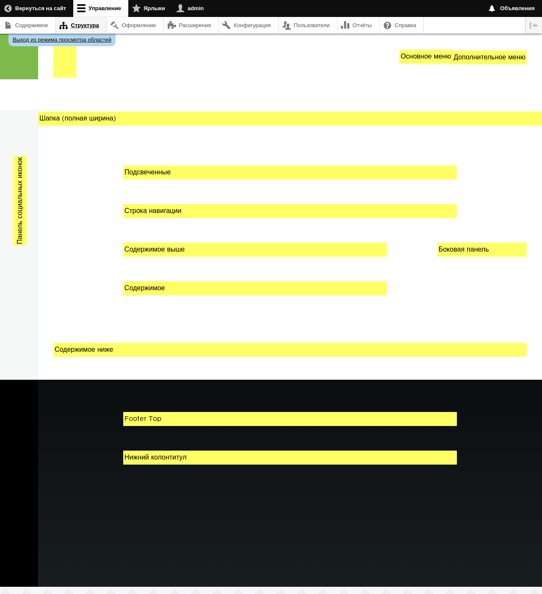

[[block-regions]]

=== Основы: Регионы в теме оформления

[role="summary"]
Обзор регионов для темизации сайта.

(((Тема оформления,регионы в ней)))
(((Тема Olivero,регионы в ней)))
(((Регион,обзор)))
(((Регион хлебных крошек,обзор)))
(((Регион контента,обзор)))
(((Регионы «Рекомендуемое»,обзор)))
(((Регионы подвала,обзор)))
(((Регион шапки,обзор)))
(((Регион помощи,обзор)))
(((Регион выделенный,обзор)))
(((Регион меню,обзор)))
(((Регион первичного меню,обзор)))
(((Регион вторичного меню,обзор)))
(((Регионы боковой колонки,обзор)))
(((Регион,хлебные крошки)))
(((Регион,контент)))
(((Регион,рекомендуемое)))
(((Регион,подвал)))
(((Регион,шапка)))
(((Регион,помощь)))
(((Регион,выделенное)))
(((Регион,меню)))
(((Регион,первичное меню)))
(((Регион,вторичное меню)))
(((Регион,боковая колонка)))

==== Необходимые знания

<<understanding-themes>>

==== Что такое регион?

Помимо основного содержимого, веб-страница содержит и другие элементы, такие как
фирменный стиль сайта (название, слоган и логотип), навигационные подсказки (меню, ссылки,
значки), форматированный текст и изображения. Каждая тема предоставляет набор именованных регионов,
например _Шапка_, _Контент_ и _Боковая колонка_, куда администраторы могут поместить контент.

Доступные регионы зависят от дизайна темы. Обязателен только регион Контент,
в котором расположен основной контент; остальные регионы необязательны.  Базовая тема Olivero
предоставляет регионы, выделенные на следующем изображении.

// Предпросмотр регионов темы Olivero на admin/structure/block/demo/olivero,
// после настройки темы для сценария Farmers Market.

==== Связанные темы

* <<block-concept>>
* <<planning-data-types>>
* <<block-place>>

// ==== Additional resources

*Авторы*

Написано и отредактировано https://www.drupal.org/u/jfmacdonald[John MacDonald],
и https://www.drupal.org/u/michaellenahan[Michael Lenahan] из
https://erdfisch.de[erdfisch]

Переведено https://www.drupal.org/u/levmyshkin[Абраменко Иван] из https://drupalbook.org/ru[DrupalBook].
