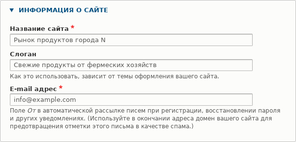
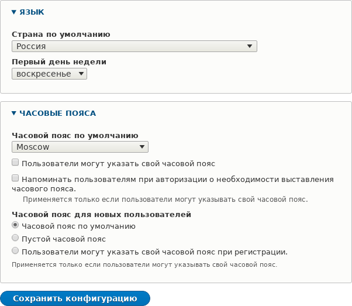

[[config-basic]]

=== Редактирование основной информации сайта

[role="summary"]
Как редактировать основную информацию сайта (название, слоган и часовой пояс по умолчанию).

(((Настройка,сайт)))
(((Название сайта,настройка)))
(((Слоган сайта,настройка)))
(((Слоган,настройка)))
(((Таглайн сайта,настройка)))
(((Таглайн,настройка)))
(((Email сайта,настройка)))
(((Email адрес,настройка)))
(((Главная страница,настройка)))
(((Страница ошибок,настройка)))
(((Региональные настройки,настройка)))
(((Настройки локали,настройка)))
(((Настройки страны,настройка)))
(((Настройки часового пояса,настройка)))
(((Первый день недели,настройка)))

==== Цель

Изменить базовую информацию сайта, такую как _Название сайта_, _Слоган_,
_Часовой пояс по умолчанию_.

==== Необходимые знания

<<config-overview>>

//==== Site prerequisites

==== Шаги

===== Настройка базовой информации сайта

. В административном меню _Управление_ перейдите в _Конфигурация_ > _Система_ >
_Основная информация сайта_ (_admin/config/system/site-information_) для изменения
_Названия сайта_, _Слогана_, административного _Email адреса_ или пути _Главной страницы_.

. Заполните поля, соответствующие вашему сайту.
+
[width="100%",frame="topbot",options="header"]
|================================
|Название поля|Пояснение|Пример значения
|Информация о сайте > Название сайта|Используется для идентификации сайта и отображается в браузере|Фермерский рынок Энитауна
|Информация о сайте > Слоган|Использование зависит от темы сайта. По умолчанию не отображается в теме Olivero.|Свежие фермерские продукты
|Информация о сайте > Email адрес|Используется как адрес _От кого_ в автоматических письмах (регистрация, сброс пароля и т. д.)|info@example.com
|================================
+
--
// Раздел «Информация о сайте» на admin/config/system/site-information.

--

. После заполнения полей нажмите _Сохранить конфигурацию_, чтобы изменения
применились к сайту.

===== Настройка региональных параметров по умолчанию

. В административном меню _Управление_ перейдите в _Конфигурация_ >
_Регион и язык_ > _Региональные настройки_
(_admin/config/regional/settings_).

. Заполните форму следующим образом:
+
[width="100%",frame="topbot",options="header"]
|================================
|Название поля|Пояснение|Пример значения
|Локаль > Страна по умолчанию|Основная страна сайта|Соединённые Штаты
|Локаль > Первый день недели|День начала недели в календарях|воскресенье
|Часовые пояса > Часовой пояс по умолчанию|Основной часовой пояс сайта |Америка > Лос-Анджелес
|Часовые пояса > Пользователи могут задавать свой часовой пояс|Позволяет ли авторизованным пользователям выбирать другой часовой пояс для отображения дат и времени|Не отмечено
|================================
+
--
// Разделы «Переводы» и «Часовые пояса» на admin/config/regional/settings.

--

. После заполнения полей нажмите _Сохранить конфигурацию_, чтобы изменения
применились к сайту.

// ==== Expand your understanding
// ==== Related concepts

==== Видео

// Видео от Drupalize.Me.
video::https://www.youtube-nocookie.com/embed/oDMCQ1cDYOI[title="Редактирование основной информации сайта"]

==== Дополнительные материалы

https://www.drupal.org/docs/administering-a-drupal-site/getting-started-with-drupal-administration[_Drupal.org_ — страница «Getting started with Drupal administration»]

*Авторы*

Написано и отредактировано https://www.drupal.org/u/sree[Sree Veturi],
https://www.drupal.org/u/michaellenahan[Michael Lenahan] из
https://erdfisch.de[erdfisch],
https://www.drupal.org/u/ifrik[Antje Lorch] и
https://www.drupal.org/u/jhodgdon[Jennifer Hodgdon].

Переведено: https://www.drupal.org/u/igorsh[Игорь Шабальников].
