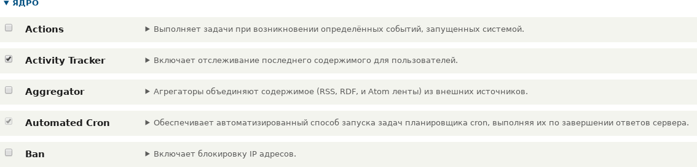

[[config-install]]
=== Установка модуля Drupal

[role="summary"]
Как установить модуль ядра или сторонний модуль через административный интерфейс
или с помощью Drush.

(((Модуль,включение)))
(((Модуль,установка)))

==== Цель

Установить модуль ядра или сторонний модуль, файлы которого уже
загружены на сайт, используя административный интерфейс или Drush.

==== Необходимые знания

<<understanding-modules>>
<<install-composer>>

==== Требования к сайту

Если вы хотите использовать Drush для установки модулей, сам Drush должен быть установлен. Смотрите
<<install-tools>>.

==== Шаги

Вы можете установить модули через административный интерфейс или Drush.

Сторонние модули не входят в ядро; их необходимо предварительно
загрузить с помощью Composer. Подробности см. в <<install-composer>>.

===== Использование административного интерфейса

. В административном меню _Управление_ перейдите в _Расширение_
(_admin/modules_). На странице _Расширение_ отображаются все доступные модули
на сайте.

. Отметьте флажками модули, которые вы хотите установить. Например,
отметьте модуль ядра Ban.
+
--
// Верхняя часть раздела Core на admin/modules, модуль Ban отмечен.

--

. Нажмите _Установить_. Выбранные модули будут установлены.

===== Использование Drush

. В административном меню _Управление_ перейдите в _Расширение_
(_admin/modules_). На странице _Расширение_ отображаются все доступные модули
на сайте.

. Раскройте информационную область модуля, чтобы узнать его машинное имя.
Например, машинное имя модуля ядра Ban — _ban_.

. Выполните следующую команду Drush для установки модуля:
+
----
drush pm:enable ban
----

==== Расширьте понимание

Если вы не видите изменений на сайте, возможно, нужно очистить кэш. Смотрите <<prevent-cache-clear>>.

// ==== Related concepts

==== Видео

// Видео от Drupalize.Me.
video::https://www.youtube-nocookie.com/embed/HymQsDOcT3E[title="Установка модуля"]

==== Дополнительные материалы

http://www.drush.org[Drush]

*Авторы*

Написано и отредактировано by https://www.drupal.org/u/batigolix[Boris Doesborg] и
https://www.drupal.org/u/jhodgdon[Jennifer Hodgdon]

Переведено https://www.drupal.org/u/levmyshkin[Абраменко Иван] из https://drupalbook.org/ru[DrupalBook].
