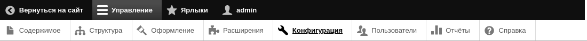
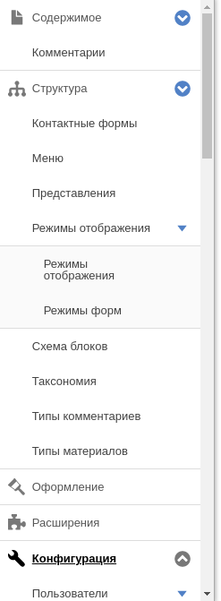
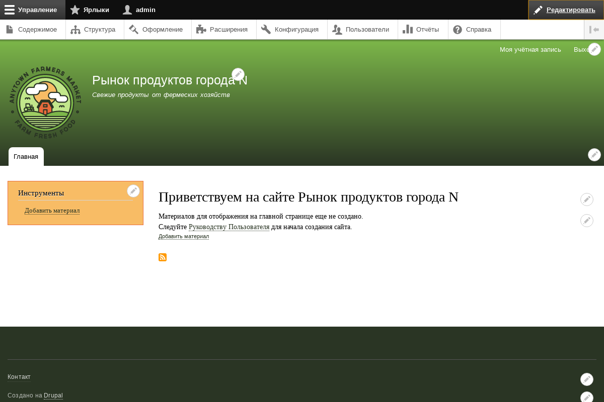

[[config-overview]]

=== Основы: Обзор интерфейса администратора

[role="summary"]
Обзор меню администратора и контекстных ссылок.

(((Администрирование,обзор)))
(((Меню администратора,обзор)))
(((Меню «Управление»,обзор)))
(((Панель инструментов,обзор)))
(((Контекстная ссылка,обзор)))
(((Ссылка меню «Содержимое»,меню администратора)))
(((Ссылка меню «Структура»,меню администратора)))
(((Ссылка меню «Оформление»,меню администратора)))
(((Ссылка меню «Расширения»,меню администратора)))
(((Ссылка меню «Конфигурация»,меню администратора)))
(((Ссылка меню «Пользователи»,меню администратора)))
(((Ссылка меню «Отчёты»,меню администратора)))
(((Ссылка меню «Справка»,меню администратора)))

==== Необходимые знания

* <<understanding-themes>>
* <<understanding-modules>>

==== Что такое меню администратора?

Модуль Toolbar ядра отображает панель инструментов с меню _Управление_
вверху или слева сайта (справа при языках с письмом справа-налево)
для пользователей, у которых есть разрешение его видеть. Это меню предоставляет
доступ ко всем административным разделам сайта. Ссылки в меню зависят от
включённых модулей на сайте и прав пользователя; если вы установили сайт
с использованием стандартного профиля и имеете все административные права,
верхний уровень меню будет таким:

// Top navigation bar on any admin page, with Manage menu showing.

Содержимое::
  Список и управление существующим контентом, а также создание нового.

Структура::
  Управление структурными элементами сайта, такими как блоки, типы
  материалов, меню и таксономия.

Оформление::
  Управление темами и настройками внешнего вида.

Расширения::
  Установка и удаление модулей.

Конфигурация::
  Ссылки на страницы настроек различных функций сайта.

Пользователи::
  Управление пользователями, ролями и разрешениями.

Отчёты::
  Доступ к журналам, информации об обновлениях, поиске и другим
  сведениям о состоянии сайта.

Справка::
  Список тем помощи для установленных модулей.

Кнопка-стрелка в правом конце второй строки панели (или левом, если
сайт просматривается на языке справа-налево) переключает отображение меню:
из горизонтального вверху страницы в вертикальное дерево слева (справа для
языков справа-налево). В вертикальном режиме меню становится
интерактивным деревом.

// Navigation in vertical orientation.

В этом руководстве принята стандартная запись путей навигации
через административную панель. См. <<preface-conventions>> для подробностей.

==== Что такое контекстные ссылки?

Часть функций администрирования и редактирования доступна через
_контекстные ссылки_, которые выводит модуль Contextual Links.
Они ведут на те же страницы, что и пункты меню администратора, но
расположены рядом с соответствующим контентом на сайте, что экономит переходы
по иерархии меню.

Чтобы увидеть контекстные ссылки, их нужно активировать. Если тема
использует стили по умолчанию, наличие активных ссылок обозначает иконка
карандаша; щёлкнув её, вы увидите ссылки. Есть два способа активировать эти
иконки:

* При использовании мыши в браузере иконка временно появляется,
  когда курсор наведён на область с контекстными ссылками.

* Нажмите главную иконку карандаша (или ссылку _Edit_) в правом конце
  верхней панели — это активирует все контекстные ссылки на текущей
  странице. Иконка видна только там, где такие ссылки есть.
+
--
// Home page with pencil icons showing, with configured theme.

--

//==== Related topics

//==== Additional resources

*Авторы*

Написано https://www.drupal.org/u/halofx[Scott Wilkinson] и
https://www.drupal.org/u/jhodgdon[Jennifer Hodgdon].

Переведено https://www.drupal.org/u/levmyshkin[Абраменко Иван] из https://drupalbook.org/ru[DrupalBook].
