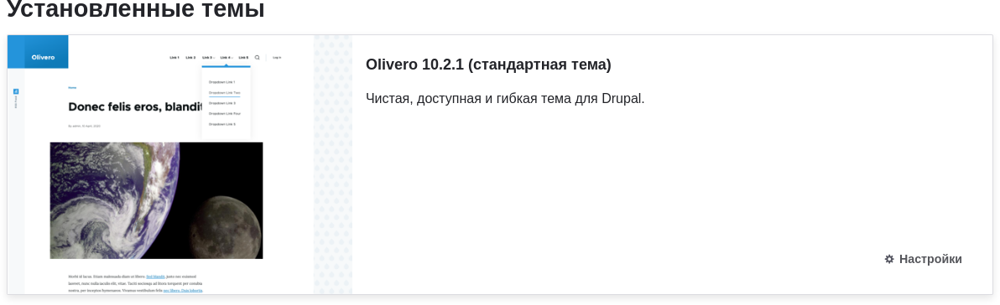
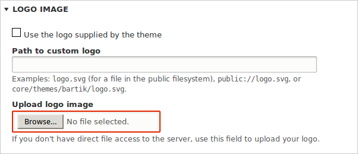
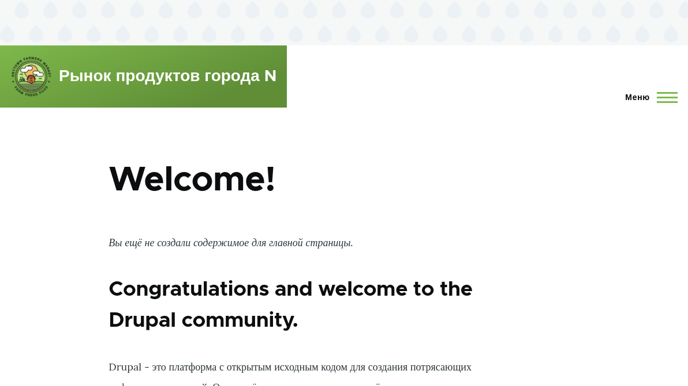

[[config-theme]]
=== Настройка темы
[role="summary"]
Как изменить настройки темы для обновления цветовой схемы и добавления логотипа.

(((Тема,настройка)))
(((Тема Olivero,настройка)))
(((Цветовая схема,настройка)))
(((Изображение логотипа,настройка)))

==== Цель

Отредактируйте настройки базовой темы ядра Olivero, чтобы изменить цветовую схему
и добавить логотип.

==== Необходимые знания

<<understanding-themes>>

//==== Site prerequisites

==== Шаги

. В административном меню _Управление_ перейдите в _Оформление_
(_admin/appearance_).

. В разделе _Установленные темы_ вы увидите, что Olivero установлена как тема
по умолчанию. В блоке _Olivero (тема по умолчанию)_ нажмите _Настройки_.
+
--
// Olivero section of admin/appearance.

--

. В разделе _Изображение логотипа_ снимите галочку _Использовать логотип,
предоставленный темой_.
+
--
// Logo upload section of admin/appearance/settings/olivero.

--

. В поле _Загрузить изображение логотипа_ найдите файл логотипа и загрузите его
на сайт. Примечание: универсальный логотип для всех тем можно задать в
_Оформление_ > _Настройки_ (_admin/appearance/settings_). Пользовательский логотип для
вашей темы переопределит универсальный логотип.
+
После выбора файла его имя появится рядом с кнопкой _Выбрать файл_ или _Обзор_
в вашем браузере.

. В разделе _Утилиты Olivero_ вы можете выбрать другую цветовую схему для
темы. Можно выбрать существующую схему либо указать цвет, и ядро сгенерирует
новую схему на его основе.

Для примера используйте следующий пользовательский цвет:
+
[width="100%",frame="topbot",options="header"]
|================================
|Поле | Цвет
|Основной базовый цвет| #7db84a (зелёный)
|================================
+
Примечание: вы также можете воспользоваться палитрой, нажав цветной квадрат
справа, — код выбранного веб-цвета подставится автоматически.

. Чтобы сохранить изменения и увидеть обновлённые цвета и логотип на сайте,
нажмите _Сохранить конфигурацию_ внизу страницы.

. Нажмите _Вернуться на сайт_ или _Главная_ на панели, чтобы убедиться, что
настройки темы Olivero обновлены.
+
--
// Home page after theme settings are finished.

--

==== Расширьте понимание

* <<extend-theme-find>>

* <<extend-theme-install>>

* Если изменения не видны на сайте, возможно, нужно очистить кэш. См. <<prevent-cache-clear>>.

//==== Related concepts

==== Видео

// Видео от Drupalize.Me.
video::https://www.youtube-nocookie.com/embed/CEi3i1YGOs0[title="Настройка темы"]

//==== Additional resources

*Авторы*

Написано и отредактировано https://www.drupal.org/u/AnnGreazel[Ann Greazel],
https://www.drupal.org/u/mndonx[Amanda Luker] из
https://www.advomatic.com/[Advomatic] и
https://www.drupal.org/u/jerseycheese[Jack Haas].

Переведено: https://www.drupal.org/u/igorsh[Игорь Шабальников].
