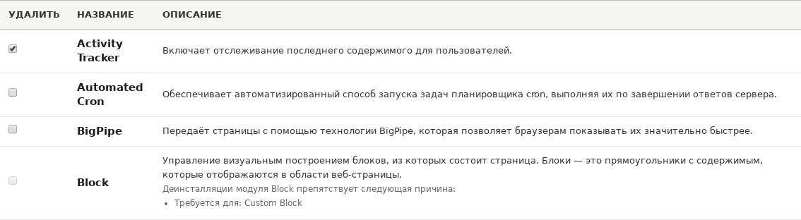
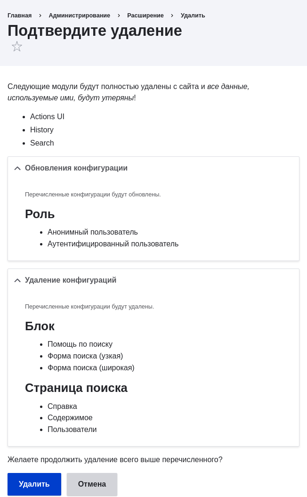

[[config-uninstall]]

=== Удаление неиспользуемых модулей

[role="summary"]
Как удалить модули, чтобы снизить нагрузку на сайт.

(((Модуль,удаление неиспользуемых)))
(((Удаление,неиспользуемые модули)))
(((Производительность,улучшение)))
(((Инструмент Drush,использование для удаления модуля)))

==== Цель

Удалить модули ядра Search и History, а также модуль ядра Ban, если вы устанавливали его в <<config-install>>, чтобы сократить нагрузку.

==== Необходимые знания

<<understanding-modules>>

==== Требования к сайту

* На сайте должен быть хотя бы один неиспользуемый модуль, который вы хотите удалить, например модуль ядра Search.

* Если вы хотите использовать Drush для удаления модулей, Drush должен быть установлен. Смотрите <<install-tools>>.

==== Шаги

Вы можете использовать административный интерфейс или Drush для удаления модулей.

===== Использование административного интерфейса

. В административном меню _Управление_ перейдите в _Расширения_ > _Удалить_
(_admin/modules/uninstall_), где отображается список модулей,
готовых к удалению.

. Отметьте флажками модули, которые нужно удалить (_Ban_, _History_ и _Search_). Затем нажмите _Удалить_ внизу страницы.
+
--
// Верхняя часть admin/modules/uninstall, модуль Ban отмечен.

[NOTE]
=================
Нельзя удалить модуль, если он требуется другим модулям и/или функциональности. Например, модуль File ядра нужен модулям Text Editor, CKEditor и Image. Его нельзя удалить, пока вы не удалите зависимые модули и функциональность. У модуля, который пока нельзя удалить, флажок будет неактивным, препятствуя удалению.
=================
--

. На шаге 2 система попросит подтвердить удаление модулей. Нажмите
_Удалить_.
+
--
// Экран подтверждения удаления после отметки модулей Ban, History
// и Search на admin/modules/uninstall.

--

===== Использование Drush

. В административном меню _Управление_ перейдите в _Расширения_
(_admin/modules_). На странице _Расширения_ отображаются все доступные модули
на сайте.

. Разверните информацию о модуле, чтобы узнать его машинное имя. Например, для модуля ядра Ban машинное имя — _ban_.

. Выполните следующую команду Drush, чтобы удалить модуль:
+
----
drush pm:uninstall ban
----

==== Расширьте своё понимание

* <<install-tools>>

* <<prevent-cache-clear>>

* Вы также можете удалить модуль ядра Comment, следуя этим шагам, но только после удаления полей комментариев, что является побочным эффектом <<structure-content-type-delete>>.

//==== Related concepts

==== Видео

// Видео от Drupalize.Me.
video::https://www.youtube-nocookie.com/embed/hUonnNkeF6g[title="Удаление неиспользуемых модулей"]

//==== Additional resources

*Авторы*

Написано и отредактировано https://www.drupal.org/u/surendramohan[Surendra Mohan],
и https://www.drupal.org/u/jojyja[Jojy Alphonso] из
http://redcrackle.com[Red Crackle]

Переведено https://www.drupal.org/u/levmyshkin[Абраменко Иван] из https://drupalbook.org/ru[DrupalBook].
