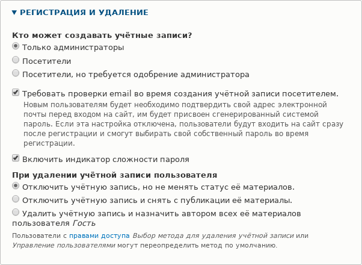
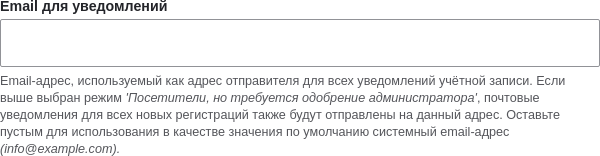
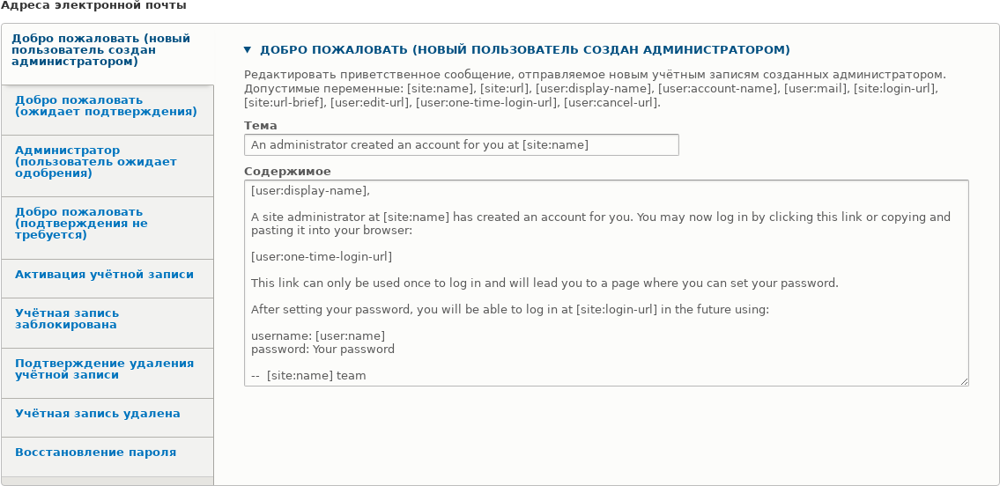

[[config-user]]

=== Настройка учетной записи пользователя

[role="summary"]
Как изменить настройки регистрации учётных записей пользователей.

(((Пользователь,настройка учетной записи)))
(((Параметры учётной записи,настройка)))
(((Безопасность,управление учётными записями)))
(((Безопасность,параметры учётной записи)))

==== Цель

Отключить возможность самостоятельной регистрации учётных записей на сайте. А также,
проверить и/или отредактировать электронные письма, которые сайт отправляет при
событиях, связанных с учётными записями.

==== Необходимые знания

<<config-overview>>

//==== Site prerequisites

==== Шаги

. В административном меню _Управление_ перейдите в _Конфигурация_ > _Пользователи_ >
  _Настройки учётной записи_ (_admin/config/people/accounts_).

. В разделе _Регистрация и удаление_ выберите _Только администраторы_ как
  пользователей, которые могут создавать учётные записи. При необходимости можно отметить
  _Требовать подтверждение электронной почты при создании учётной записи посетителем_,
  если вы захотите позже изменить правила регистрации.
+
--
// Registration and cancellation section of admin/config/people/accounts.

--

. При желании измените адрес электронной почты, с которого будут отправляться
  уведомления о событиях учётных записей. Это позволит использовать отдельный
  адрес, отличный от общесайтового. Например, такой адрес пригодится
  сотрудникам, которые общаются с поставщиками.
+
--
// Email address section of admin/config/people/accounts.

--

. При желании отредактируйте шаблоны писем в разделе _Письма_, чтобы настроить
  автоматические уведомления. Ядро содержит несколько шаблонов для разных
  ситуаций. Все они настраиваются, а три можно отключить флажками: активация,
  блокировка и удаление.
+
  Вы можете отправить собственный текст (например, приветствие для новых
  поставщиков, чьи учётные записи только что созданы), изменив шаблон _Добро
  пожаловать (новый пользователь создан администратором)_.
+
--
// Emails section of admin/config/people/accounts.

--

. Нажмите _Сохранить конфигурацию_, чтобы сохранить изменения.

==== Расширьте понимание

* <<prevent-cache-clear>>
* <<user-new-user>>

==== Связанные темы

Смотрите <<user-chapter>> для получения дополнительной информации об учётных
записях и разрешениях.

==== Видео

// Video from Drupalize.Me.
video::https://www.youtube-nocookie.com/embed/POhQTAX93R8[title="Configuring User Account Settings"]

==== Дополнительные материалы

https://www.drupal.org/security/secure-configuration[Securing your site] может
помочь вам с более целенаправленным подходом к конфигурации с точки зрения
безопасности.

*Авторы*

Написано и отредактировано https://www.drupal.org/u/lolk[Laura Vass] из
https://pronovix.com/[Pronovix] и
https://www.drupal.org/u/jojyja[Jojy Alphonso] из
http://redcrackle.com[Red Crackle].

Переведено: https://www.drupal.org/u/igorsh[Игорь Шабальников].
