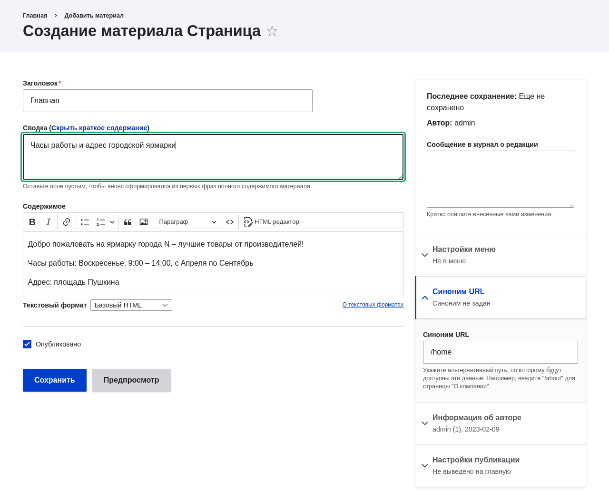

[[content-create]]

=== Создание элемента контента

[role="summary"]
Как создать элемент контента для использования в качестве главной страницы.

(((Элемент контента,создание)))
(((Основная страница,создание)))
(((Главная страница,создание)))

==== Цель

Создать и опубликовать элемент контента, который будет использоваться как главная
страница сайта.

==== Необходимые знания

* <<content-paths>>
* <<planning-data-types>>

==== Предпосылки сайта

Тип содержимого _Основная страница_ (_Basic page_) должен существовать. Он создаётся при
установке сайта с использованием стандартного установочного профиля ядра.

==== Шаги

. В административном меню _Управление_ перейдите _Содержимое_ > _Добавить содержимое_ >
_Основная страница_ (_node/add/page_). Откроется форма _Создать Основную страницу_.

. Нажмите _Редактировать краткое описание_.

. Заполните поля, как показано ниже.
+
[width="100%",frame="topbot",options="header"]
|================================
| Название поля | Пояснение | Значение
| Заголовок | Заголовок страницы. Также будет использоваться как мета-тег в исходном коде,
 URL-алиас и метка элемента контента на административных страницах | Home
| Краткое описание | Краткое содержание поля Текст. Может использоваться как тизер
 на обзорных страницах | Время работы и адрес городского рынка.
| Текст | Полное содержимое страницы | Добро пожаловать на Рынок продуктор города N — ваш
районный городской рынок!

Открыто: воскресенье, 9:00–14:00, апрель–сентябрь

Адрес: парковка Trust Bank, 1-я и Union, центр города
|Опубликовано | Опубликован ли контент для публичного просмотра | Отмечено
|URL-алиас > URL-алиас| Альтернативный относительный путь к содержимому | /home
|================================
+
Нажав кнопку _Исходный код_ на панели визуального редактора, вы можете увидеть
HTML-код редактируемого текста.
+
--
// Partly filled-in node/add/page, with Summary section open.

--

. Нажмите _Предпросмотр_, чтобы убедиться, что всё выглядит как ожидалось.

. Нажмите _Вернуться к редактированию_.

. Нажмите _Сохранить_. Контент будет сохранён и появится на
странице _Содержимое_.

. По тем же шагам создайте страницу «О нас» с заголовком «About» и текстом,
рассказывающим об истории городского рынка.

==== Узнайте больше

* <<menu-home>>
* <<menu-link-from-content>>
* <<language-content-translate>>

==== Связанные понятия

* <<language-concept>>
* <<content-paths>>
* <<content-edit>>

==== Видео

// Видео от Drupalize.Me.
video::https://www.youtube-nocookie.com/embed/h312fekiSNE[title="Создание элемента контента"]

==== Дополнительные материалы

https://www.drupal.org/docs/core-modules-and-themes/core-modules/node-module/about-nodes[_Drupal.org_ — «About nodes»]

*Авторы*

Написано: https://www.drupal.org/u/pixiekiss[Agnes Kiss] and
https://www.drupal.org/u/batigolix[Boris Doesborg]

Переведено: https://www.drupal.org/u/asdasha[Аземша Дарья].