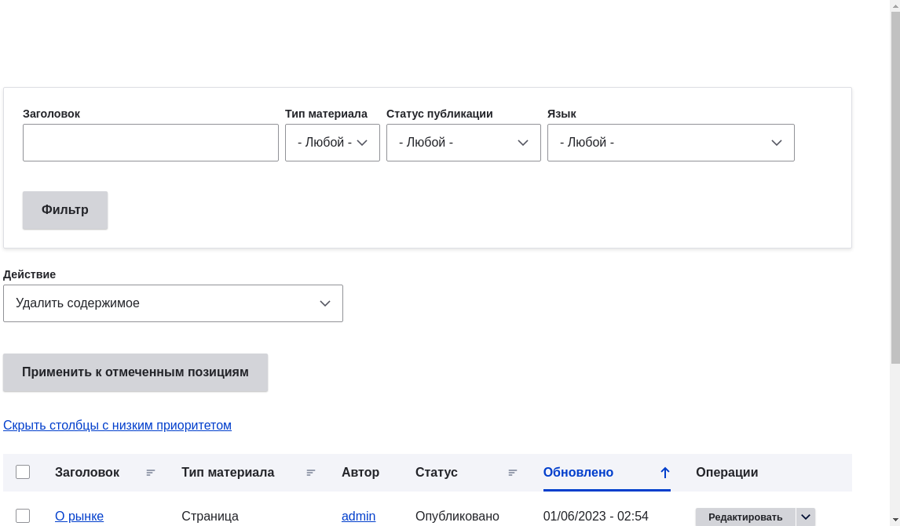
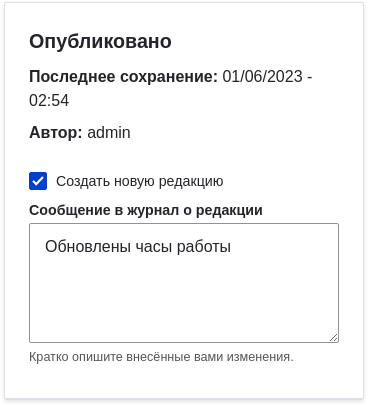
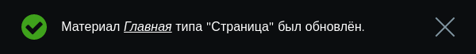

[[content-edit]]
=== Редактирование элемента контента

[role="summary"]
Как редактировать элемент контента.

(((Контент,редактирование)))
(((Контент,поиск)))
(((Редактирование контента)))

==== Цель

Обновить часы работы в элементе контента главной страницы.

==== Необходимые знания

<<content-create>>

==== Требования к сайту

Элемент контента для главной страницы должен существовать. Смотрите <<content-create>>.

==== Шаги

. В административном меню _Управление_ перейдите в _Контент_ (_admin/content_).

. Если нужный элемент был создан или изменён недавно, он
должен быть в верхней части списка. Иначе используйте фильтры
_Тип контента_, _Заголовок_ или другие, чтобы найти его.
+
--
// Content list on admin/content, with filters above.

--

. Нажмите _Редактировать_ в строке нужного элемента (Home), чтобы
открыть форму редактирования. Обновите часы работы в поле _Текст_. См.
<<content-create>> для описания полей и скриншота.

. Отметьте _Создать новую ревизию_ под _Опубликовано_, если флажок не
установлен, и введите _Комментарий к ревизии_, описав изменения
(например «Обновлены часы работы»). Этот текст
появится в журнале ревизий страницы.
+
--
// Revision area of the content edit page.

--

. Нажмите _Сохранить_, чтобы применить изменения.

. Вас перенаправит обратно на страницу _Контент_, и появится сообщение
о том, что элемент обновлён.
+
--
// Updated content message.

--

==== Дополнительная информация

Вместо первых двух шагов форму редактирования можно открыть так:

. С главной страницы сайта с помощью меню перейдите на страницу,
где отображается нужный контент.

. Большинство тем показывают ссылку или вкладку _Редактировать_ вверху
страницы пользователям с правом редактировать; нажатие откроет
полную форму редактирования.

//==== Related concepts

==== Видео

// Video from Drupalize.Me.
video::https://www.youtube-nocookie.com/embed/TAFZMcuOqG0[title="Редактирование элемента контента"]

==== Дополнительные материалы

*Авторы*

Написано https://www.drupal.org/u/chris-dart[Chris Dart]
и https://www.drupal.org/u/jhodgdon[Jennifer Hodgdon]

Переведено https://www.drupal.org/u/levmyshkin[Абраменко Иван] из https://drupalbook.org/ru[DrupalBook].
