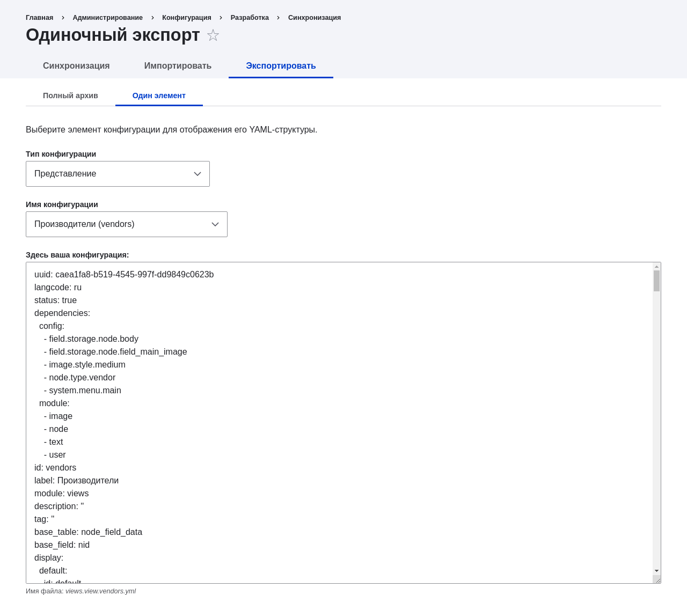

[[extend-deploy]]

=== Развёртывание новых функций сайта

[role="summary"]
Как скопировать представление, созданное на локальном сайте разработки, на рабочий сайт.

(((Функция,развёртывание)))
(((Конфигурация,развёртывание)))
(((Функция,копирование)))
(((Конфигурация,копирование)))

==== Цель

Скопировать представление, созданное на локальном сайте разработки, на рабочий
сайт.

==== Необходимые знания

* <<install-dev-making>>
* <<extend-config-versions>>
* <<install-dev-sites>>

==== Требования к сайту

* Модуль ядра Configuration Manager должен быть установлен как на сайте
разработки, так и на рабочем сайте. Смотрите <<config-install>> для
инструкций по установке модулей ядра.

* Тип контента Vendor должен существовать как на сайте разработки, так и на рабочем
сайте, с одинаковыми полями. Смотрите <<structure-content-type>>.

* Представление Vendors должно существовать на сайте разработки, но не на рабочем
сайте. Смотрите <<views-create>>.

==== Шаги

. Откройте локальный сайт разработки.

. В административном меню _Управление_ перейдите в _Конфигурация_ >
_Разработка_ > _Синхронизация конфигурации_ > _Экспорт_ > _Один элемент_
(_admin/config/development/configuration/single/export_).
Появится страница _Одиночный экспорт_.

. Выберите _View_ в списке _Тип конфигурации_.

. Выберите Vendors в списке _Имя конфигурации_. Конфигурация
появится в текстовой области.

. Скопируйте конфигурацию из текстовой области.
+
--
// Экспорт одиночной конфигурации представления Vendors из
// admin/config/development/configuration/single/export.

--

. Откройте рабочий сайт.

. В административном меню _Управление_ перейдите в _Конфигурация_ >
_Разработка_ > _Синхронизация конфигурации_ > _Импорт_ > _Один элемент_
(_admin/config/development/configuration_). Появится страница _Одиночный импорт_.

. Выберите _View_ в списке _Тип конфигурации_.

. Вставьте конфигурацию в текстовую область.

. Нажмите _Импортировать_. Появится страница подтверждения.

. Нажмите _Подтвердить_.

. Убедитесь, что представление импортировано, перейдя в _Управление_
и открыв _Структура_ > _Представления_.

==== Расширьте понимание

* Если изменения затрагивают только один элемент конфигурации (например, одно
представление), вы можете использовать одиночный экспорт/импорт конфигурации,
чтобы развернуть изменение между сайтами. Смотрите <<extend-deploy>>.

* После шага, на котором вы экспортируете полную конфигурацию с исходного сайта,
вы можете распаковать архив и зафиксировать его в системе контроля версий,
например Git, чтобы отслеживать изменения конфигурации сайта. Смотрите
<<extend-git>>.

// ==== Related concepts

==== Видео

// Видео от Drupalize.Me.
video::https://www.youtube-nocookie.com/embed/hysqVDIfLTA[title="Развёртывание новых функций сайта"]

// ==== Additional resources

*Авторы*

Написано https://www.drupal.org/u/batigolix[Boris Doesborg].

Переведено https://www.drupal.org/u/MishaIsmajlov[Михаил Исмайлов].
