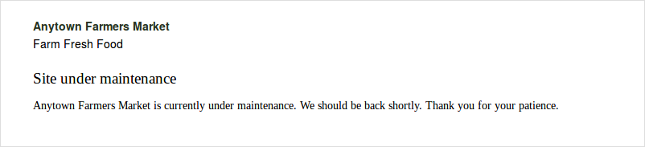
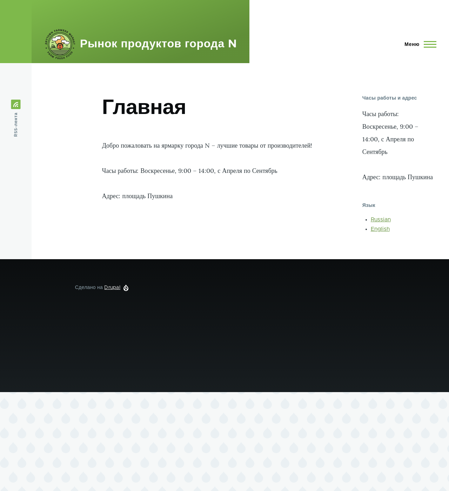

[[extend-maintenance]]

=== Включение и отключение режима обслуживания

[role="summary"]
Как включить режим обслуживания для отображения сообщения «Сайт находится в режиме обслуживания»
и как отключить этот режим.

(((Режим обслуживания,обзор)))
(((Режим обслуживания,включение)))
(((Режим обслуживания,отключение)))

==== Цель

Включить режим обслуживания, чтобы пользователи с нужными правами могли
использовать сайт, а остальные видели сообщение о технических работах.

==== Необходимые знания

<<security-concept>>

==== Требования к сайту

Если вы хотите использовать Drush для включения/отключения режима обслуживания,
Drush должен быть установлен. Смотрите <<install-tools>>.

==== Шаги

Вы можете включать и отключать режим обслуживания через административный интерфейс или Drush.

===== Включение режима обслуживания через административный интерфейс

. В административном меню _Управление_ перейдите в _Конфигурация_ >
_Разработка_ > _Режим обслуживания_ (_admin/config/development/maintenance_). Откроется
страница _Режим обслуживания_.

. Заполните поля, как показано ниже.
+
[width="100%",frame="topbot",options="header"]
|================================
|Имя поля | Объяснение | Значение

| Перевести сайт в режим обслуживания | Включить режим обслуживания |
Checked

| Сообщение для режима обслуживания | Сообщение для посетителей сайта при включённом режиме.
Можно использовать переменные вроде @site |@site сейчас находится на обслуживании, но скоро будет доступен. Спасибо за ваше терпение.

|================================

. Нажмите _Сохранить конфигурацию_.

. Проверьте, что сайт находится в режиме обслуживания, открыв его в другом
браузере без авторизации. Если не удаётся проверить, попробуйте очистить кэш — см. <<prevent-cache-clear>>.
+
--
// Site in maintenance mode.

--

===== Отключение режима обслуживания через административный интерфейс

. В административном меню _Управление_ перейдите в _Конфигурация_ >
_Разработка_ > _Режим обслуживания_ (_admin/config/development/maintenance_).
Откроется страница _Режим обслуживания_.

. Заполните поля, как показано ниже.
+
[width="100%",frame="topbot",options="header"]
|================================
|Имя поля | Объяснение | Значение

| Перевести сайт в режим обслуживания | Отключить режим обслуживания |
Unchecked

| Сообщение для режима обслуживания | При отключении сообщения не требуется, поле можно оставить пустым. |

|================================

. Нажмите _Сохранить конфигурацию_.

. Проверьте, что сайт больше не в режиме обслуживания, открыв его в другом
браузере без авторизации. Если не удаётся проверить — попробуйте очистить кэш (<<prevent-cache-clear>>).
+
--
// Site no longer in maintenance mode.

--

===== Включение или отключение режима обслуживания с помощью Drush

. Если нужно, сначала через интерфейс измените сообщение для режима обслуживания.

. Для включения режима обслуживания и очистки кэша выполните:
+
----
drush config:set system.maintenance message "Необязательное сообщение" -y
drush state:set system.maintenance_mode 1 --input-format=integer
drush cache:rebuild
----

. Для отключения режима обслуживания и очистки кэша выполните:
+
----
drush state:set system.maintenance_mode 0 --input-format=integer
drush cache:rebuild
----

. После выполнения команд проверьте, включён ли режим обслуживания, открыв сайт
в браузере без авторизации.

==== Расширьте своё понимание

* <<security-update-core>>
* <<security-update-theme>>
* <<security-update-module>>

==== Видео

// Видео от Drupalize.Me.
video::https://www.youtube-nocookie.com/embed/IQbqQs5h03Q[title="Включение и отключение режима обслуживания"]

*Авторы*

Написано и отредактировано https://www.drupal.org/u/batigolix[Boris Doesborg],
https://www.drupal.org/u/jojyja[Jojy Alphonso] в
http://redcrackle.com[Red Crackle], и
https://www.drupal.org/u/jhodgdon[Jennifer Hodgdon].

Переведено https://www.drupal.org/u/MishaIsmajlov[Михаил Исмайлов].
