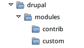

[[extend-manual-install]]

=== Ручная установка файлов модуля или темы

[role="summary"]
Как вручную установить модуль или тему.

(((Модуль,загрузка)))
(((Дополнительный модуль,загрузка)))
(((Тема,загрузка)))
(((Дополнительная тема,загрузка)))
(((Загрузка,файлы модуля или темы вручную)))
(((Ручная загрузка файлов модуля или темы,обзор)))

==== Цель

Пользовательские модули и темы могут быть недоступны через Composer, и их файлы
необходимо устанавливать вручную.

==== Необходимые знания

* <<understanding-modules>>
* <<extend-module-find>>
* <<understanding-themes>>
* <<extend-theme-find>>

==== Требования к сайту

Используйте этот подход, если вы создали собственный модуль/тему или получили
файлы от кого-либо.

При установке или обновлении ядра, сторонних модулей и тем рекомендуется использовать Composer.
Смотрите <<install-composer>>, <<extend-module-install>>, и <<extend-theme-install>> вместо этой темы.

==== Шаги

Если вы устанавливаете модуль или тему с _Drupal.org_, следуйте инструкциям по загрузке,
а затем по загрузке/распаковке. Если вы сами создали модуль или тему — пропустите
шаг загрузки и просто создайте архив (который сможете разархивировать на сервере) и переходите к
шагу загрузки/распаковки, используя подходящий вам способ.

===== Загрузка файлов на сайт и их распаковка

. Если вы добавляете новый модуль или тему, создайте подкаталоги в ваших
верхнеуровневых директориях _modules_ и _themes_ (если они ещё не существуют).
Обычно для сторонних модулей и тем, скачанных с _Drupal.org_, создают подкаталог _contrib_,
а для своих — подкаталог _custom_. Ваша директория _modules_ может выглядеть так:
+
--
// Make custom and contrib directories under modules, and take a screenshot
// showing the directory structure.

// NOTE for Translators: you don't need to localize the 'custom' and 'contrib' directory names as they are more common in English.
--

. Если вы заменяете существующий модуль или тему новой версией, переведите
сайт в режим обслуживания. Смотрите <<extend-maintenance>>.

. Если вы заменяете существующий модуль или тему, найдите и удалите все старые файлы и папки
модуля или темы. Обычно модули размещаются в подкаталогах верхнего уровня _modules_,
темы — в _themes_.

. Загрузите _.tar.gz_ файл (или другой архив) на ваш сайт. Поместите его либо в ту же папку,
откуда удалили предыдущий модуль/тему (если обновляете), либо в нужный подкаталог
в _modules_ или _themes_ (если добавляете новый модуль/тему).

. Разархивируйте файлы из _.tar.gz_ (или другого архива), чтобы появился подкаталог
в том же месте, где лежит архив. Если у вас нет терминального доступа, используйте
файловый менеджер панели управления хостинга — там обычно есть функция распаковки.
Если у вас есть терминальный доступ (Linux) и tar.gz-архив, используйте, например:
+
----
tar -xzf custom_toolbar-2.4.0.tar.gz
----

. Удалите архивный файл с сервера, если ваша система распаковки этого не сделала автоматически.

. Перейдите к <<extend-module-install>>, <<extend-theme-install>>,
<<security-update-module>> или <<security-update-theme>>, чтобы завершить
установку или обновление. Начните с шага после автоматической загрузки.

==== Расширьте понимание

* Если у вас несколько окружений (например, локальная разработка и продакшн),
вам нужно повторять эти действия на каждом окружении или склонировать его заново.
Смотрите <<install-dev-making>>.

* Если вы добавили новую тему, в административном меню _Управление_ откройте
_Оформление_ (_admin/appearance_) и удалите старую тему.

==== Видео

// Видео от Drupalize.Me.
video::https://www.youtube-nocookie.com/embed/kOzQz9q3Kf8[title="Ручная загрузка файлов модуля или темы"]

==== Дополнительные материалы

* https://www.drupal.org/docs/extending-drupal/updating-modules[_Drupal.org_ документация: "Updating modules"]
* https://www.drupal.org/docs/extending-drupal/installing-drupal-modules[_Drupal.org_ документация: "Installing Drupal modules"]
* https://www.drupal.org/docs/extending-drupal/installing-themes[_Drupal.org_ документация: "Installing themes"]

*Авторы*

Написано и отредактировано https://www.drupal.org/u/batigolix[Boris Doesborg],
https://www.drupal.org/u/jhodgdon[Jennifer Hodgdon], и
https://www.drupal.org/u/vegantriathlete[Marc Isaacson].

Переведено https://www.drupal.org/u/MishaIsmajlov[Михаил Исмайлов].
