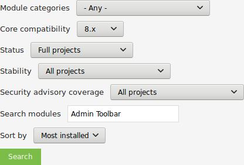
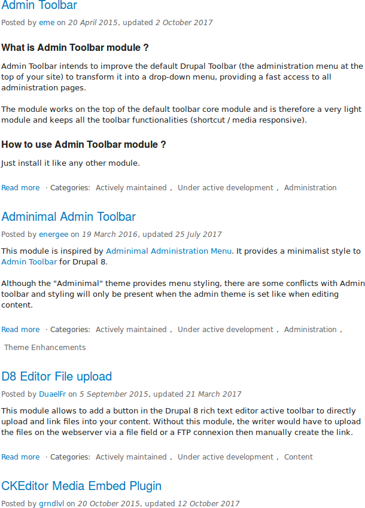
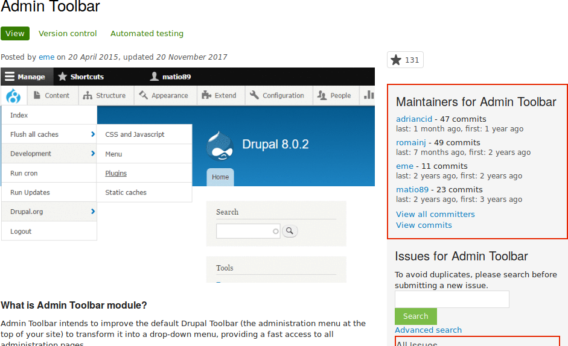

[[extend-module-find]]

=== Поиск модулей

[role="summary"]
Как искать и оценивать модули на Drupal.org.

(((Модуль,поиск)))
(((Модуль,оценка)))
(((Дополнительный модуль,поиск)))
(((Дополнительный модуль,оценка)))
(((Сайт Drupal.org,поиск и оценка модулей)))

==== Цель

Найдите и оцените модули на _Drupal.org_.

==== Необходимые знания

* <<understanding-drupal>>
* <<understanding-modules>>

//==== Site prerequisites

==== Шаги

. Зайдите на https://www.drupal.org[_Drupal.org_], и перейдите в _Download &
Extend_ > _Modules_ (https://www.drupal.org/project/project_module).

. Используйте фильтры на странице поиска модулей.
Заполните поля, как показано ниже.
+
[width="100%",frame="topbot",options="header"]
|================================
|Имя поля |Описание |Пример значения
|Статус поддержки |Насколько активно поддерживается модуль? |Активно поддерживается
|Статус разработки |Какой этап разработки проходит модуль?|Любой
|Категория модуля |Тематическая область модуля.|Администрирование
|Совместимость с ядром |Версия ядра, с которой совместим модуль.|9.x
|Статус |Статус проекта: _Sandbox projects_ — экспериментальные проекты. _Full projects_ уже утверждены, но могут быть в разработке. |Full projects
|Стабильность |Есть ли стабильный релиз.|Has a supported stable release
|Покрытие рекомендаций по безопасности |Соглашение поддерживать рекомендации по безопасности Drupal.|Has security advisory coverage
|Поиск модулей |Ищите _Admin Toolbar_, модуль, который будет рассмотрен далее. Можно оставить пустым, если не уверены, какой модуль искать.|Admin Toolbar
|Сортировать по |Порядок отображения: например, _Most installed_ (самые популярные) или _Last release_ (последний релиз).|Most installed
|================================
+
--
// Module search box on https://www.drupal.org/project/project_module.

--

. Нажмите _Search_. Появятся результаты поиска.
+
--
// Search results on https://www.drupal.org/project/project_module.

--

. Чтобы подробнее оценить модуль, кликните по его названию в списке результатов — вы попадёте на страницу проекта.

Обратите внимание на следующие аспекты при оценке модуля:

* Описание проекта: На странице модуля должно быть чёткое описание, позволяющее понять его возможности и требования.
* Информация о проекте: Могут быть предупреждения, если модуль более не разрабатывается или не покрывается рекомендациями по безопасности.
* Статистика: Количество установок и загрузок — если модуль используется мало, это может быть либо уникальным решением, либо предупреждением.
* Поддержка: Посмотрите дату последнего коммита и релиза. Если давно не было обновлений и при этом много открытых проблем — возможно, проект заброшен.
* Проблемы (Issues): Проверьте наличие открытых проблем и как быстро на них отвечают.
* Документация, ресурсы: Есть ли README или подробная документация для установки и настройки.
+
--
// Project page for Admin Toolbar module.

--

==== Расширьте своё понимание

<<extend-module-install>>

//==== Related concepts

==== Видео

// Видео от Drupalize.Me.
video::https://www.youtube-nocookie.com/embed/G-XUuSj9xYA[title="Поиск модулей"]

//==== Additional resources

*Авторы*

Написано https://www.drupal.org/u/dianalakatos[Diána Lakatos] в
https://pronovix.com//[Pronovix].

Переведено https://www.drupal.org/u/MishaIsmajlov[Михаил Исмайлов].
