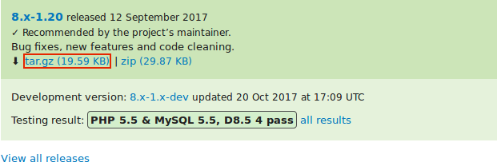
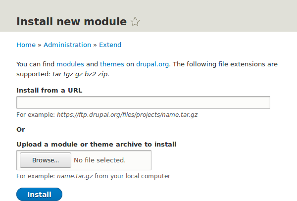

[[extend-module-install]]

=== Загрузка и установка модуля с _Drupal.org_

[role="summary"]
Как скачать и установить модуль с Drupal.org.

(((Модуль,загрузка)))
(((Модуль,установка)))
(((Модуль,включение)))
(((Модуль,дополнительный)))
(((Модуль,пользовательский)))
(((Загрузка,модуль)))
(((Установка,модуль)))
(((Включение,модуль)))
(((Дополнительный модуль,загрузка)))
(((Дополнительный модуль,установка)))
(((Функциональность,расширение)))
(((Инструмент Drush,использование для установки модуля)))
(((Admin Toolbar модуль,загрузка)))
(((Admin Toolbar модуль,установка)))
(((Модуль,Admin Toolbar)))
(((Сайт Drupal.org,загрузка и установка модуля)))

==== Цель

Загрузить и установить
https://www.drupal.org/project/admin_toolbar[дополнительный модуль Admin Toolbar],
который позволяет легко просматривать административный раздел
сайта.

==== Необходимые знания

* <<understanding-modules>>
* <<extend-module-find>>
* <<install-tools>>

==== Требования к сайту

Composer должен быть установлен для загрузки модулей. Если вы хотите использовать Drush,
Drush также должен быть установлен. Смотрите <<install-tools>>.

==== Шаги

Чтобы установить дополнительный модуль, сначала скачайте модуль с помощью Composer.
Затем установите его через административный интерфейс или Drush.
Если вы устанавливаете пользовательский модуль, который недоступен через Composer,
пропустите шаги по скачиванию модуля и обратитесь к <<extend-manual-install>>.
Затем вернитесь сюда и выполните шаги для установки модуля через административный интерфейс или Drush.

===== Скачивание дополнительного модуля через Composer

. На странице проекта _Admin toolbar_ на drupal.org
(_https://www.drupal.org/project/admin_toolbar_) прокрутите вниз до раздела _Releases_.

. Скопируйте команду Composer для нужной версии модуля.
+
--
// Releases section of the Admin Toolbar project page on Drupal.org.

--

. Или введите следующую команду (замените короткое имя и версию на нужные вам):
+
----
composer require 'drupal/admin_toolbar:^3.5'
----

. В терминале перейдите в корневую директорию вашего проекта. Вставьте и выполните команду Composer.

. Дождитесь сообщения об успешном скачивании модуля.

===== Установка модуля через административный интерфейс

. В _Управлении_ административного меню, перейдите в _Расширения_
(_admin/modules_). Откроется страница _Расширения_.

. Найдите модуль _Admin toolbar_ и поставьте галочку напротив него.
+
--
// Extend page showing Admin Toolbar module checked.

--

. Нажмите _Установить_, чтобы включить новый модуль.

===== Установка модуля через Drush

. Запустите следующую команду Drush, указав название проекта (например, `admin_toolbar`):
+
----
drush pm:enable admin_toolbar
----

. Следуйте инструкциям на экране.

==== Расширьте своё понимание

* Проверьте, что
https://www.drupal.org/project/admin_toolbar[дополнительный модуль Admin Toolbar]
работает, просматривая административное меню.

* Установите и настройте
https://www.drupal.org/project/pathauto[дополнительный модуль Pathauto]
для красивых URL-адресов контента по умолчанию. Смотрите <<content-paths>> для подробностей о ссылках.

* Если вы не видите изменений на сайте, возможно, потребуется очистить кэш. Смотрите <<prevent-cache-clear>>.

//==== Related concepts

==== Видео

// Видео от Drupalize.Me.
video::https://www.youtube-nocookie.com/embed/vx9nWJE1Kbk[title="Downloading and Installing a Module from Drupal.org"]

==== Дополнительные материалы

* https://www.drupal.org/docs/extending-drupal/installing-drupal-modules[_Drupal.org_ страница "Installing Drupal modules"]
* https://www.drupal.org/download["Download and Extend" страница на _Drupal.org_]
* https://www.drupal.org/project/admin_toolbar[Admin Toolbar модуль на _Drupal.org_]

*Авторы*

Написано и отредактировано https://www.drupal.org/u/batigolix[Boris Doesborg],
https://www.drupal.org/u/eojthebrave[Joe Shindelar] из https://drupalize.me[Drupalize.Me] и
https://www.drupal.org/u/jhodgdon[Jennifer Hodgdon].

Переведено https://www.drupal.org/u/MishaIsmajlov[Михаил Исмайлов]
