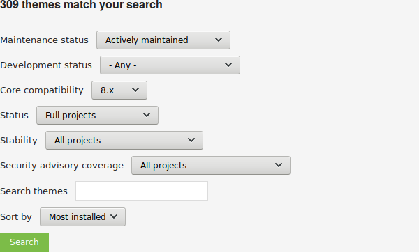
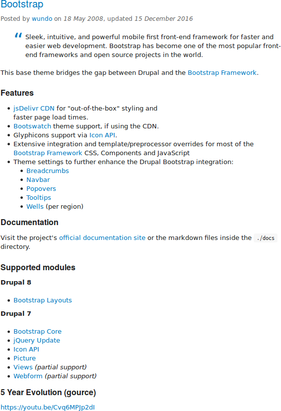

[[extend-theme-find]]

=== Поиск тем оформления

[role="summary"]
Как использовать фильтры для поиска тем и их оценки.

(((Тема,поиск)))
(((Тема,оценка)))
(((Дополнительная тема,поиск)))
(((Дополнительная тема,оценка)))
(((Сайт Drupal.org,поиск и оценка тем)))

==== Цель

Найти и оценить темы на _Drupal.org_.

==== Необходимые знания

* <<understanding-drupal>>
* <<understanding-themes>>

//==== Site prerequisites

==== Шаги

. Перейдите на https://www.drupal.org и откройте _Download & Extend > Themes_
(https://www.drupal.org/project/project_theme).

. Отфильтруйте поиск, используя категории на странице поиска тем.
Например, вы можете использовать такие фильтры:
+
[width="100%",frame="topbot",options="header"]
|================================
|Имя поля |Объяснение |Пример значения
|Maintenance status |Насколько активно поддерживается тема? Если тема активно
 поддерживается, можно ожидать регулярные исправления ошибок и улучшения.
 |Actively maintained
|Development status |На каком этапе разработки тема? Если выбрано _Under active development_, ожидаются новые функции,
 и некоторые аспекты темы могут измениться. Если выбрано _Maintenance fixes only_, это значит,
 что тема считается завершённой. |Any
|Core compatibility |Версия Drupal, с которой тема совместима.|9.x
|Status |_Sandbox projects_ — экспериментальные проекты. _Full projects_ уже
 прошли процесс утверждения, но всё ещё могут находиться в разработке.|Full projects
|Stability | Есть ли у проекта стабильная версия, готовая для использования на рабочем сайте.
 |Has a supported stable release
|Security advisory coverage | Согласился ли мейнтейнер следовать процедурам Drupal Security Team. |Has security advisory coverage
|Search themes |Поиск по ключевым словам в описании темы.|-
|Sort by |Упорядочить результаты поиска по критериям, например _Most installed_ (популярные темы,
 которые используют многие сайты) или _Last release_ (дата последнего релиза). |Most installed
|================================
+
--
// Theme search box on https://www.drupal.org/project/project_theme.

--

. Нажмите _Search_. Появятся результаты поиска.
+
--
// Search results on https://www.drupal.org/project/project_theme.

--

. Для более детальной оценки темы щёлкните её название в списке результатов поиска,
чтобы открыть страницу проекта.

Некоторые аспекты, на которые стоит обратить внимание при оценке тем:

* Введение: Описание темы на странице проекта должно быть ясным и полезным. Скриншот темы
также поможет оценить её.

* Информация о проекте: В этой области могут быть предупреждения, например,
если тема больше не поддерживается или не попадает под политику безопасности.

* Информация о проекте > Количество установок, загрузок: Можно увидеть,
сколько людей скачали тему и сколько сайтов её используют.

* Проблемы (Issues): Посмотрите, есть ли открытые проблемы, потенциальные баги. Проверьте
статистику — как быстро реагируют на обращения.

* Документация, ресурсы: Посмотрите, есть ли у темы документация или файл README,
который поможет установить, настроить и протестировать тему.

==== Расширьте своё понимание

* <<extend-theme-install>>

//==== Related concepts

==== Видео

// Video from Drupalize.Me.
video::https://www.youtube-nocookie.com/embed/M8LYX6K53jg[title="Finding Themes"]

//==== Additional resources

*Авторы*

Написано https://www.drupal.org/u/dianalakatos[Diána Lakatos].

Переведено https://www.drupal.org/u/MishaIsmajlov[Михаил Исмайлов].
