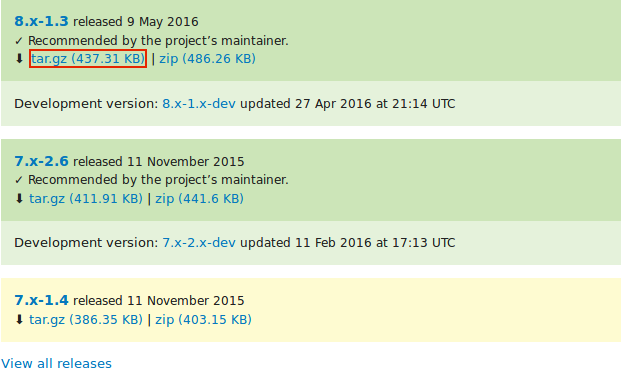
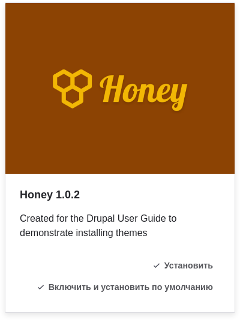

[[extend-theme-install]]

=== Загрузка и установка темы оформления с _Drupal.org_

[role="summary"]
Как загрузить и установить тему оформления с Drupal.org.

(((Тема,загрузка)))
(((Тема,установка)))
(((Тема,включение)))
(((Тема,дополнительная)))
(((Тема,пользовательская)))
(((Дополнительная тема,загрузка)))
(((Дополнительная тема,установка)))
(((Дополнительная тема,включение)))
(((Пользовательская тема,установка)))
(((Пользовательская тема,включение)))
(((Загрузка,тема)))
(((Установка,тема)))
(((Включение,тема)))
(((Drush инструмент,использование для установки темы)))
(((Drupal.org сайт,загрузка и установка темы из)))

==== Цель

Загрузить и установить тему оформления с _Drupal.org_.

==== Необходимые знания

* <<extend-theme-find>>
* <<install-tools>>

==== Требования к сайту

Для загрузки тем должен быть установлен Composer. Если вы хотите использовать Drush, Drush
должен быть установлен. Смотрите <<install-tools>>.

==== Шаги

Чтобы установить дополнительную тему, сначала загрузите тему с помощью Composer. Затем
установите её через административный интерфейс или с помощью Drush. Если вы
устанавливаете пользовательскую тему, а не дополнительную тему, которая недоступна
через Composer, пропустите шаги по загрузке темы и смотрите
<<extend-manual-install>>. Затем вернитесь сюда и выполните шаги по установке
темы через административный интерфейс или Drush.

===== Загрузка дополнительной темы с помощью Composer

. На странице темы проекта на drupal.org (например,
_https://www.drupal.org/project/honey_), прокрутите вниз к разделу _Releases_.

. Скопируйте предоставленную Composer-команду для версии темы, которую вы хотите
установить.
+
--
// Раздел Releases на странице проекта темы на drupal.org.

--

. Либо выполните следующую команду (подставив короткое имя темы и нужную версию вместо +honey:^1.0+):
+
----
composer require 'drupal/honey:^1.0'
----

. В командной строке перейдите в корневую директорию вашего проекта. Вставьте
Composer-команду и выполните её.

. Вы должны увидеть сообщение об успешной загрузке темы.

===== Установка темы через административный интерфейс

. В _Управлении_ административного меню перейдите в _Оформление_
(_admin/appearance_). Появится страница _Оформление_.

. Найдите новую тему в разделе _Неустановленные темы_ и нажмите _Установить и назначить по умолчанию_
для её использования. Все неадминистративные страницы сайта теперь будут использовать
эту тему.
+
--
// Honey theme on the Appearance page.

--

===== Установка темы с помощью Drush

. Чтобы установить тему и назначить её по умолчанию, выполните следующие команды Drush,
указав имя проекта (например, _honey_) в качестве параметра:
+
----
drush theme:enable honey
drush config:set system.theme default honey
----

. Следуйте инструкциям на экране.

==== Расширьте своё понимание

* В _Управлении_ административного меню перейдите в _Оформление_
(_admin/appearance_) и удалите темы, которые вы не используете.

* <<extend-module-find>>

* <<extend-module-install>>

* Если вы не видите изменений на вашем сайте, возможно, вам нужно
очистить кэш. Смотрите <<prevent-cache-clear>>.

// ==== Related concepts

==== Видео

// Video from Drupalize.Me.
video::https://www.youtube-nocookie.com/embed/UFgddj0F_bU[title="Downloading and Installing a Theme from Drupal.org"]

//==== Additional resources

*Авторы*

Написано и отредактировано https://www.drupal.org/u/eojthebrave[Joe Shindelar] в
https://drupalize.me[Drupalize.Me], и
https://www.drupal.org/u/batigolix[Boris Doesborgh].

Переведено https://www.drupal.org/u/MishaIsmajlov[Михаил Исмайлов]
