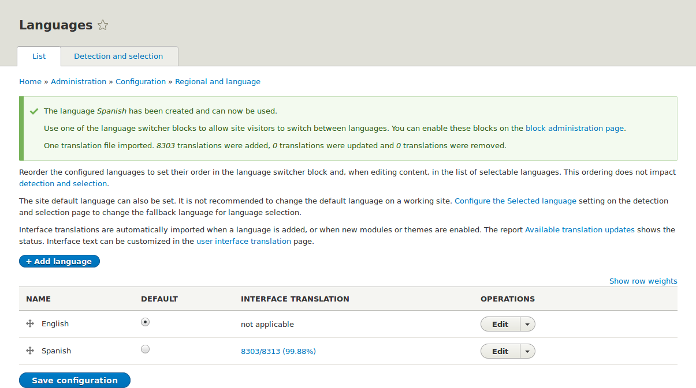

[[language-add]]

=== Добавление языка

[role="summary"]
Как добавить язык, установить необходимые модули и включить блок _Language switcher_.

(((Язык,добавление)))
(((Многоязычные модули,установка)))
(((Многоязычные модули,включение)))
(((Language,модуль,установка)))
(((Content Translation,модуль,установка)))
(((Configuration Translation,модуль,установка)))
(((Interface Translation,модуль,установка)))
(((Модуль,Language)))
(((Модуль,Content Translation)))
(((Модуль,Configuration Translation)))
(((Модуль,Interface Translation)))

==== Цель

Добавить один или несколько языков на сайт и определить, какой язык будет использоваться по умолчанию.

==== Необходимые знания

<<language-concept>>

==== Шаги

. Установите четыре основных многоязычных модуля (Language, Interface Translation, Content Translation и Configuration Translation), следуя инструкциям в <<config-install>>.

. В административном меню _Управление_ перейдите в _Конфигурация_ > _Регион и язык_ > _Языки_ (_admin/config/regional/language_).

. Нажмите _Добавить язык_.

. Выберите _Spanish_ (или предпочитаемый вами язык) из списка _Название языка_. Нажмите _Добавить язык_. После загрузки переводов вы вернетесь на страницу _Языки_ с подтверждением и новым языком в списке.
+
--
// Confirmation and language list after adding Spanish language.

--

. Следуйте инструкциям из <<block-place>>, чтобы разместить блок _Language switcher_ в регионе _Sidebar second_. Это позволит посетителям сайта переключаться между языками, как только сайт будет переведен.

==== Расширьте свое понимание

* <<language-content-config>>
* <<language-content-translate>>

==== Видео

// Video from Drupalize.Me.
video::https://www.youtube-nocookie.com/embed/8Yu0G4gJ0f4[title="Adding a Language"]

==== Дополнительные материалы

https://www.drupal.org/docs/multilingual-guide[_Drupal.org_: Multilingual guide]

*Авторы*

Написано и отредактировано https://www.drupal.org/u/yrvyn[Leila Tite], https://www.drupal.org/u/jhodgdon[Jennifer Hodgdon], и https://www.drupal.org/u/batigolix[Boris Doesborg].

Переведено https://www.drupal.org/u/MishaIsmajlov[Михаил Исмайлов].
