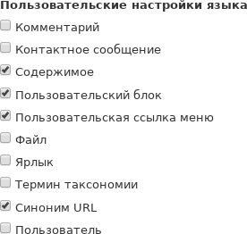
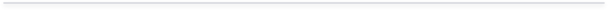
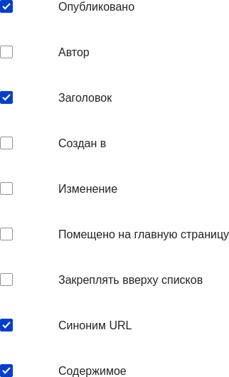

[[language-content-config]]

=== Настройка перевода содержимого

[role="summary"]
Как сделать материалы, пользовательские блоки и ссылки меню переводимыми.

(((Содержимое,перевод)))
(((Настройка,перевод содержимого)))

==== Цель

Сделать типы сущностей _Пользовательский блок_, _Пользовательская ссылка меню_ и _Содержимое_ переводимыми. Отметить нужные подтипы и выбрать поля, доступные для перевода.

==== Необходимые знания

* <<planning-data-types>>
* <<language-concept>>

==== Требования к сайту

Модуль ядра Content Translation должен быть установлен, и на сайте должно быть как минимум два языка. См. <<language-add>>.

==== Шаги

. В административном меню _Управление_ перейдите в _Конфигурация_ > _Регион и язык_ > _Язык содержимого и перевод_ (_admin/config/regional/content-language_).

. В разделе _Пользовательские языковые настройки_ отметьте _Содержимое_, _Пользовательский блок_ и _Пользовательская ссылка меню_, чтобы сделать эти типы сущностей переводимыми.
+
--
// Верхняя часть страницы Языковые настройки содержимого

--

. Появятся параметры конфигурации для _Содержимого_, _Пользовательского блока_ и _Пользовательской ссылки меню_. Выберите нужные подтипы для перевода. Например, отметьте _Basic page_ для _Содержимого_, _Basic block_ для _Пользовательского блока_ и _Custom menu link_ для _Пользовательской ссылки меню_.

. Проверьте параметры для каждого подтипа сущности:
+
[width="100%",frame="topbot",options="header"]
|================================
|Название поля | Описание | Пример значения
| Язык по умолчанию | Язык по умолчанию для данного подтипа сущности | Язык сайта по умолчанию (например, русский)
| Показывать выбор языка на страницах создания и редактирования | Отображать ли переключатель языка при создании/редактировании | Отмечено
|================================
+
--
// Основная область настроек для перевода пользовательских блоков

--

. Отметьте поля, которые должны быть переводимыми для _Basic page_ (Простая страница), как указано ниже. Если поле не зависит от языка, оставьте его неотмеченным.
+
[width="100%",frame="topbot",options="header"]
|================================
|Название поля | Описание | Пример значения
| Заголовок | Заголовок содержимого | Отмечено
| Автор | Автор материала | Не отмечено
| Опубликовано | Статус публикации | Отмечено
| Дата создания | Дата публикации | Не отмечено
| Дата изменения | Дата последнего изменения | Не отмечено
| Продвижение на главную | Включение в отдельные представления | Не отмечено
| Закреплять вверху списков | Приоритет в выводе материалов | Не отмечено
| Синоним URL | ЧПУ для содержимого | Отмечено
| Основной текст | Основной контент страницы | Отмечено
|================================
+
--
// Область настройки переводимых полей для Basic page

--

. Аналогичным образом отметьте переводимые поля для _Basic block_ и _Custom menu link_.

. Нажмите _Сохранить конфигурацию_.

==== Расширьте своё понимание

* <<language-config-translate>>
* <<language-content-translate>>

==== Видео

video::https://www.youtube-nocookie.com/embed/b_w904_pcTY[title="Configuring Content Translation"]

==== Дополнительные ресурсы

* http://hojtsy.hu/blog/2013-jun-21/drupal-8-multilingual-tidbits-5-almost-limitless-language-assignment[Блог "Multilingual Drupal 8 tidbits, part 5"]
* http://hojtsy.hu/blog/2015-jan-27/drupal-8-multilingual-tidbits-17-content-translation-basics[Блог "Multilingual Drupal 8 tidbits, part 17"]

*Авторы*

Написано и отредактировано https://www.drupal.org/u/lolk[Laura Vass] (Pronovix),
https://www.drupal.org/u/jojyja[Jojy Alphonso] (Red Crackle),
и https://www.drupal.org/u/jhodgdon[Jennifer Hodgdon].

Переведено https://www.drupal.org/u/MishaIsmajlov[Михаил Исмайлов].
