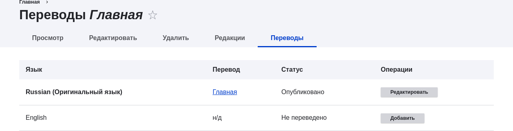

[[language-content-translate]]

=== Перевод контента

[role="summary"]
Как перевести страницу на другой язык.

(((Содержимое,перевод)))
(((Перевод,содержимое)))

==== Цель

Перевести домашнюю страницу на испанский язык.

==== Необходимые знания

<<language-concept>>

==== Требования к сайту

* Должен существовать материал "Главная страница". См. <<content-create>>.
* Модуль ядра Content Translation должен быть установлен, и на сайте должно быть как минимум два языка. См. <<language-add>>.
* Тип материала _Страница_ должен быть настроен как переводимый. См. <<language-content-config>>.

==== Шаги

. В административном меню _Управление_ перейдите в _Содержимое_ (_admin/content_).
. Найдите домашнюю страницу. Для поиска можно ввести "Главная" в поле заголовка.
. В строке материала "Главная" выберите _Переводы_ из выпадающего меню. Откроется страница _Переводы: Главная страница_.
. Нажмите _Добавить_ в строке _Spanish_ (Испанский).
+
--
// Скриншот страницы перевода для материала Главная страница.

--

. Обратите внимание, что пользовательский интерфейс переключился на испанский. Чтобы вернуть его на русский, удалите первую часть _es_ из URL-адреса браузера. Например, если ваш URL выглядит как _example.com/es/node/5/translations/add/en/es_, удалите _es_, который идет сразу после _example.com_.

. Заполните поля, как показано ниже:
+
[width="100%",frame="topbot",options="header"]
|================================
|Название поля | Описание | Значение
|Заголовок | Переведённый заголовок страницы | Página principal
|Содержимое | Переведённый текст страницы |
Bienvenido al mercado de la ciudad - ¡el mercado de agricultores de tu barrio!
Horario: Domingos de 9:00 a 14:00. Desde Abril a Septiembre
Lugar: parking del Banco Trust número 1. En el centro de la ciudad
|Синоним URL | Переведённый адрес веб-страницы | pagina-principal
|================================

. Нажмите _Сохранить (этот перевод)_.
. Перейдите на домашнюю страницу сайта, чтобы увидеть недавно добавленный перевод.

==== Расширьте своё понимание

* Повторите эти шаги для перевода других материалов на вашем сайте.
* <<language-config-translate>>

==== Видео

// Видео с Drupalize.Me.
video::https://www.youtube-nocookie.com/embed/TOalcUYD5zM[title="Translating Content"]

// ==== Additional resources

*Авторы*

Написано https://www.drupal.org/u/batigolix[Boris Doesborg].

Переведено https://www.drupal.org/u/MishaIsmajlov[Михаил Исмайлов].
