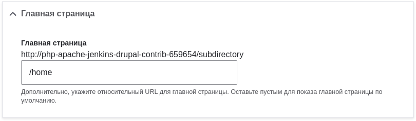
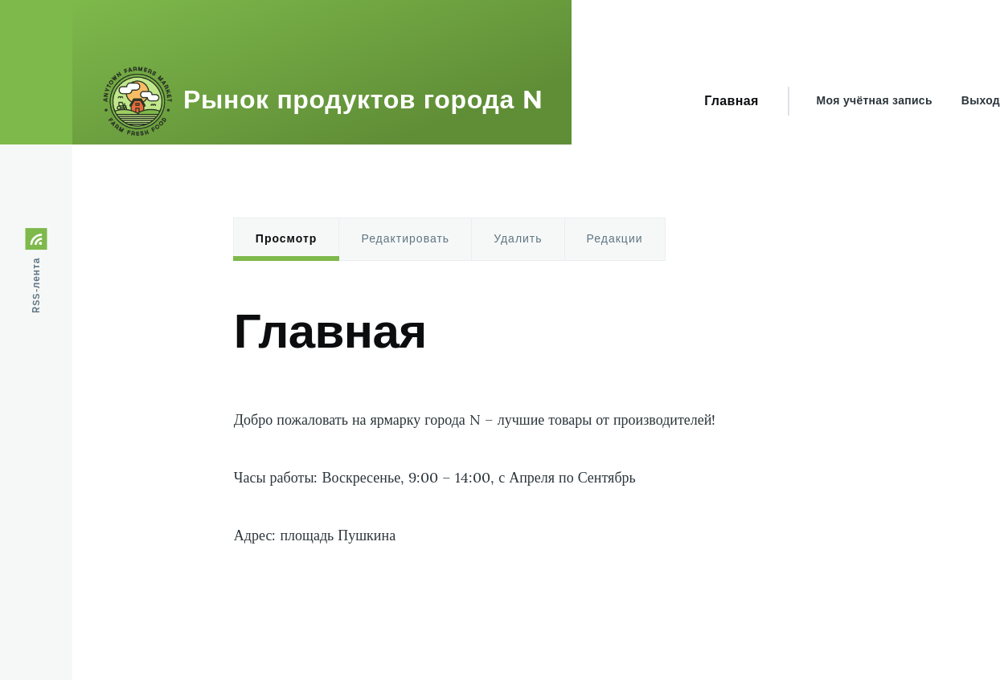

[[menu-home]]

=== Настройка главной страницы

[role="summary"]
Как выбрать материал, который будет отображаться в качестве главной страницы сайта.

(((Главная страница, настройка)))
(((Начальная страница, настройка)))
(((Настройка, главная страница)))

==== Цель

Настроить, какой материал будет показываться в качестве главной (начальной) страницы вашего сайта.

==== Требования к сайту

Материал, который вы хотите сделать главной страницей сайта, должен быть уже создан. См. <<content-create>>.

==== Шаги

. В административном меню _Управление_ перейдите в _Конфигурация_ > _Система_ > _Основные настройки сайта_ (_admin/config/system/site-information_).

. В поле _Начальная страница_ замените _/node_ на путь к странице, которую вы хотите сделать главной. Чтобы использовать ранее созданную страницу "Главная", укажите путь _/home_. Нажмите _Сохранить настройки_.
+
--
// Блок "Начальная страница" на admin/config/system/site-information.

--

. Перейдите на главную страницу сайта и убедитесь, что отображается нужное содержимое.
+
--
// Главная страница после настройки для показа материала "Главная".

--

==== Узнать больше

* <<menu-link-from-content>>
* Выполните <<content-create>>, чтобы создать страницу ошибки, которую можно будет назначить для 404 (страница не найдена) или 403 (нет доступа) в разделе _Страницы ошибок_ этой же конфигурации.

==== Связанные понятия

<<menu-concept>>

==== Видео

// Видео от Drupalize.Me.
video::https://www.youtube-nocookie.com/embed/qOL8arBYpJ4[title="Назначение главной страницы сайта"]

//==== Дополнительные ресурсы

*Авторы*

Написано и отредактировано: https://www.drupal.org/u/AnnGreazel[Ann Greazel], https://www.drupal.org/u/jerseycheese[Jack Haas], и https://www.drupal.org/u/jojyja[Jojy Alphonso] из http://redcrackle.com[Red Crackle].

Переведено: https://www.drupal.org/u/asdasha[Аземша Дарья].
