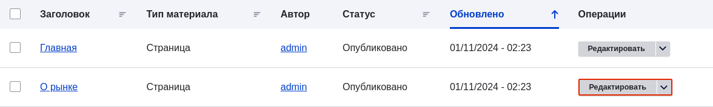
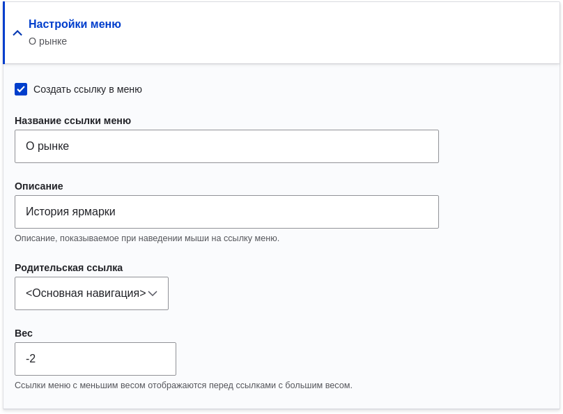
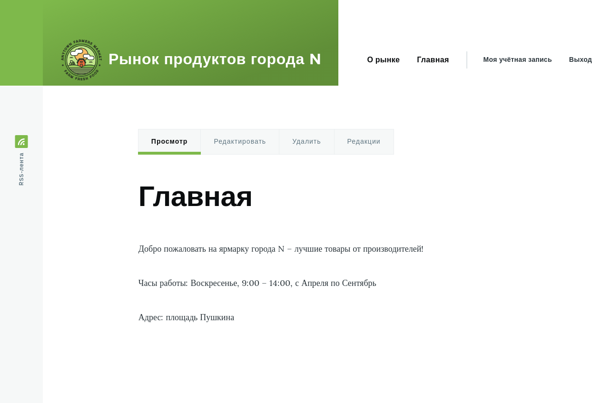

[[menu-link-from-content]]
=== Добавление страницы в меню навигации

[role="summary"]
Как добавить страницу в меню сайта при редактировании содержимого.

(((Меню,добавление ссылки на страницу)))
(((Страница,добавление в меню при редактировании)))
(((Содержимое,добавление в меню при редактировании)))
(((Навигация,добавление ссылки на страницу)))

==== Цель

Добавить страницу в меню навигации сайта. Например, добавить страницу "О рынке".

==== Необходимые знания

* <<menu-concept>>
* <<content-edit>>

==== Требования к сайту

Страница "О рынке" уже должна быть создана. См. <<content-create>>.

==== Шаги

. В административном меню _Управление_ перейдите в _Содержимое_ (_admin/content_).

. Найдите страницу "О рынке" в списке и нажмите _Редактировать_ в её строке. Откроется форма редактирования материала.
+
--
// Таблица содержимого на admin/content с красной рамкой вокруг кнопки "Редактировать" для страницы "О рынке".

--

. Справа найдите и разверните вкладку _Настройки меню_.

. Установите флажок _Создать ссылку в меню_, чтобы появились дополнительные поля настроек.

. Заполните поля следующим образом:
+
[width="100%",frame="topbot",options="header"]
|================================
|Название поля         |Описание                                                  |Пример значения
|Название ссылки меню  |Текст ссылки, который будет отображаться в меню           | О рынке
|Описание              |Текст-подсказка, который показывается при наведении       | История ярмарки
|Родительская ссылка   |Место расположения в иерархии меню. Например, выберите _<Основная навигация>_, чтобы разместить ссылку на верхнем уровне меню. Если выбрать другую ссылку как родительскую, можно создать вложенность меню. | <Основная навигация>
|Вес                   |Порядок вывода ссылки в меню (меньший вес — выше в списке)| -2
|================================
+
--
// Блок "Настройки меню" в форме редактирования содержимого.

--

. Нажмите _Сохранить_, чтобы применить изменения. Затем нажмите _Главная_ или _Вернуться на сайт_ в навигационной панели и убедитесь, что новая ссылка появилась в главном меню.
+
--
// Главная страница после добавления страницы "О рынке" в меню навигации.

--

==== Узнать больше

<<menu-reorder>>

==== Видео

// Видео от Drupalize.Me.
video::https://www.youtube-nocookie.com/embed/JE_3INtBcTw[title="Добавление страницы в меню навигации"]

==== Дополнительные ресурсы

https://www.drupal.org/docs/core-modules-and-themes/core-modules/menu-ui-module/adding-a-link-to-a-menu[_Drupal.org_ — документация "Добавление ссылки в меню"]

*Авторы*

Адаптировано https://www.drupal.org/u/batigolix[Boris Doesborg] из
https://www.drupal.org/docs/core-modules-and-themes/core-modules/menu-ui-module/adding-a-link-to-a-menu["Adding a link to a menu"],
авторские права 2000-copyright_upper_year за отдельными участниками
https://www.drupal.org/documentation[Drupal Community Documentation];
отредактировано https://www.drupal.org/u/jerseycheese[Jack Haas].

Перевод: https://www.drupal.org/u/igorsh[Игорь Шабальников].
