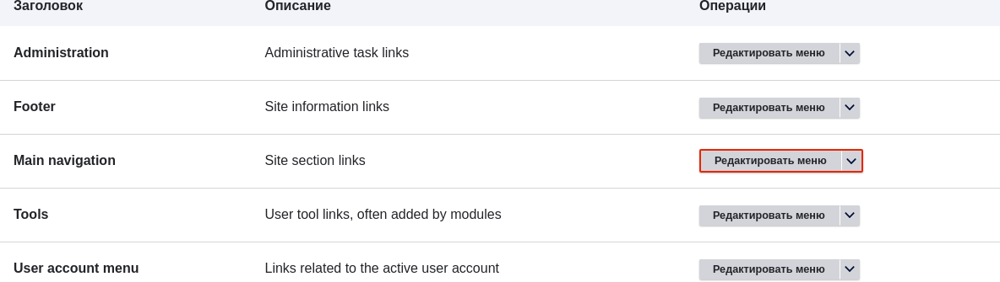
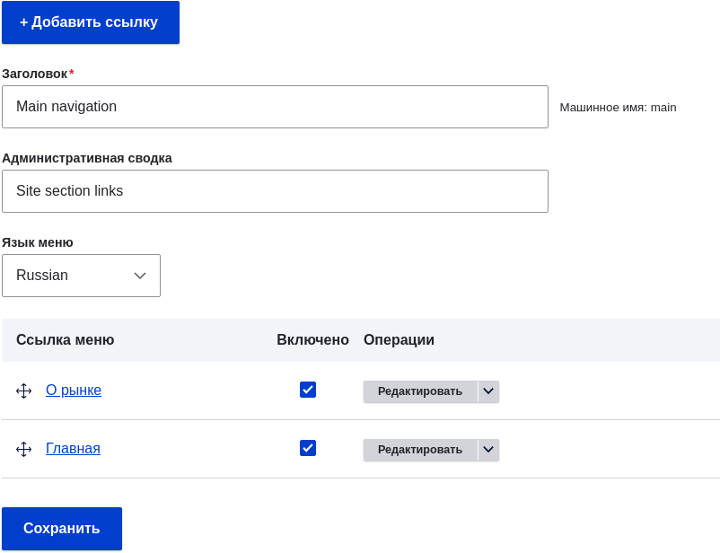
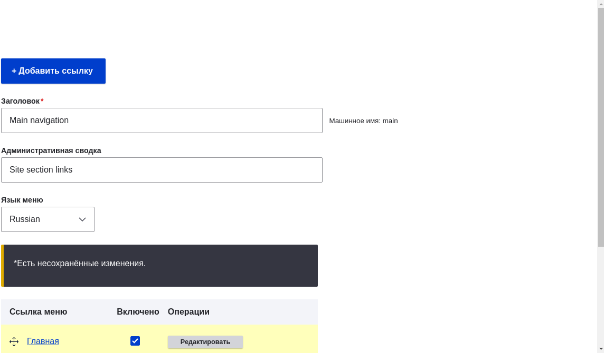

[[menu-reorder]]
=== Изменение порядка ссылок в меню

[role="summary"]
Как изменить порядок ссылок в меню.

(((Ссылки меню, изменение порядка)))
(((Навигация, изменение порядка ссылок меню)))

==== Цель

Изменить порядок вывода ссылок в меню.

==== Необходимые знания

* <<menu-concept>>
* <<menu-link-from-content>>

==== Требования к сайту

В меню основной навигации уже должны быть добавлены страницы "Главная" и "О рынке". См. <<menu-link-from-content>>.

==== Шаги

. В административном меню _Управление_ перейдите в _Структура_ > _Меню_ (_admin/structure/menu_), где отображаются все меню сайта. В строке _Основная навигация_ выберите _Редактировать меню_ в выпадающем списке _Операции_. На эту страницу можно попасть и через контекстные ссылки (см. <<config-overview>>). Обратите внимание, что названия и описания меню, добавленных при установке, могут отображаться на английском языке; подробнее — см. <<language-concept>>.
+
--
// Раздел списка меню на admin/structure/menu, с выделенной кнопкой "Редактировать меню" для Main navigation.

--

. На странице _Редактировать меню_ будет представлен список всех ссылок этого меню (_Основная навигация_).
+
--
// Раздел ссылок меню на admin/structure/menu/manage/main.

--

. Перетащите значки-перекрестия напротив нужных ссылок для изменения порядка, чтобы, например, "Главная" была первой, а "О рынке" — второй. Альтернативно можно нажать _Показать веса строк_ и назначить числовой вес (чем меньше/отрицательнее значение, тем выше ссылка в меню).
+
--
// Раздел ссылок меню после изменения порядка.

--

. Нажмите _Сохранить_.

. Теперь на главной странице в меню первой отображается ссылка "Главная".
+
--
// Шапка главной страницы с изменённым порядком ссылок меню.

--

==== Расширьте своё понимание

Добавьте ссылку _Контакт_, ведущую на страницу _/contact_, в меню основной навигации. Эта страница создаётся основным модулем Contact. При необходимости настройте её поля и расположение (см. <<structure-form-editing>>).

==== Связанные понятия

<<menu-concept>>

==== Видео

// Видео от Drupalize.Me.
video::https://www.youtube-nocookie.com/embed/OtT8e8lLx5E[title="Changing the Order of Navigation"]

//==== Дополнительные ресурсы

*Авторы*

Написано https://www.drupal.org/u/AnnGreazel[Ann Greazel].

Перевод: https://www.drupal.org/u/igorsh[Игорь Шабальников].
