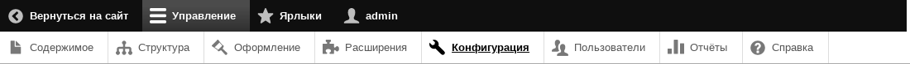
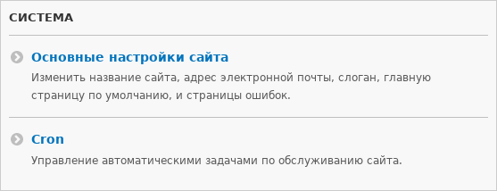

[[preface-conventions]]
=== Условные обозначения Руководства

[role="summary"]
Объяснение обозначений, используемых в этом руководстве.

==== Предположения и предварительные требования

В этом руководстве приняты следующие предположения и предварительные требования:

* Руководство охватывает текущую основную версию основного программного обеспечения.

* Руководство организовано по темам; см. <<preface-organization>> для подробностей.
Многие темы содержат раздел _Необходимые знания_, в котором перечислены другие
темы, знания из которых нужны для понимания текущей темы. Также предполагается некоторое фоновое знание, не охваченное в руководстве; см. <<preface-audience>> для подробностей.

* Во многих практических темах приведён список _Требования к сайту_, то есть задач, которые необходимо выполнить на сайте перед выполнением задачи, описанной в теме.

* Конкретика требований к сайту связана со сценарием, используемым в этом руководстве —
созданием сайта для городского рынка (см. <<preface-scenario>> для подробностей).
Вы можете адаптировать задания под свой сценарий, но вам также потребуется помнить об изменениях, чтобы убедиться, что ваш сайт соответствует требованиям для задачи.

* Для всех практических тем после <<install-run>> существует также неявное требование:
у вас должна быть установлена последняя стабильная версия системы управления содержимым на вашем сайте, а также вы должны быть авторизованы под учетной записью с достаточными правами для выполнения задачи (например, под учетной записью, созданной при установке сайта, обладающей всеми правами).

* Если вы будете читать все темы по порядку и выполнять все шаги в практических заданиях по мере продвижения (не выходя из системы), вы будете обладать необходимыми знаниями и требования к сайту будут выполнены для каждой темы по мере чтения.

* Руководство показывает, как выполнять задачи с помощью административного пользовательского интерфейса, а также, где возможно, с помощью последней стабильной версии инструмента командной строки Drush (см. <<install-tools>>). Вы можете использовать только административный интерфейс, если вам так удобнее.

==== Обозначения в тексте

В тексте руководства используются следующие обозначения:

* URL _example.com_ означает базовый адрес вашего сайта. Подробнее о том, как в руководстве указываются внутренние адреса сайта, смотрите в разделе Навигация ниже.

* Текст, который вы должны увидеть в пользовательском интерфейсе сайта, выделяется _курсивом_, например: Нажмите _Сохранить настройки_. Это относится только к тексту интерфейса, встроенному в программное обеспечение, а не к введённому ранее тексту. Например, в теме о редактировании вы можете увидеть инструкцию: Нажмите _Редактировать_ в строке страницы О рынке (_Редактировать_ будет курсивом, а О рынке — нет, потому что страница была создана в предыдущей теме).

* URL-адреса, имена файлов и впервые встречающиеся термины также выделяются _курсивом_.

* Текст, который нужно ввести в командной строке, отображается моноширинным шрифтом, например:
+
----
drush cache:rebuild
----

* В данном руководстве слово _каталог_ всегда используется для обозначения файловых директорий (которые иногда называют _папками_).

==== Навигация

Для выполнения большинства практических заданий из этого руководства вам потребуется переходить на одну или несколько страниц административного интерфейса сайта. В инструкциях вы увидите, например, следующее (это станет понятнее после установки основного ПО):

=============
В административном меню _Управление_ перейдите в
_Структура_ > _Таксономия_ (_admin/structure/taxonomy_).
=============

Такие инструкции предполагают, что у вас установлен модуль Toolbar, и пример означает, что в верхней панели меню сайта нужно нажать _Управление_, затем _Структура_, затем _Таксономия_, после чего вы окажетесь на странице с адресом _http://example.com/admin/structure/taxonomy_ (если базовый адрес сайта — _http://example.com_).

// Top navigation bar on any admin page, with Manage menu showing.

Вот ещё пример:

=============
В административном меню _Управление_ перейдите в
_Конфигурация_ > _Система_ > _Основные настройки сайта_
(_admin/config/system/site-information_).
=============

В этом примере после нажатия _Управление_ и _Конфигурация_ нужно найти раздел _Система_ и в нём нажать _Основные настройки сайта_. В результате вы окажетесь на странице _http://example.com/admin/config/system/site-information_.

// System section of admin/config page.

Ещё одно замечание: если вы используете стандартную административную тему Seven, многие кнопки "Добавить" в интерфейсе показываются со знаком +. Например, на admin/content кнопка Добавить новый контент будет _+ Add new content_. Однако это зависит от темы и не обязательно отображается как часть текста кнопки (например, этот плюс может не прочитать скринридер), поэтому в этом руководстве не принято указывать знак + на кнопках.

==== Заполнение форм

Во многих практических заданиях этого руководства есть шаги по заполнению веб-форм. Обычно приводится скриншот формы и таблица значений для каждого поля формы. Например, вы можете увидеть такую таблицу, описывающую форму основных настроек сайта (_Конфигурация_ > _Система_ > _Информация о сайте_):

[width="100%",frame="topbot",options="header"]
|================================
|Имя поля|Объяснение|Пример значения
|Детали сайта > Имя сайта|Название вашего сайта|Ярмарка города N
|================================

Чтобы воспользоваться этой таблицей, найдите в форме поле с меткой _Имя сайта_ в разделе _Детали сайта_ и введите туда название сайта. В качестве примера в таблице предложено имя "Ярмарка города N", связанное со сценарием создания сайта для городского рынка, который используется по всему руководству (см. <<preface-scenario>> для подробностей). Также обратите внимание, что на некоторых формах может потребоваться кликнуть по заголовку раздела (например, _Детали сайта_), чтобы развернуть его и увидеть нужное поле.

*Авторы*

Написано/отредактировано https://www.drupal.org/u/jhodgdon[Jennifer Hodgdon].

Переведено https://www.drupal.org/u/levmyshkin[Абраменко Иван] из https://drupalbook.org/ru[DrupalBook].
