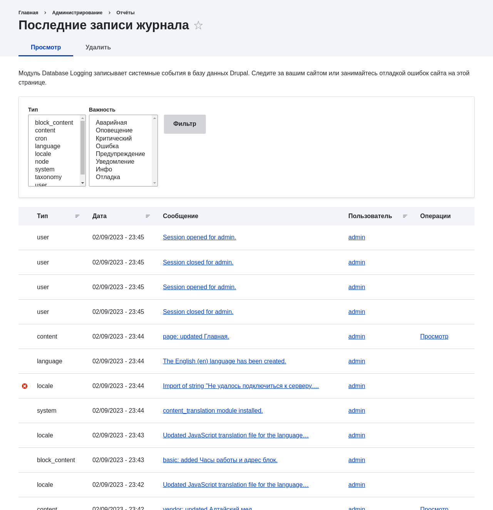

[[prevent-log]]

=== Основы: Логи

[role="summary"]
Обзор логов и где найти последние сообщения лога.

(((Логи,обзор)))
(((Отчеты,Последние сообщения журнала)))
(((Ошибки,отчёт журнала)))
(((Поиск ошибок,отчёт журнала)))
(((Производительность,отчёт журнала)))

//==== Prerequisite knowledge

==== Что такое Лог?

Ваш сайт фиксирует системные события в логах для последующего просмотра авторизованным пользователем.
Лог — это список зафиксированных событий,
содержащий данные об использовании, производительности, ошибки, предупреждения и служебную
информацию. Очень важно регулярно проверять логи, так как это часто
единственный способ узнать, что происходит на сайте.

Вы можете найти последние сообщения лога в _Управление_ административного меню,
перейдя в _Отчёты_ > _Последние сообщения журнала_ (_admin/reports/dblog_).
Эти логи могут очищаться администраторами и автоматическими задачами cron, поэтому их не следует использовать для https://en.wikipedia.org/wiki/Audit_trail[форензик-логирования]. Для таких целей используйте модуль Syslog.

// Recent log messages report (admin/reports/dblog).

//==== Related topics

//==== Additional resources

*Авторы*

Адаптировано https://www.drupal.org/u/dianalakatos[Diána Lakatos]
из https://www.drupal.org/docs/7/monitoring-a-site/reports["Reports"]
авторские права 2000-copyright_upper_year за отдельными участниками
https://www.drupal.org/documentation[Drupal Community Documentation].

Переведено https://www.drupal.org/u/levmyshkin[Абраменко Иван] из https://drupalbook.org/ru[DrupalBook].
