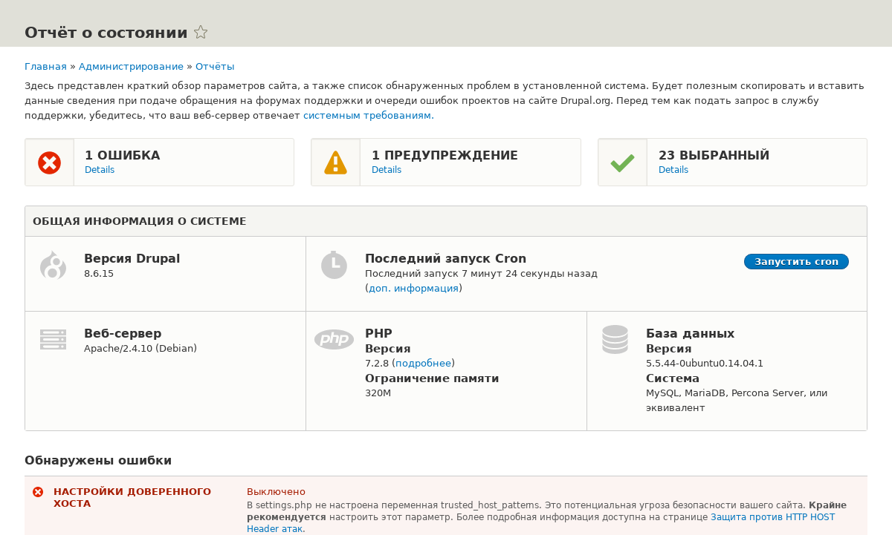

[[prevent-status]]

=== Основы: Отчет о состоянии

[role="summary"]
Обзор отчета о состоянии и где его найти на сайте.

(((Отчет о состоянии,обзор)))
(((Безопасность,отчет о состоянии)))
(((PHP версия,отчет о состоянии)))
(((Версия программного обеспечения,отчет о состоянии)))
(((Статус обновления,отчет о состоянии)))
(((Обновление,отчет о состоянии)))
(((Информация о сайте,отчет о состоянии)))
(((Информация о сервере,отчет о состоянии)))
(((Производительность,отчет о состоянии)))
(((Поиск проблем,отчет о состоянии)))

//==== Prerequisite knowledge

==== Что такое Отчет о состоянии?

Отчет о состоянии — это краткий обзор параметров вашего сайта, а также любых
проблем, обнаруженных при установке. Может быть полезно скопировать и вставить
эту информацию в обращения на форумах поддержки _Drupal.org_ или в очереди задач проектов, а также при обращении за помощью в других каналах.

Вы можете найти отчет о состоянии в _Управление_ административного меню,
перейдя в _Отчеты_ > _Отчет о состоянии_ (_admin/reports/status_).

// Status report (admin/reports/status).

==== Связанные темы

<<thoughts-support>>

==== Дополнительные материалы

Если у вас возникает ошибка о trusted host settings в отчете о состоянии, смотрите
https://www.drupal.org/docs/installing-drupal/trusted-host-settings[_Drupal.org_ страница документации сообщества "Trusted Host settings"].

*Авторы*

Адаптировано https://www.drupal.org/u/dianalakatos[Diána Lakatos]
из https://www.drupal.org/docs/7/monitoring-a-site/reports["Reports"]
авторские права 2000-copyright_upper_year за отдельными участниками
https://www.drupal.org/documentation[Drupal Community Documentation]

Переведено https://www.drupal.org/u/MishaIsmajlov[Михаил Исмайлов].
