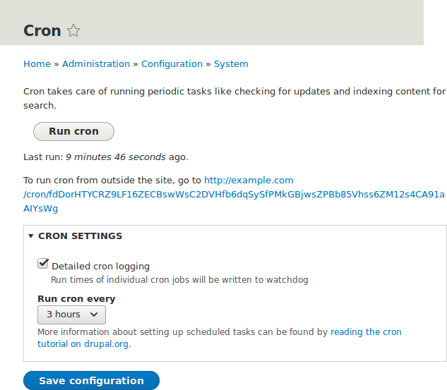

[[security-cron]]

=== Настройка задач крона для обслуживания сайта

[role="summary"]
Как запускать задачи крона с помощью модуля ядра Automated Cron или запускать их извне сайта.

(((Automated Cron модуль,настройка)))
(((Задача крона,настройка)))

==== Цель

Проверьте, выполняются ли задачи крона регулярно, и если нет, либо установите модуль ядра Automated Cron, либо настройте запуск задач крона извне сайта.

==== Необходимые знания

<<security-cron-concept>>

// ==== Site prerequisites

==== Шаги

. Просмотрите страницу _Отчет о состоянии_ (см. <<prevent-status>>), чтобы узнать, когда задачи крона запускались в последний раз.
+
Если вы устанавливали сайт с помощью стандартного установочного профиля ядра (или похожего), задачи крона, вероятно, уже запускаются через модуль ядра Automated Cron. По умолчанию задачи выполняются примерно каждые три часа.

. Выберите, запускать ли задачи крона с помощью модуля ядра Automated Cron или другим способом. Модуль ядра Automated Cron может не подходить для некоторых сайтов по следующим причинам:
+
  * Каждый раз, когда кто-то посещает страницу сайта, модуль проверяет, сколько времени прошло с последнего запуска задач крона, и запускает их при необходимости. Если сайт долго никто не посещает, задачи крона не будут выполняться.
  * Задачи крона запускаются после генерации страницы. Это значит, что времени на их выполнение может быть меньше до срабатывания различных серверных таймаутов (например, таймаут выполнения PHP). Если это произойдет, в логах (см. <<prevent-log>>) появятся сообщения о том, что крон не может завершиться.
  * Существует небольшая https://en.wikipedia.org/wiki/Scalability[нагрузка на масштабируемость] при использовании модуля Automated Cron, поскольку один из процессов веб-сервера занят (и не может обслуживать другие страницы), пока задачи крона не завершатся.

. Если вы хотите использовать модуль Automated Cron, сначала убедитесь, что он установлен (он устанавливается вместе со стандартным установочным профилем; см. <<config-install>>, если не установлен).
+
Затем настройте модуль, чтобы управлять частотой запуска задач крона. В меню администратора _Управление_ перейдите к _Конфигурация_ > _Система_ > _Крон_ (_admin/config/system/cron_). В поле _Запускать cron каждые_ в разделе _Настройки крон_ выберите желаемый интервал и нажмите _Сохранить конфигурацию_.
+
--
// Cron configuration page (admin/config/system/cron).

--

. Если вы хотите запускать задачи крона извне сайта, удалите модуль ядра Automated Cron (см. <<config-uninstall>>). Далее найдите URL для запуска крона. Этот URL указан на странице _Отчет о состоянии_ (см. <<prevent-status>>), а также на странице _Крон_ (см. предыдущий шаг). URL выглядит примерно так:
_http://www.example.com/cron/0MgWtfB33FYbbQ5UAC3L0LL3RC0PT3RNUBZILLA0Nf1Re_
+
Каждый раз, когда этот URL посещается, задачи крона запускаются. Настройте один из следующих планировщиков, чтобы регулярно обращаться по этому адресу:
+
  * https://www.drupal.org/docs/7/setting-up-cron/configuring-cron-jobs-using-the-cron-command[Cron daemon] (Linux, OS X, Solaris, BSD)
  * https://www.drupal.org/docs/7/setting-up-cron-for-drupal/configuring-cron-jobs-with-windows[Scheduled Tasks] (Windows)
  * SaaS-сервис для крона (software as a service)
  * Менеджер крона, предоставляемый вашим хостинг-провайдером (см. документацию от провайдера)

// ==== Expand your understanding

==== Связанные концепции

<<security-concept>>

==== Видео

// Video from Drupalize.Me.
video::https://www.youtube-nocookie.com/embed/ts4g1jTEAt4[title="Configuring Cron Maintenance Tasks"]

==== Дополнительные материалы

* https://www.drush.org/latest/cron/[Drush page "Running Drupal cron tasks from Drush"]
* https://www.drupal.org/docs/7/setting-up-cron/overview[_Drupal.org_ страница документации сообщества "Setting up cron"]

*Авторы*

Написано и отредактировано https://www.drupal.org/u/dalin[Dave Hansen-Lange] из
https://www.advomatic.com/[Advomatic],
https://www.drupal.org/u/batigolix[Boris Doesborg],
и https://www.drupal.org/u/jhodgdon[Jennifer Hodgdon].

Переведено https://www.drupal.org/u/levmyshkin[Абраменко Иван] из https://drupalbook.org/ru[DrupalBook].
