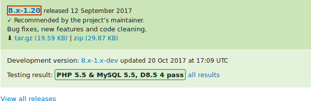
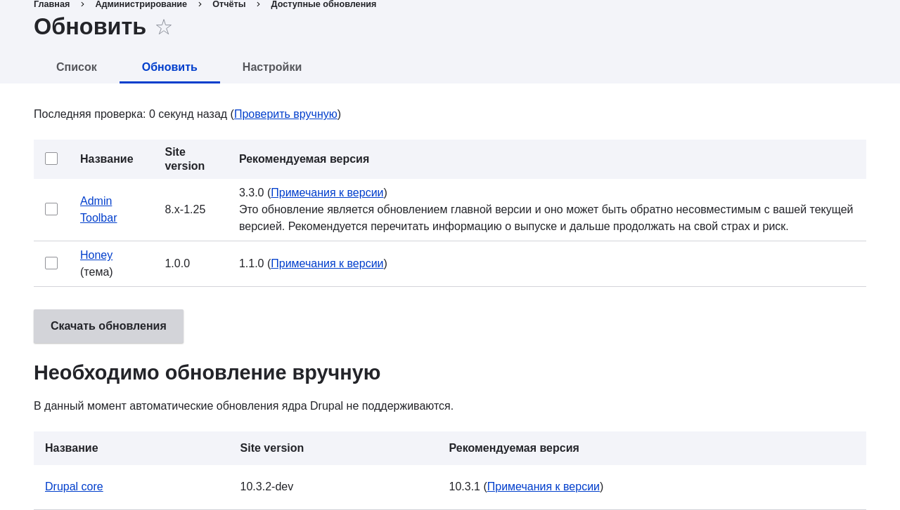

[[security-update-module]]

=== Обновление модуля Drupal

[role="summary"]
Как обновить дополнительный модуль с помощью Composer и административного интерфейса для запуска скрипта обновления базы данных.

(((Модуль,обновление)))
(((Обновление безопасности,применение)))
(((Дополнительный модуль,обновление)))

==== Цель

Обновить дополнительный модуль и запустить скрипт _Обновление базы данных_.

==== Необходимые знания

* <<security-concept>>
* <<security-cron-concept>>

==== Требования к сайту

* Установлен дополнительный модуль, для которого доступно обновление.
  См. <<extend-module-install>> и <<security-announce>>.

* Если ваш сайт находится в интернете, сначала рекомендуется протестировать этот процесс в разработческой среде перед запуском на рабочем сайте. См. <<install-dev-making>>.

* Сделана полная резервная копия сайта. См. <<prevent-backups>>.

* Если вы хотите использовать интерфейс для проверки обновлений, модуль ядра Update Manager должен быть установлен. См. <<config-install>> для инструкции по установке модулей ядра.

==== Шаги

Перед началом проверьте инструкции по обновлению для конкретного модуля. Прочитайте и выполните все специфические требования для модуля перед обновлением. Чтобы найти инструкции, проверьте ссылку _Read Documentation_ на странице проекта модуля.

Чтобы узнать больше, после загрузки обновленных файлов найдите файлы _README.txt_, _INSTALL.txt_ и _UPGRADE.txt_, входящие в комплект модуля. Также изучите примечания к релизу на странице проекта, нажав на номер скачиваемой версии.

// Downloads section of the Admin Toolbar project page on drupal.org.

Обновление модуля включает перевод сайта в режим обслуживания, получение новых файлов и выполнение необходимых обновлений базы данных, а затем возвращение сайта в обычный режим.

Вы можете обновить код дополнительного модуля с помощью Composer. Если вы обновляете пользовательский модуль, получите новые файлы модуля, а затем следуйте инструкции ниже для запуска обновлений базы данных через административный интерфейс.

Далее предполагается, что вы используете Composer для управления файлами на сайте; см. <<install-composer>>.

===== Обновление дополнительного модуля с помощью Composer

. Переведите сайт в режим обслуживания. См. <<extend-maintenance>>.

. В _Управлении_ административного меню перейдите в _Отчеты_ > _Доступные обновления_ > _Обновить_ (_admin/reports/updates_).

. Найдите и отметьте модуль в списке. Нажмите _Скачать эти обновления_ для модуля.
+
--
// Update page for theme (admin/reports/updates/update).

--

. Определите короткое имя проекта, который вы хотите обновить. Для дополнительных модулей и тем это последняя часть URL страницы проекта; например, модуль Geofield на https://www.drupal.org/project/geofield имеет короткое имя +geofield+.

. Если вы хотите обновить до последнего стабильного релиза, используйте команду, подставив короткое имя проекта вместо +geofield+:
+
----
composer update drupal/geofield --with-dependencies
----
+
Чтобы узнать, как загрузить определенные версии, см. <<install-composer>>.

. После получения новых файлов модуля запустите обновление базы данных, введя в браузере URL _example.com/update.php_.

. Нажмите _Продолжить_, чтобы запустить обновления. Скрипты обновления базы данных будут выполнены.

. Нажмите _Страницы администрирования_, чтобы вернуться в административный раздел сайта.

. Выведите сайт из режима обслуживания. См. <<extend-maintenance>>.

. Очистите кэш Drupal (см. <<prevent-cache-clear>>).

==== Расширьте своё понимание

* Проверьте журнал сайта (см. <<prevent-log>>) после завершения обновлений, чтобы убедиться в отсутствии ошибок.

* <<security-update-theme>>

//==== Related concepts

==== Видео

// Video from Drupalize.Me.
video::https://www.youtube-nocookie.com/embed/wxWW-lPQ_Pc[title="Updating a Module"]

// ==== Additional resources

*Атрибуция*

Адаптировано https://www.drupal.org/u/batigolix[Boris Doesborgh],
https://www.drupal.org/u/hey_germano[Sarah German] на
https://www.advomatic.com[Advomatic], и
https://www.drupal.org/u/eojthebrave[Joe Shindelar] на https://drupalize.me[Drupalize.Me]
из https://www.drupal.org/docs/7/update/updating-modules["Update modules"],
авторские права 2000-copyright_upper_year за отдельными участниками
https://www.drupal.org/documentation[Drupal Community Documentation].

Переведено https://www.drupal.org/u/MishaIsmajlov[Михаил Исмайлов].
