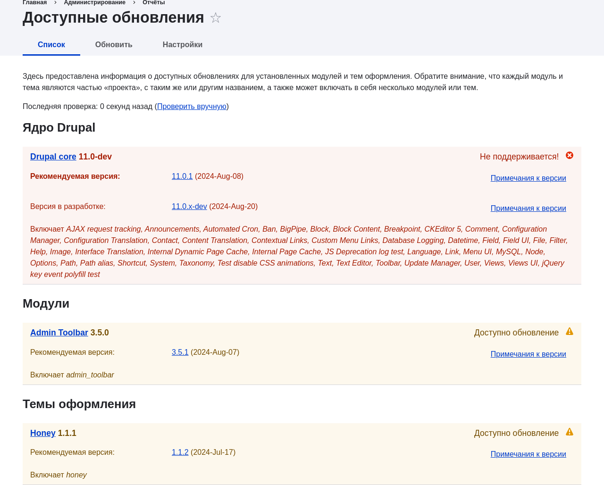

[[security-update-theme]]

=== Обновление темы

[role="summary"]
Как обновить дополнительную тему с помощью Composer и административного интерфейса для запуска скрипта обновления базы данных.

(((Тема,обновление)))
(((Обновление безопасности,применение)))
(((Дополнительная тема,обновление)))

==== Цель

Обновить дополнительную тему на сайте и запустить скрипт _Обновление базы данных_.

==== Необходимые знания

* <<security-concept>>
* <<security-cron-concept>>

==== Требования к сайту

* Установлена дополнительная тема, и для неё доступно обновление. См. <<extend-theme-install>> и <<security-announce>>.

* Если сайт находится в интернете, сначала протестируйте процесс в разработческой среде, прежде чем запускать на рабочем сайте. См. <<install-dev-making>>.

* Сделана полная резервная копия сайта. См. <<prevent-backups>>.

* Если вы хотите использовать интерфейс для проверки обновлений, модуль ядра Update Manager должен быть установлен. См. <<config-install>> для инструкции по установке модулей ядра.

==== Шаги

Обновление дополнительной темы предполагает перевод сайта в режим обслуживания, затем получение новых файлов темы и выполнение необходимых обновлений базы данных, а затем возврат сайта к обычной работе.

Вы можете обновить код дополнительной темы с помощью Composer. Если вы обновляете пользовательскую тему, получите новые файлы темы, затем продолжите с инструкций по запуску обновлений базы данных через административный интерфейс ниже.

Далее предполагается, что вы используете Composer для управления файлами на сайте; см. <<install-composer>>.

===== Обновление дополнительной темы с помощью Composer

. Переведите сайт в режим обслуживания. См. <<extend-maintenance>>.

. В _Управлении_ административного меню перейдите в _Отчёты_ > _Доступные обновления_ > _Обновить_ (_admin/reports/updates_).

. Найдите все темы в списке, для которых доступны обновления.
+
// Update page for theme (admin/reports/updates/update).

. Определите короткое имя проекта, который вы хотите обновить. Для дополнительных модулей и тем это последняя часть URL страницы проекта; например, тема Honey на https://www.drupal.org/project/honey имеет короткое имя +honey+.

. Если вы хотите обновить до последнего стабильного релиза, используйте команду, подставив короткое имя проекта вместо +honey+:
+
----
composer update drupal/honey --with-dependencies
----
+
Чтобы узнать, как загрузить определённые версии, см. <<install-composer>>.

. После получения новых файлов темы запустите обновления базы данных, введя в браузере URL _example.com/update.php_.

. Нажмите _Продолжить_, чтобы запустить обновления. Скрипты обновления базы данных будут выполнены.

. Нажмите _Страницы администрирования_, чтобы вернуться в административный раздел сайта.

. Выведите сайт из режима обслуживания. См. <<extend-maintenance>>.

. Очистите кэш Drupal (см. <<prevent-cache-clear>>).

==== Расширьте своё понимание

* Проверьте журнал сайта, см. <<prevent-log>>, после завершения обновлений для проверки ошибок.

* <<security-update-module>>

// ==== Related concepts

==== Видео

// Video from Drupalize.Me.
video::https://www.youtube-nocookie.com/embed/elVnWoaQMkk[title="Updating a Theme"]

// ==== Additional resources

*Атрибуция*

Написано https://www.drupal.org/u/batigolix[Boris Doesborg] и
https://www.drupal.org/u/eojthebrave[Joe Shindelar] на https://drupalize.me[Drupalize.Me].

Переведено https://www.drupal.org/u/MishaIsmajlov[Михаил Исмайлов].