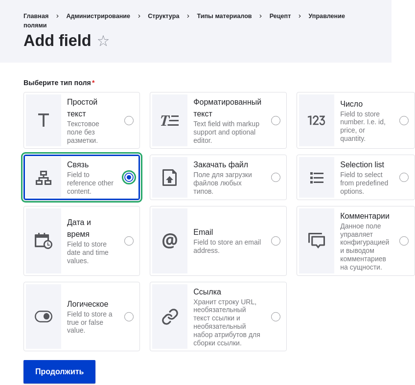
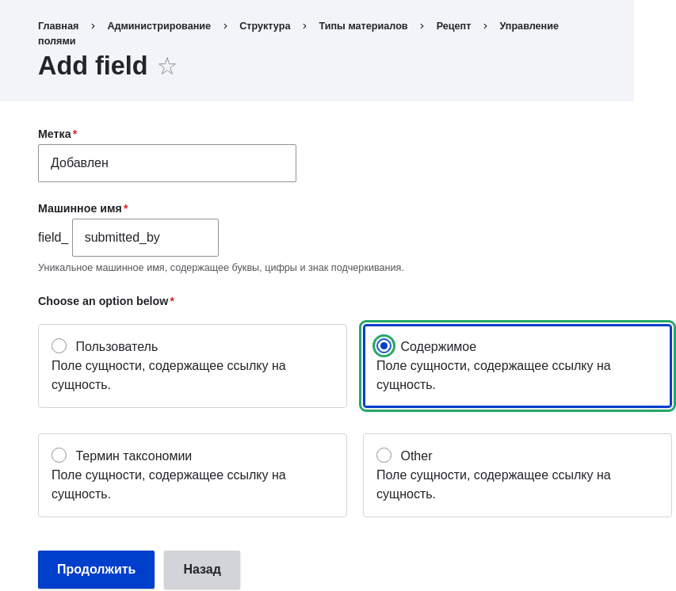
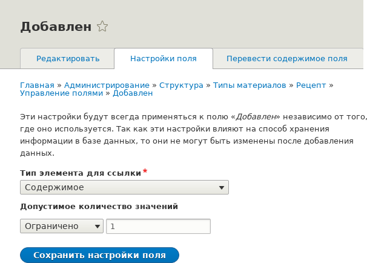
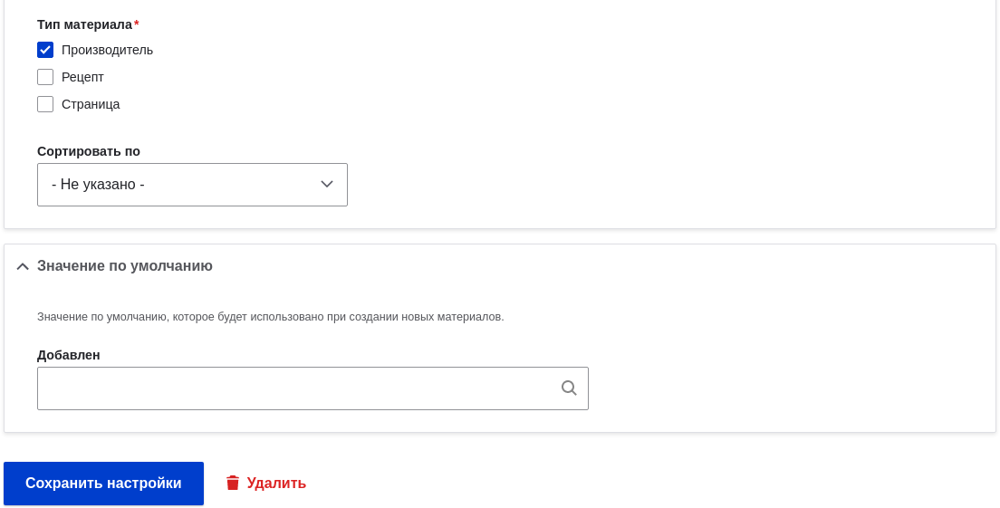
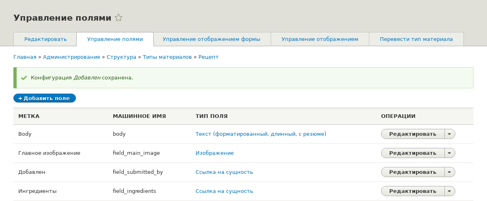

[[structure-adding-reference]]

=== Добавление поля ссылки на сущность

[role="summary"]
Как добавить поле ссылки, которое соединяет два типа контента.

(((Поле ссылки,добавление)))
(((Поле,для добавления ссылок)))
(((Поле-ссылка на сущность,добавление)))
(((Поле-ссылка на материал,добавление)))
(((Поле-ссылка на пользователя,добавление)))
(((Поле-ссылка на термин таксономии,добавление)))

==== Цель

Добавить поле ссылки, чтобы рецепты можно было связать с производителем, который их предоставил.

==== Необходимые знания

* <<structure-fields>>
* <<structure-reference-fields>>
* <<structure-content-type>>

==== Требования к сайту

Типы контента Рецепт и Производитель должны существовать. См. <<structure-content-type>>.

==== Шаги

. В _Управлении_ административного меню перейдите в _Структура_ > _Типы контента_ (_admin/structure/types_). Затем нажмите _Управление полями_ в выпадающем списке для типа контента Рецепт. Откроется страница _Управление полями_.

. Нажмите _Создать новое поле_. Откроется страница _Добавить поле_. Выберите тип поля _Ссылка_ из вариантов _Выберите тип поля_. Нажмите _Продолжить_. Откроется страница _Добавить поле_ с формой для настройки метки поля.
+
--
// Add field page for adding a Submitted by field to Recipe.

--

. Заполните поля, как показано ниже. Нажмите _Сохранить и продолжить_.
+
[width="100%",frame="topbot",options="header"]
|================================
|Название поля | Описание | Значение
| Метка | Название поля | Предоставлено
| Выберите вариант ниже: | Тип сущности для связи | Контент
|================================
+
--
// Add field page for adding a Submitted by field to Recipe.

--

. Откроется страница Предоставлено, где можно указать допустимое количество значений. Заполните поля, как показано ниже. Нажмите _Сохранить настройки_.
+
[width="100%",frame="topbot",options="header"]
|================================
|Название поля | Описание | Значение
|Тип сущности для ссылки| Вариант для выбора типа сущности | Контент
| Допустимое количество значений | Количество значений для поля | Ограничено, 1
|================================
+
--
// Field storage settings page for Submitted by field.

--

. Откроется страница _Настройки поля Предоставлено для Рецепта_, позволяющая настроить поле. Заполните поля, как показано ниже. Нажмите _Сохранить настройки_.
+
[width="100%",frame="topbot",options="header"]
|================================
|Название поля | Описание | Значение
| Метка  | Название, отображаемое для этого поля на странице | Предоставлено
| Текст подсказки | Краткий текст для помощи при создании контента | Выберите производителя, который предоставил этот рецепт
| Обязательное поле | Нужно ли обязательно указывать значение | Отмечено
| Тип ссылки > Метод ссылки | Способ выбора значения | По умолчанию
| Тип ссылки > Тип контента  |  Тип связанного контента | Производитель
| Тип ссылки > Сортировать по | Поле для сортировки | Имя производителя
| Тип ссылки > Направление сортировки | Порядок сортировки | По возрастанию
|================================
+
--
// Field settings page for Submitted by field.

--

. Поле Предоставлено было добавлено к типу контента.
+
--
// Manage fields page for content type Recipe, after adding Submitted by field.

--

// ==== Expand your understanding

// ==== Related concepts

==== Видео

// Video from Drupalize.Me.
video::https://www.youtube-nocookie.com/embed/hAhWiqPlKh0[title="Adding a Reference Field"]

// ==== Additional resources

*Авторы*

Написано и отредактировано https://www.drupal.org/u/batigolix[Boris Doesborg],
и https://www.drupal.org/u/jojyja[Jojy Alphonso] на
http://redcrackle.com[Red Crackle].

Переведено https://www.drupal.org/u/MishaIsmajlov[Михаил Исмайлов].
