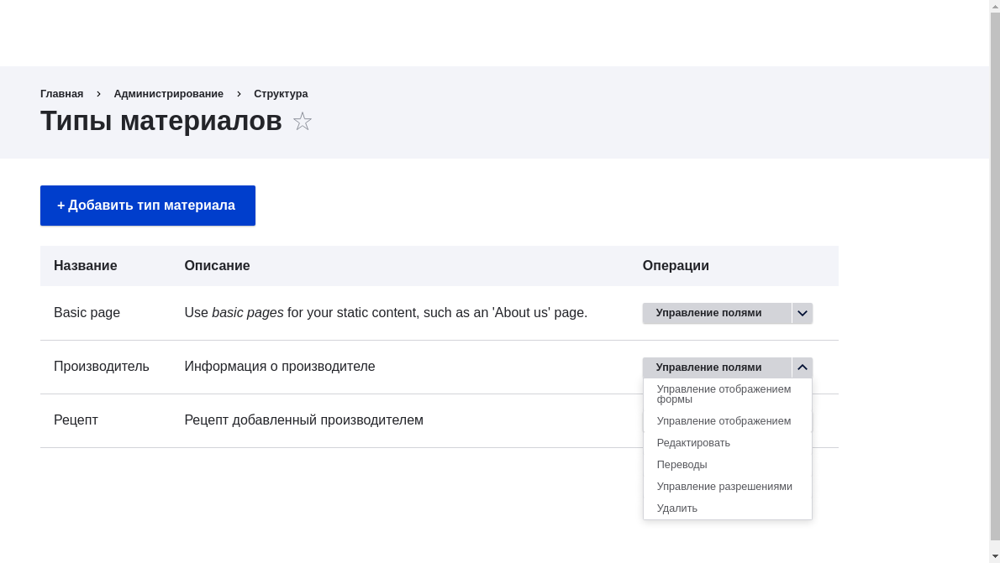
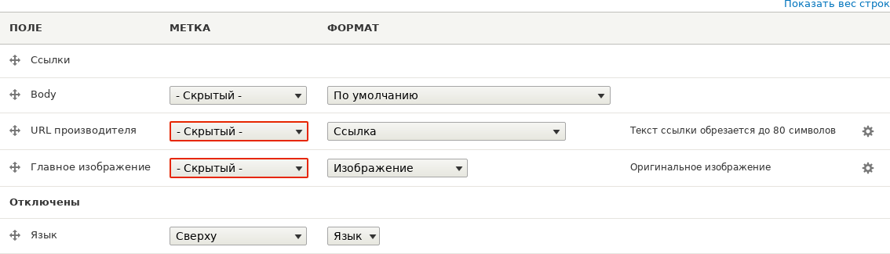
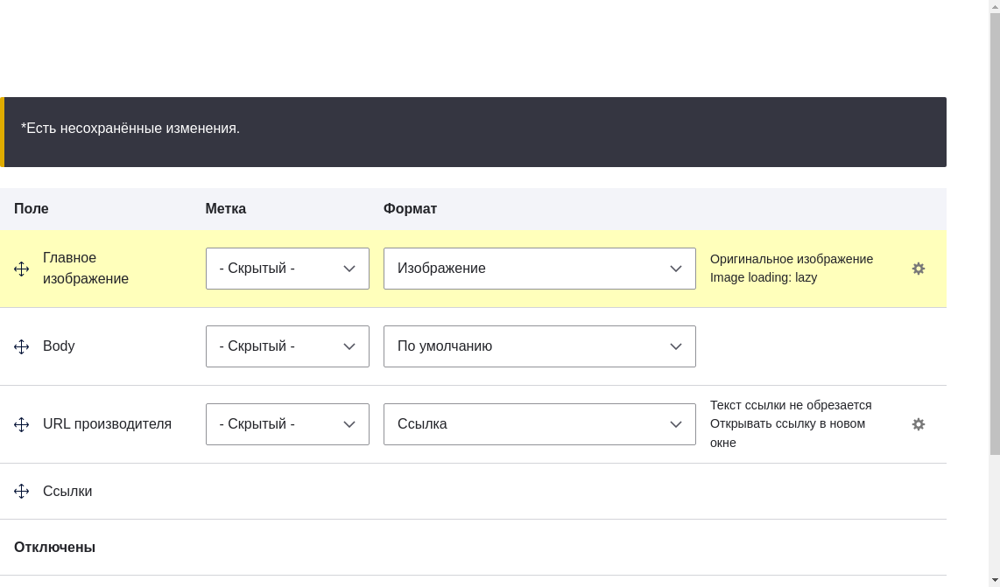

[[structure-content-display]]

=== Изменение отображения содержимого

[role="summary"]
Как сделать элементы содержимого более презентабельными.

(((Отображение содержимого,изменение)))
(((Отображение содержимого,управление)))
(((Содержимое,отображение)))

==== Цель

Сделать элементы содержимого более удобочитаемыми, доступными и визуально привлекательными,
изменяя порядок полей, скрывая метки и настраивая вывод полей.

==== Необходимые знания

* <<planning-data-types>>
* <<structure-view-modes>>

==== Требования к сайту

Должен существовать тип контента "Производитель", в нем должны быть поля Главное изображение и URL производителя,
а также на сайте должен быть создан хотя бы один элемент этого типа. См.
<<structure-content-type>>, <<structure-fields>> и <<content-create>>.

==== Шаги

. Найдите и откройте элемент типа Производитель, который вы создавали в <<structure-fields>>.
Обратите внимание, что есть несколько моментов, которые можно улучшить в отображении страницы:
+
  * Для полей Главное изображение и URL производителя не нужны метки.
  * Следует изменить порядок полей, чтобы изображение было первым.
  * Изображение должно быть меньше.

. Чтобы исправить первые две проблемы и обновить некоторые дополнительные настройки,
в меню _Управление_ перейдите в _Структура_ > _Типы контента_ (_admin/structure/types_).
Затем в выпадающем списке для типа контента Производитель выберите _Управление отображением_.
+
--
// Content types list on admin/structure/types, with operations dropdown
// for Vendor content type expanded.

--

. В колонке _Метка_ выберите _Скрыто_ для Главного изображения. То же самое сделайте для поля URL производителя.
+
--
// Manage display page for Vendor content type
// (admin/structure/types/manage/vendor/display), with labels for Main
// Image and Vendor URL hidden, and their select lists outlined in red.

--

. Нажмите на значок шестерёнки для поля URL производителя, чтобы открыть его параметры.

. Заполните поля, как показано ниже.
+
[width="100%",frame="topbot",options="header"]
|================================
|Имя поля|Объяснение|Пример значения
|Обрезать длину текста ссылки|Максимальная длина текста ссылки|Пусто (не обрезать)
|Открывать ссылку в новом окне|Должны ли ссылки открываться в новом окне или в текущем|Отмечено
|================================
+
--
// Vendor URL settings form, with trim length cleared, and open link in
// new window checked.

--

. Нажмите _Обновить_.

. Перетащите поля так, чтобы порядок был: Главное изображение, _Body_, URL производителя, _Ссылки_.
Вместо перетаскивания можно воспользоваться ссылкой _Показать веса строк_ в начале таблицы и
ввести числовые значения веса (поля с меньшими или более отрицательными весами отображаются первыми).
+
--
// Manage display page for Vendor content type, with order changed.

--

. Нажмите _Сохранить_.

. Снова найдите элемент Производитель из первого шага и убедитесь, что изменения применены.

. Повторите похожие шаги для управления отображением полей типа контента Рецепт.

==== Расширьте своё понимание

* Сделайте главное изображение меньше. См. <<structure-image-style-create>>.

* Если вы не видите результат изменений на сайте, попробуйте очистить кэш. См. <<prevent-cache-clear>>.

==== Связанные понятия

<<structure-image-styles>>

==== Видео

// Video from Drupalize.Me.
video::https://www.youtube-nocookie.com/embed/myYI9rhF_4o[title="Changing Content Display"]

==== Дополнительные ресурсы

* https://www.drupal.org/docs/7/nodes-content-types-and-fields/specify-how-fields-are-displayed[_Drupal.org_ страница документации сообщества "Specify how fields are displayed"]
* https://www.drupal.org/docs/7/nodes-content-types-and-fields/rearrange-the-order-of-fields[_Drupal.org_ страница документации сообщества "Rearrange the order of fields"]
* https://www.drupal.org/node/1577752[_Drupal.org_ страница документации сообщества "View modes"]

*Авторы*

Написано https://www.drupal.org/u/AnnGreazel[Ann Greazel] и
https://www.drupal.org/u/batigolix[Boris Doesborg].

Переведено https://www.drupal.org/u/valeriytolmachov[Валерий Толмачёв].
