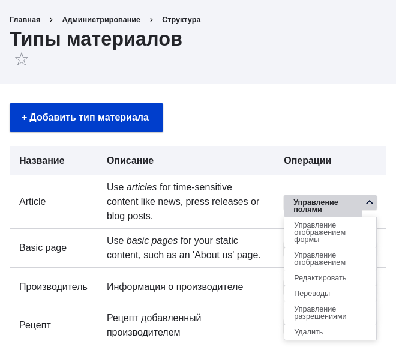
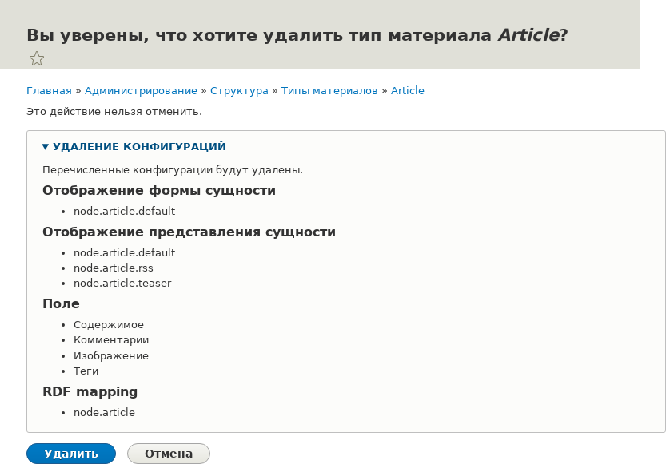

[[structure-content-type-delete]]

=== Удаление типа контента

[role="summary"]
Как удалить тип контента, который не требуется для сайта.

(((Тип контента,удаление)))

==== Цель

Удалить ненужный тип контента _Article_.

==== Необходимые знания

<<config-overview>>

==== Требования к сайту

Тип контента _Article_ должен существовать. Он создаётся на вашем сайте при установке с основным стандартным профилем установки.

==== Шаги

. В административном меню _Управление_ перейдите в _Структура_ > _Типы контента_ (_admin/structure/types_). Откроется страница _Типы контента_.

. Нажмите _Удалить_ в выпадающем списке _Operations_ для типа контента _Article_. Обратите внимание, что имя этого типа контента приведено на английском языке на этой странице; см. <<language-concept>> для объяснения.
+
--
// Content types list on admin/structure/types, with operations dropdown
// for Article content type expanded.

--

. Появится страница подтверждения. Нажмите _Удалить_.
+
--
// Confirmation page for deleting Article content type.

--

. Появится страница _Типы контента_ с сообщением о том, что тип контента был удалён:
+
--
// Confirmation message after deleting Article content type.

--

//==== Expand your understanding

// ==== Related concepts

==== Видео

// Video from Drupalize.Me.
video::https://www.youtube-nocookie.com/embed/1627xZFcJCY[title="Deleting a Content Type"]

//==== Additional resources

*Авторы*

Написано и отредактировано https://www.drupal.org/u/sree[Sree Veturi]
и https://www.drupal.org/u/batigolix[Boris Doesborg].

Перевод: https://www.drupal.org/u/igorsh[Игорь Шабальников].
