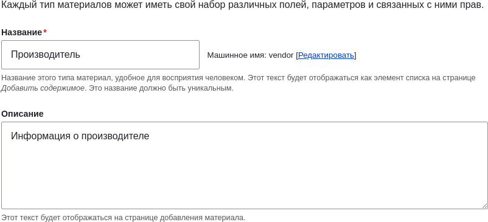
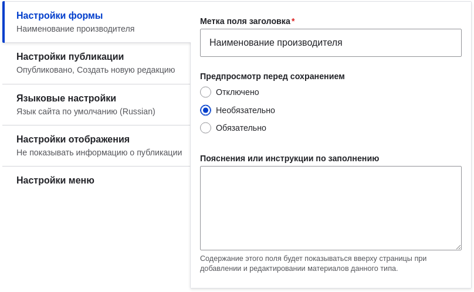
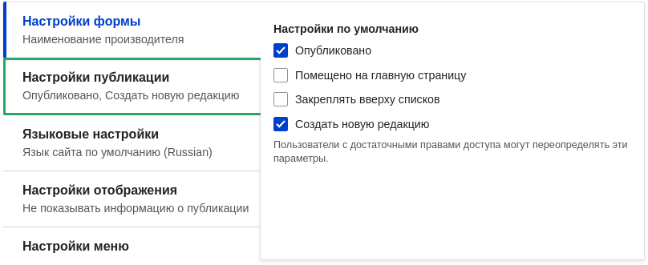
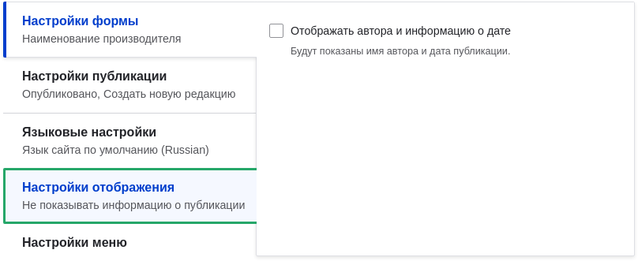
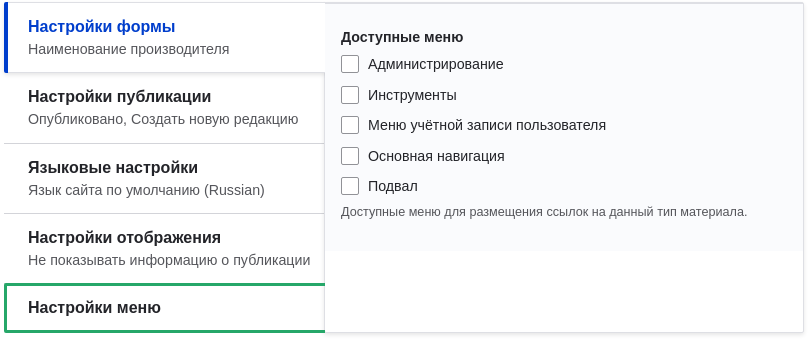
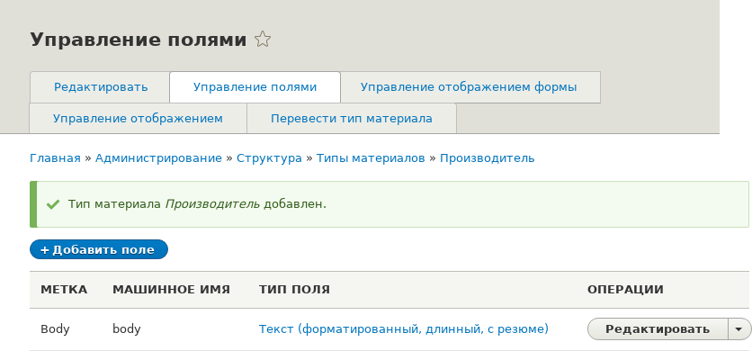

[[structure-content-type]]

=== Добавление типа контента

[role="summary"]
Как добавить и настроить новый тип контента.

(((Тип контента, добавление)))

==== Цель

Добавить и настроить новый тип контента "Производитель".

==== Необходимые знания

<<planning-data-types>>

==== Требования к сайту

Вам необходимо иметь план структуры контента. См. <<planning-structure>>.

==== Шаги

. В административном меню _Управление_ перейдите в _Структура_ > _Типы контента_
(_admin/structure/types_). Откроется страница _Типы контента_,
отображающая все доступные типы содержимого. Обратите внимание, что имена и описания
типов контента, которые были добавлены вашим профилем установки, отображаются на этой странице на
английском языке; см. <<language-concept>> для объяснения.

. Нажмите _Добавить тип контента_. Откроется страница _Добавить тип контента_. Заполните поля как указано ниже.
+
[width="100%",frame="topbot",options="header"]
|================================
| Имя поля | Объяснение | Пример значения
| Имя | Имя типа контента | Производитель
| Описание | Объяснение для чего используется этот тип | Информация о производителе
|================================
+
--
// Top of admin/structure/types/add, with Name and Description fields.

--

. В разделе _Настройки формы отправки_ настройте форму, которая
используется для создания и редактирования контента этого типа. Заполните поля как указано ниже.
+
[width="100%",frame="topbot",options="header"]
|================================
| Имя поля | Объяснение | Пример значения
| Метка поля заголовка | Метка поля "Заголовок", отображаемая при создании или редактировании | Имя производителя
| Предпросмотр перед отправкой | Нужно ли предварительно просматривать содержимое перед отправкой | Необязательно
| Пояснение или инструкция по заполнению | Инструкция по созданию или редактированию | (Оставьте пустым)
|================================
+
--
// Submission form settings section of admin/structure/types/add.

--

. В разделе _Опции публикации_ выберите параметры по умолчанию для нового
контента этого типа. Заполните поля как указано ниже.
+
[width="100%",frame="topbot",options="header"]
|================================
| Имя поля | Объяснение | Пример значения
| Опубликовано | Контент публикуется по умолчанию | Отмечено
| Продвигать на главную | На стандартном сайте можно показывать на главной | Не отмечено
| Закрепить вверху списков | Можно закрепить в начале списка | Не отмечено
| Создавать новую редакцию | Создавать новую редакцию при каждом редактировании | Отмечено
|================================
+
Изменение этих настроек не влияет на уже созданные элементы.
+
--
// Publishing settings section of admin/structure/types/add.

--

. В разделе _Настройки отображения_ решите, будет ли отображаться имя автора и дата публикации.
Заполните поля как указано ниже.
+
[width="100%",frame="topbot",options="header"]
|================================
| Имя поля | Объяснение | Пример значения
| Показывать автора и дату публикации | Показывать имя автора и дату на каждой странице производителя | Не отмечено
|================================
+
--
// Display settings section of admin/structure/types/add.

--

. В разделе _Настройки меню_ заполните поля как указано ниже.
+
[width="100%",frame="topbot",options="header"]
|================================
| Имя поля | Объяснение | Пример значения
| Доступные меню | Меню, в которые можно добавить этот тип контента. Производителей не нужно добавлять в меню, поэтому снимите все флажки. | Не отмечено
|================================
+
--
// Menu settings section of admin/structure/types/add.

--

. Нажмите _Сохранить и управлять полями_, чтобы сохранить тип контента. Откроется страница _Управление полями_, позволяющая добавить поля к типу контента. См. <<structure-fields>>
+
--
// Manage fields page after adding Vendor content type.

--

. Повторите те же шаги, чтобы создать тип контента для рецептов. Пример значений для полей, если отличаются:
+
[width="100%",frame="topbot",options="header"]
|================================
| Имя поля | Пример значения
| Имя | Рецепт
| Описание | Рецепт, отправленный производителем
| Настройки формы отправки – Заголовок | Имя рецепта
|================================

==== Расширьте своё понимание

* <<structure-fields>>

* Установите и настройте https://www.drupal.org/project/pathauto[дополнительный модуль Pathauto], чтобы элементы контента автоматически получали URL-алиасы. См. <<content-paths>> для информации об адресах внутри сайта, <<extend-module-find>> для поиска дополнительных модулей, и <<extend-module-install>> для загрузки и установки модулей.

==== Видео

// Video from Drupalize.Me.
video::https://www.youtube-nocookie.com/embed/vyvqiaaGM1k[title="Adding a Content Type"]

*Авторы*

Написано и отредактировано https://www.drupal.org/u/sree[Sree Veturi],
https://www.drupal.org/u/batigolix[Boris Doesborg] и
https://www.drupal.org/u/jhodgdon[Jennifer Hodgdon].

Перевод: https://www.drupal.org/u/igorsh[Игорь Шабальников].
