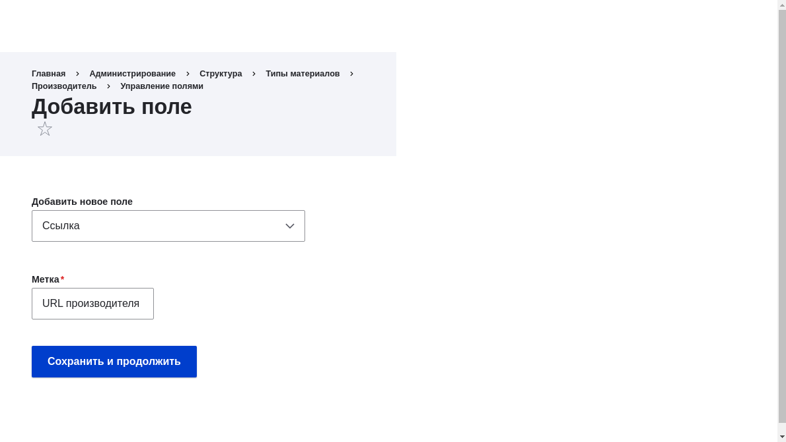
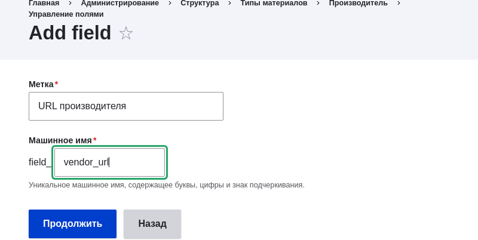
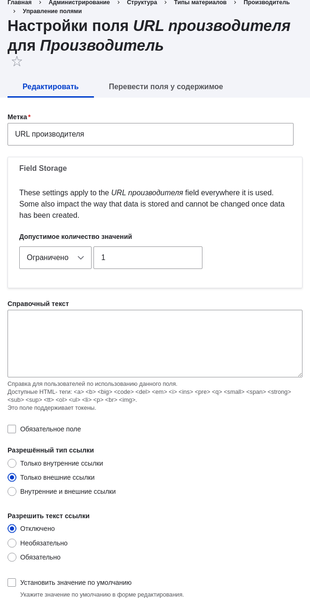
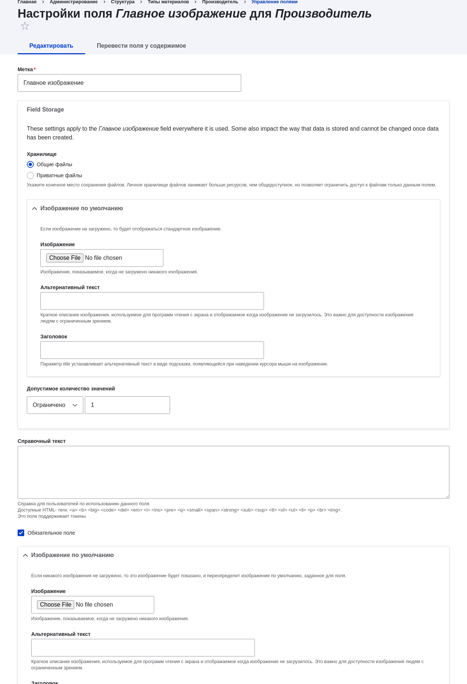
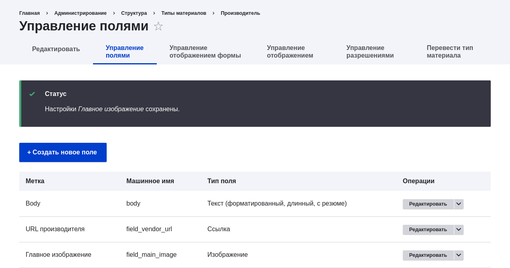
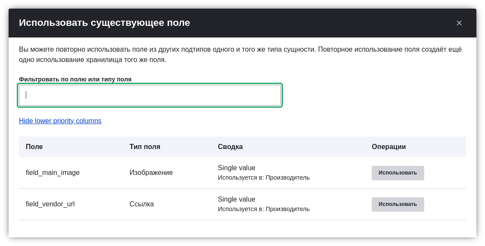

[[structure-fields]]

=== Добавление базовых полей к типу контента

[role="summary"]
Как добавить поля к типу контента.

(((Тип контента,добавление поля к)))
(((Поле,добавление к типу контента)))
(((Поле изображение,добавление)))
(((Поле URL,добавление)))

==== Цель

Добавить поле ссылки и поле изображения к типу контента Производитель.

==== Необходимые знания

<<planning-data-types>>

==== Требования к сайту

Тип контента Производитель должен существовать. См. <<structure-content-type>>.

==== Шаги

Добавьте поля Vendor URL и Main image к типу контента Производитель.

. В административном меню _Управление_ перейдите к _Структура_ > _Типы контента_ (_admin/structure/types_). Затем нажмите _Управление полями_ в выпадающем меню для типа контента Производитель. Откроется страница _Управление полями_. Здесь вы можете создать новое поле или использовать уже существующее поле. Обратите внимание, что названия и описания типов контента и полей, которые были предоставлены вашим профилем установки, отображаются на английском языке; см. <<language-concept>> для объяснения.

. Нажмите _Создать новое поле_. Появится страница _Добавить поле_.
+
--
// Initial page for admin/structure/types/manage/vendor/fields/add-field.

--

. Выберите тип поля _Ссылка_ из вариантов _Выберите тип поля_. Нажмите _Продолжить_. Появится страница _Добавить поле_ с формой для настройки метки поля.

. Заполните поля как показано ниже.
+
[width="100%",frame="topbot",options="header"]
|================================
| Имя поля | Объяснение | Значение
| Метка | Метка, видимая на страницах администрирования | URL производителя
| Выберите тип поля | Тип поля| Ссылка
|================================
+
Машинное имя создаётся автоматически на основе значения _Метка_. Нажмите _Редактировать_, если хотите переопределить имя по умолчанию.
+
--
// Second page for admin/structure/types/manage/vendor/fields/add-field.

--

. Нажмите _Продолжить_. Появится страница _Настройки поля URL производителя для Производитель_, где можно настроить параметры поля. Заполните поля как показано ниже.
+
[width="100%",frame="topbot",options="header"]
|================================
| Имя поля | Объяснение | Значение
| Метка  | Метка, видимая в форме добавления/редактирования | URL производителя
| Допустимое количество значений | Сколько значений можно ввести | Ограничено, 1
| Справочный текст | Инструкция, отображаемая под полем | (оставьте пустым)
| Обязательное поле | Является ли поле обязательным | Нет флажка
| Разрешённый тип ссылки | Какие ссылки можно вводить | Только внешние ссылки
| Разрешить текст ссылки | Можно ли вводить текст ссылки | Отключено
|================================
+
--
// Field settings page for adding vendor URL field.

--

. Нажмите _Сохранить настройки_. Поле URL производителя добавлено к типу контента. Теперь добавьте поле Main image.

. Нажмите _Создать новое поле_. Откроется страница _Добавить поле_.

. Выберите тип поля _Загрузка файла_ из вариантов _Выберите тип поля_. Нажмите _Продолжить_. Появится страница _Добавить поле_ с формой для настройки метки поля.

. Некоторые типы полей требуют выбора подтипа. Заполните поля как показано ниже.
+
[width="100%",frame="topbot",options="header"]
|================================
| Имя поля | Объяснение | Значение
| Метка | Метка, видимая на страницах администрирования | Главное изображение
| Выберите вариант ниже | Подтип поля | Изображение
|================================

. Нажмите _Продолжить_. Появится страница _Настройки поля Главное изображение для Производитель_. Заполните поля как показано ниже.
+
[width="100%",frame="topbot",options="header"]
|================================
| Имя поля | Объяснение | Значение
| Метка  | Метка, видимая в форме | Главное изображение
| Допустимое количество значений | Сколько значений можно ввести | Ограничено, 1
| Изображение по умолчанию | Можно указать изображение по умолчанию. Оно будет использоваться, если не указано изображение при создании материала. | (оставьте пустым)
| Справочный текст | Инструкция, отображаемая под полем | (оставьте пустым)
| Обязательное поле | Является ли поле обязательным | Флажок
| Разрешённые расширения файлов | Типы изображений, которые можно загружать | png, gif, jpg, jpeg
| Каталог файлов | Папка, где будут храниться файлы. Это позволяет размещать все изображения в одном каталоге. | vendors
| Минимальное разрешение изображения | Минимальный размер изображения | 600 x 600
| Максимальный размер файла | Максимальный размер файла изображения | 5 MB
| Включить поле Alt | Можно ли ввести альтернативный текст | Флажок
| Требовать поле Alt | Является ли альтернативный текст обязательным | Флажок
|================================
+
--
// Field settings page for adding main image field.

--

. Нажмите _Сохранить настройки_. Поле Главное изображение добавлено к типу контента.
+
--
// Manage fields page for Vendor, showing two new fields.

--

. Добавьте поле Главное изображение в тип контента Рецепт, используя похожие шаги. Начните с перехода на страницу _Управление полями_ для типа контента Рецепт. Затем используйте кнопку _Повторно использовать существующее поле_, выберите Главное изображение из таблицы и нажмите _Повторно использовать_. Затем переходите к шагу 7 и выполните остальные шаги.
+
--
// Modal dialog with list of fields to re-use.

--

. Создайте два материала типа Производитель (см. <<content-create>>) с названиями "Веселый Молочник" и "Алтайский мёд". Убедитесь, что они содержат изображения и URL.

==== Расширьте своё понимание

* <<structure-image-styles>>
* <<structure-content-display>>
* <<structure-form-editing>>

// ==== Related concepts

==== Видео

// Video from Drupalize.Me.
video::https://www.youtube-nocookie.com/embed/CZpfR9WbVcQ[title="Adding Basic Fields to a Content Type"]

==== Дополнительные ресурсы

https://www.drupal.org/docs/7/nodes-content-types-and-fields/add-a-field-to-a-content-type[_Drupal.org_ страница документации сообщества "Add a field to a content type"]

*Авторы*

Написано https://www.drupal.org/u/sree[Sree Veturi] и
https://www.drupal.org/u/batigolix[Boris Doesborg], а также https://www.drupal.org/u/eojthebrave[Joe Shindelar] с https://drupalize.me[Drupalize.Me].

Перевод: https://www.drupal.org/u/igorsh[Игорь Шабальников].
