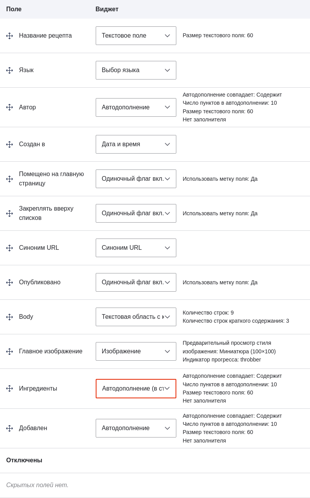
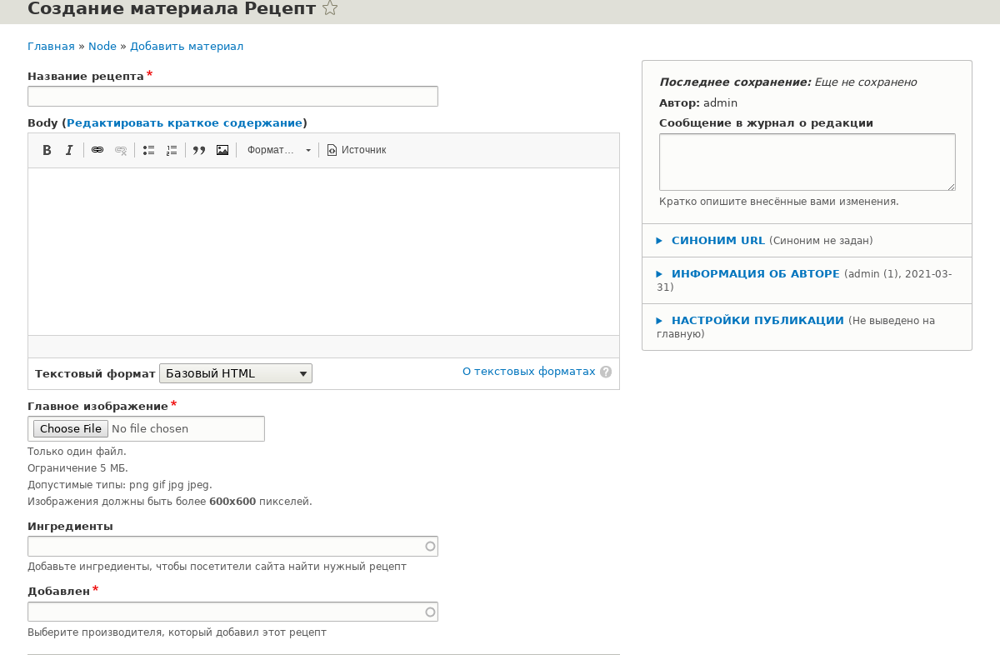

[[structure-form-editing]]

=== Изменение формы ввода материала

[role="summary"]
Как изменить форму ввода содержимого.

(((Содержимое,изменение формы ввода)))

==== Цель

Изменить форму для типа материала Рецепт, чтобы использовать другой виджет для выбора терминов в поле Ингредиенты.

==== Необходимые знания

* <<structure-content-type>>
* <<structure-fields>>
* <<structure-taxonomy>>
* <<structure-widgets>>

==== Требования к сайту

Должен существовать тип материала Рецепт с полем Ингредиенты — ссылка на термин таксономии. Также должен быть создан хотя бы один материал типа Производитель. См. <<structure-content-type>> и <<structure-taxonomy-setup>>.

==== Шаги

. В административном меню _Управление_ перейдите к _Содержимое_ > _Добавить материал_ > _Рецепт_ (_node/add/recipe_), чтобы посмотреть текущую форму ввода. Обратите внимание, что по умолчанию ингредиенты нужно добавлять по одному — более компактного ввода нет.

. В административном меню _Управление_ перейдите к _Структура_ > _Типы материалов_ (_admin/structure/types_). Далее выберите _Управление отображением формы_ из выпадающего меню для типа материала Рецепт. Откроется страница _Управление отображением формы_.

. Для поля Ингредиенты в колонке _Виджет_ выберите _Автодополнение (в стиле тегов)_.
+
--
// Manage form display page for Recipe, Ingredients field area, with
// Widget drop-down outlined.

--

. Нажмите _Сохранить_.

. В административном меню _Управление_ перейдите к _Содержимое_ > _Добавить материал_ > _Рецепт_ (_node/add/recipe_), чтобы проверить обновлённую форму. Теперь поле Ингредиенты — это единое текстовое поле, куда можно ввести несколько значений.
+
--
// Create recipe page (node/add/recipe).

--

. Создайте два материала типа Рецепт (см. <<content-create>>), например "Зелёный салат" и "Свежая морковь". Убедитесь, что все поля заполнены: изображения, ингредиенты, а также поле "Предоставлено" (укажите одного из производителей, созданных в <<structure-fields>>).

==== Узнать больше

Изменить основную контактную форму сайта можно по пути _Структура_ > _Контактные формы_ в меню _Управление_. Например, вы можете скрыть поля _Отправить себе копию_ или _Язык_.

==== Видео

// Video from Drupalize.Me.
video::https://www.youtube-nocookie.com/embed/CELMGX93fjE[title="Changing Content Entry Forms"]

*Авторы*

Написано https://www.drupal.org/u/batigolix[Boris Doesborg].

Перевод: https://www.drupal.org/u/valeriytolmachov[Валерий Толмачёв].
