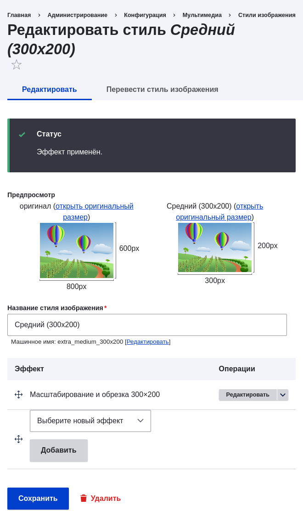
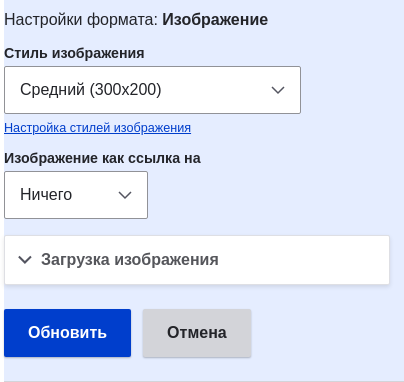

[[structure-image-style-create]]

=== Настройка стиля изображения

[role="summary"]
Как добавить стиль изображения, чтобы переформатировать изображение.

(((Стиль изображения,создание)))
(((Стиль,изображение)))
(((Эффект,изображение)))
(((Изображение,изменение размера)))

==== Цель

Добавить стиль изображения и использовать его для отображения изображений на страницах Производителя.

==== Необходимые знания

* <<structure-fields>>
* <<structure-content-display>>
* <<structure-image-styles>>

==== Требования к сайту

* Типы материалов Производитель и Рецепт должны существовать. См. <<structure-content-type>>.
* Основные поля изображений должны существовать для обоих типов материалов. См. <<structure-fields>>.
* Должны быть созданы материалы обоих типов. См.
<<structure-content-type>>, <<structure-fields>>, и <<content-create>>.

==== Шаги

. В административном меню _Управление_ перейдите в _Конфигурация_ > _Медиа_ > _Стили изображений_ (_admin/config/media/image-styles_).

. Нажмите _Добавить стиль изображения_.

. Введите название стиля: _Extra medium (300x200)_.

. Нажмите _Создать новый стиль_. Откроется страница _Редактировать стиль Extra medium (300x200)_.

. В таблице _Эффекты_, выберите _Масштабировать и обрезать_ (_Scale and crop_). Нажмите _Добавить_.

. Заполните поля следующим образом:
+
[width="100%",frame="topbot",options="header"]
|================================
|Имя поля | Значение
|Ширина | 300
|Высота | 200
|================================

. Нажмите _Добавить эффект_. Стиль изображения будет сохранён с добавленным эффектом.
+
--
// Image style editing page, with effects added.

--

. В административном меню _Управление_ перейдите в _Структура_ > _Типы материалов_ (_admin/structure/types_).

. В выпадающем меню _Операции_ для типа материала Производитель выберите _Управление отображением_. Откроется страница _Управление отображением_ (_admin/structure/types/manage/vendor/display_).

. Убедитесь, что выбрана вкладка _По умолчанию_ (_Default_).

. Нажмите на значок шестерёнки для поля _Главное изображение_, чтобы открыть настройки поля.

. Заполните поля следующим образом:
+
[width="100%",frame="topbot",options="header"]
|================================
|Имя поля | Описание | Пример значения
|Стиль изображения | Какой стиль использовать | Extra medium (300x200)
|Связать изображение с | Куда вести при клике | Ничего
|================================
+
--
// Main image settings area of Vendor content type.

--

. Нажмите _Обновить_.

. Нажмите _Сохранить_. Новый стиль изображения будет использоваться для отображения материалов типа Производитель.

. Откройте материал Производитель и убедитесь, что изображение отображается уменьшенным. См. <<content-edit>> для поиска нужного материала.

. Повторите шаги 8-15 для типа материала Рецепт.

==== Связанные понятия

* <<structure-fields>>
* <<structure-image-styles>>
* <<structure-image-responsive>>

==== Видео

// Video from Drupalize.Me.
video::https://www.youtube-nocookie.com/embed/DKIo7j19ulY[title="Setting up an Image Style"]

==== Дополнительные ресурсы

https://www.drupal.org/docs/core-modules-and-themes/core-modules/image-module/working-with-images[_Drupal.org_ страница документации сообщества "Working with images"]

*Авторы*

Адаптировано и отредактировано https://www.drupal.org/u/batigolix[Boris Doesborg] и
https://www.drupal.org/u/jojyja[Jojy Alphonso] из
http://redcrackle.com[Red Crackle], по материалам
https://www.drupal.org/docs/core-modules-and-themes/core-modules/image-module/working-with-images["Working with images"],
авторские права 2000-copyright_upper_year за отдельными вкладчиками
https://www.drupal.org/documentation[Drupal Community Documentation].

Переведено https://www.drupal.org/u/MishaIsmajlov[Михаил Исмайлов].
