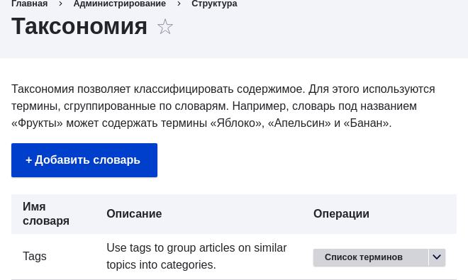
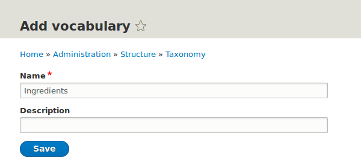
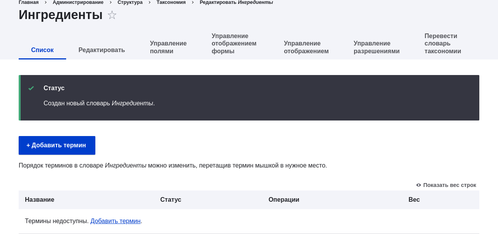
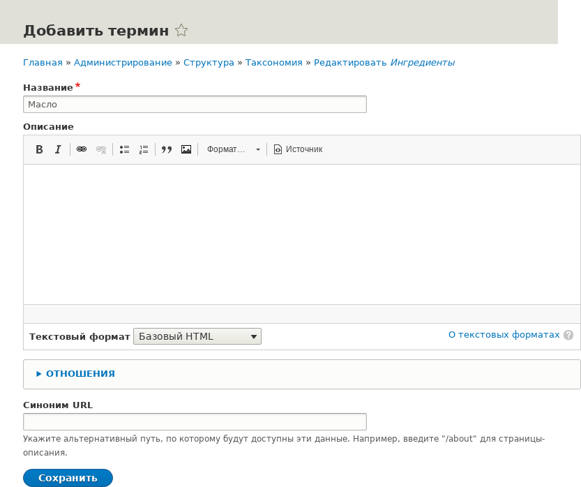
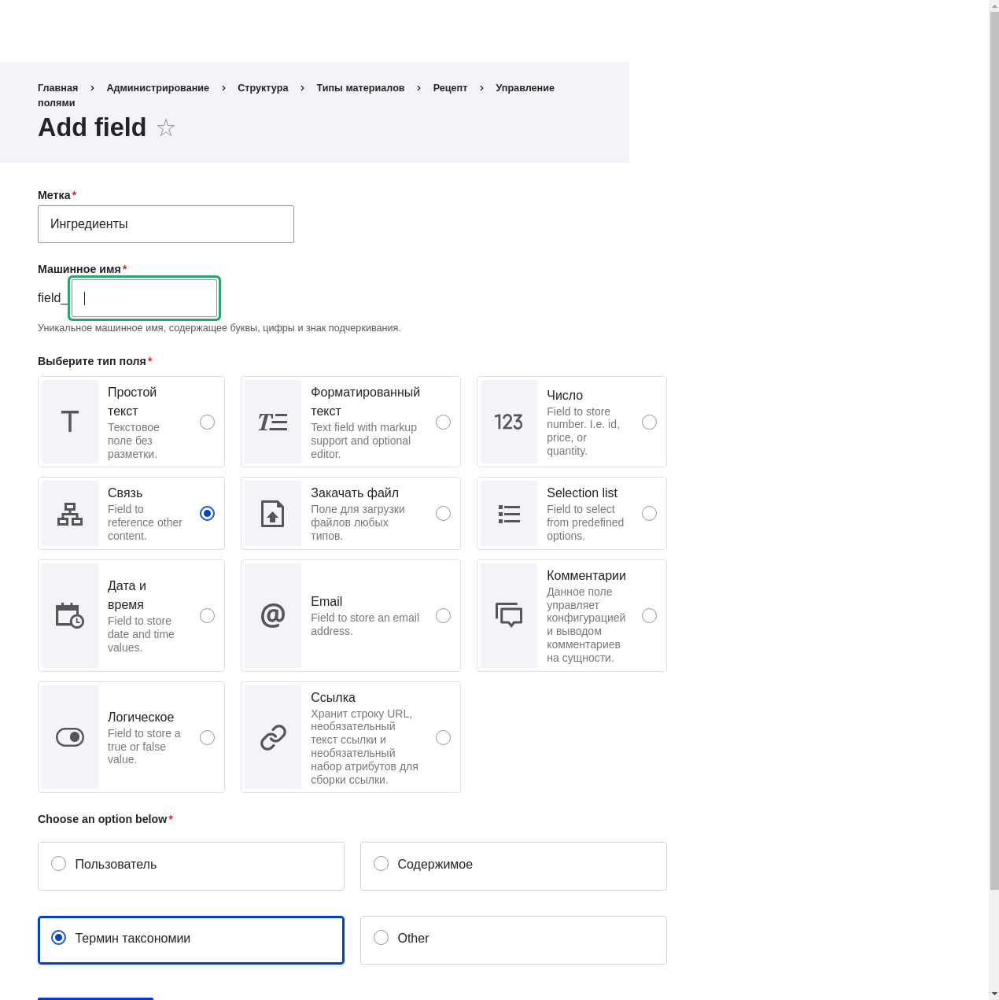
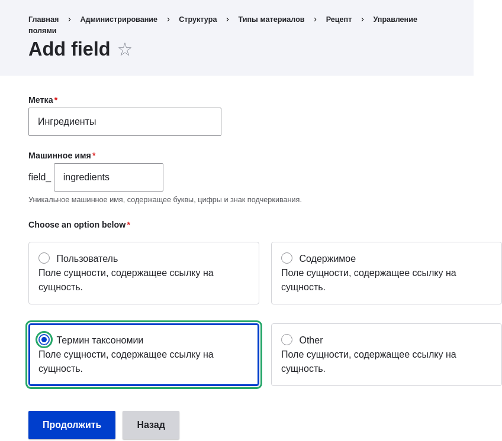
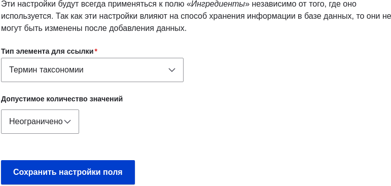
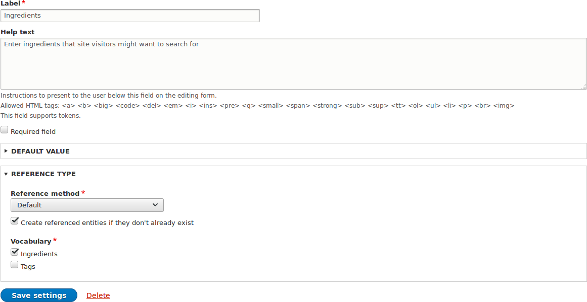
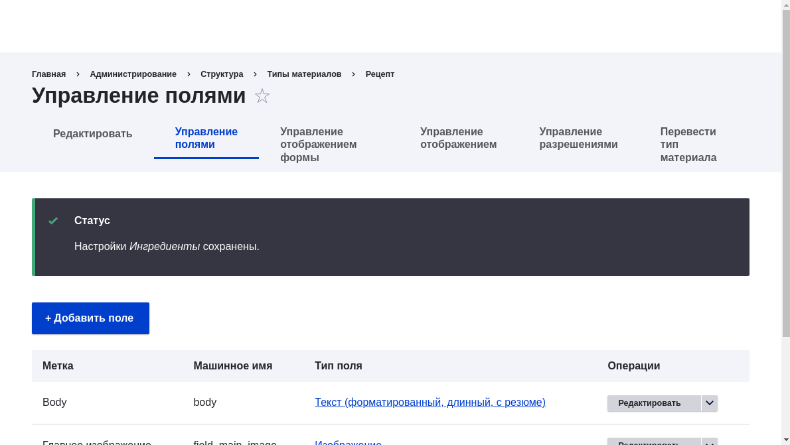

[[structure-taxonomy-setup]]

=== Настройка таксономии

[role="summary"]
Как создать словарь таксономии и добавить его в качестве поля к типу материала.

(((Таксономия,создание)))
(((Словарь,создание)))
(((Метаданные,создание)))
(((Список терминов,создание)))

==== Цель

Создать словарь Ингредиенты и добавить его в тип материала Рецепт как поле, позволяющее вводить неограниченное количество значений и создавать новые термины прямо из формы.

==== Необходимые знания

* <<planning-data-types>>
* <<structure-taxonomy>>
* <<structure-fields>>

==== Требования к сайту

Тип материала Рецепт должен быть создан. См. <<structure-content-type>>.

==== Шаги

. В административном меню _Управление_ перейдите в _Структура_ > _Таксономия_ (_admin/structure/taxonomy_). Вы увидите словарь _Теги_, созданный при установке стандартного профиля. (Обратите внимание, что название и описание словаря отображаются на английском; см. <<language-concept>>.)
+
--
// Taxonomy list page (admin/structure/taxonomy).

--

. Нажмите _Добавить словарь_ и заполните поля:
+
[width="100%",frame="topbot",options="header"]
|================================
| Название поля | Объяснение | Пример значения
| Название | Название словаря | Ингредиенты
| Описание | Краткое описание словаря | (оставить пустым)
|================================
+
--
// Add Ingredients vocabulary from admin/structure/taxonomy/add.

--

. Нажмите _Сохранить_. Откроется страница Ингредиенты с перечнем терминов в этом словаре.
+
--
// Ingredients vocabulary page
// (admin/structure/taxonomy/manage/ingredients/overview).

--

. Нажмите _Добавить термин_. В поле _Название_ введите «Масло». Нажмите _Сохранить_.
+
--
// Name portion of Add term page
// (admin/structure/taxonomy/manage/ingredients/add).

--

. Появится подтверждение о создании термина. Добавьте еще несколько терминов — например, «Яйца» и «Молоко».

. В административном меню _Управление_ перейдите в _Структура_ > _Типы материалов_ (_admin/structure/types_). Для типа материала Рецепт нажмите _Управление полями_.

. Нажмите _Добавить поле_. В открывшемся окне выберите тип поля _Ссылка_ и подтип _Термин таксономии_. Нажмите _Сохранить и продолжить_.
+
--
// Add field page to add Ingredients taxonomy reference field.

--

. Заполните поля:
+
[width="100%",frame="topbot",options="header"]
|================================
| Название поля | Объяснение | Значение
| Метка | Название поля | Ингредиенты
|================================
+
--
// Add field page to add Ingredients taxonomy reference field.

--

. На следующем экране настройки задайте параметры:
+
[width="100%",frame="topbot",options="header"]
|================================
| Название поля | Объяснение | Значение
| Тип элемента для ссылки | Тип сущности, на которую ссылается поле | Термин таксономии
| Допустимое количество значений | Сколько значений может быть указано | Неограниченно
|================================
+
--
// Field storage settings page for Ingredients field.

--

. На следующем экране задайте:
+
[width="100%",frame="topbot",options="header"]
|================================
|Название поля | Описание | Значение
|Справочный текст | Справка, показанная пользователям, создающим контент |Введите ингредиенты, которые посетители сайта могут искать
|Тип связи > Тип ссылки | Выберите метод, используемый для выбора допустимых значений | По умолчанию
|Тип связи > Словарь | Выберите словарь, чтобы выбрать из него допустимые значения | Ингредиенты
|Тип связи > Создать сущности по ссылке, если они еще не созданы | Можно ли создавать новые термины для ингредиентов из формы редактирования контента | Выбрано
|================================
+
--
// Reference type section of field settings page for Ingredients field.

--

. Нажмите _Сохранить настройки_. Вы вернетесь на страницу _Управление полями_. Появится сообщение, что настройка поля Ингредиенты завершена.
+
--
// Manage fields page showing Ingredients field on Recipe content type.

--

==== Видео

// Video from Drupalize.Me.
video::https://www.youtube-nocookie.com/embed/EbsXffnjsjc[title="Setting up a Taxonomy"]

*Авторы*

Основано на тексте https://www.drupal.org/u/bsnodgrass[Bob Snodgrass] и https://www.drupal.org/u/jojyja[Jojy Alphonso] с http://redcrackle.com[Red Crackle].

Переведено https://www.drupal.org/u/MishaIsmajlov[Михаил Исмайлов].
