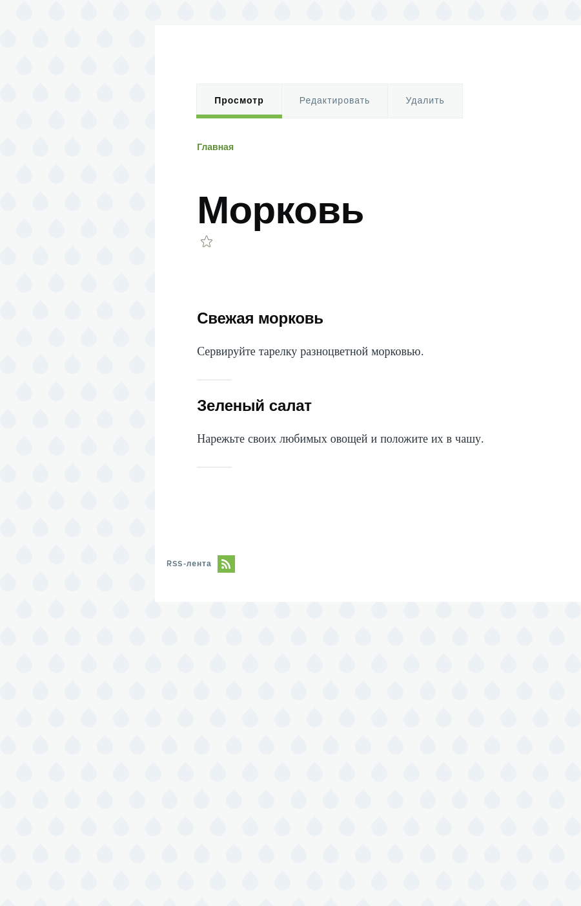

[[structure-taxonomy]]

=== Основы: Таксономия

[role="summary"]
Обзор таксономии и того, как ее можно использовать для классификации контента на сайте.

(((Таксономия,обзор)))
(((Термин (таксономия),обзор)))
(((Термин (таксономия),свободная маркировка)))
(((Термин (таксономия),фиксированный список)))
(((Словарь,обзор)))

==== Необходимые знания

* <<planning-data-types>>
* <<structure-reference-fields>>

==== Что такое таксономия?

_Таксономия_ используется для классификации контента на сайте. Один из распространённых примеров — теги, с помощью которых категоризируются посты в блогах; на сайте городского рынка, например, можно использовать таксономию ингредиентов для классификации рецептов.
Отдельные элементы таксономии называются _терминами_ (например, теги в блоге или ингредиенты в рецептах), а набор терминов — это _словарь_ (например, набор всех тегов или всех ингредиентов).

Технически, термины таксономии — это тип сущности, а словари — это подтипы. Как и другие сущности, термины таксономии могут иметь дополнительные поля; например, можно добавить поле изображения для хранения иконки термина.

Словарь может быть организован как иерархия (например, «помидоры» как подтермин «овощей», а под «помидорами» — «зелёные» и «красные») или как плоский список (как теги в блоге).

Термины таксономии обычно подключаются к другим сущностям сайта через справочные поля — так их и используют для классификации контента. При добавлении такого поля вы можете позволить пользователям вводить термины двумя способами:

Свободная маркировка::
  Новые термины можно создавать прямо в форме редактирования материала.

Фиксированный список терминов::
  Список терминов заранее задан и управляется отдельно, а пользователи при редактировании выбирают только из существующего списка.

Поля-ссылки на термины таксономии можно добавить к любой сущности — например, к учетным записям пользователей, кастомным блокам или обычным материалам. Если вы используете их для классификации материалов, для каждого термина автоматически будет создана страница со списком всех материалов с этим термином. Например, если вы создали несколько рецептов с ингредиентом «морковь», на странице «Морковь» в таксономии появится список всех этих рецептов:

// Carrots taxonomy page after adding Recipe content items.

==== Похожие темы

* <<structure-taxonomy-setup>>
* Страницы списков терминов таксономии — это views, они подробнее рассматриваются в разделе <<views-chapter>>.

// ==== Additional resources

*Авторы*

Адаптировано и отредактировано https://www.drupal.org/u/surendramohan[Surendra Mohan],
https://www.drupal.org/u/jhodgdon[Jennifer Hodgdon],
и https://www.drupal.org/u/jojyja[Jojy Alphonso] в http://redcrackle.com[Red Crackle]
от https://www.drupal.org/docs/7/organizing-content-with-taxonomies/organizing-content-with-taxonomy["Организация контента с таксономиями"]
и https://www.drupal.org/docs/7/organizing-content-with-taxonomies/about-taxonomies["О таксономии"],
авторские права 2000-copyright_upper_year за отдельными участниками
https://www.drupal.org/documentation[Drupal Community Documentation].

Переведено https://www.drupal.org/u/MishaIsmajlov[Михаил Исмайлов].
