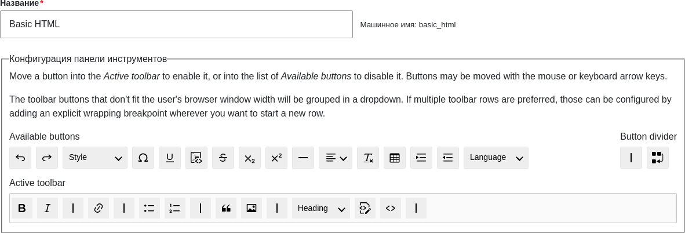
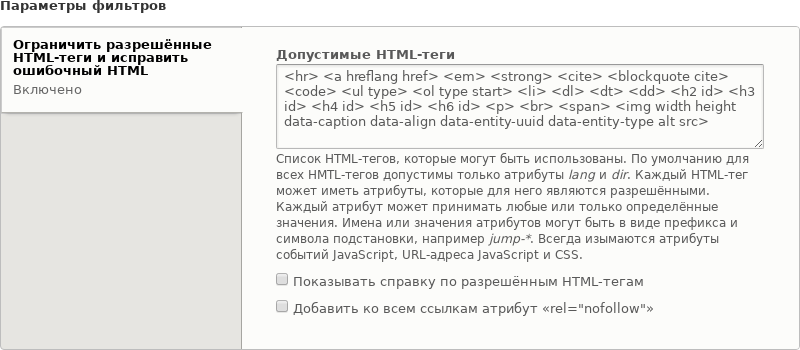

[[structure-text-format-config]]

=== Настройка текстовых форматов и редакторов

[role="summary"]
Как внести изменения в текстовый формат и его конфигурацию редактора.

(((Текстовый формат,настройка)))
(((Настройка,текстовый формат)))
(((Редактор,настройка)))
(((CKEditor текстовый редактор,назначение по умолчанию для текстового формата)))
(((WYSIWYG (Что вижу, то и получаю),настройка редактора)))
(((Что вижу, то и получаю (What You See Is What You Get),настройка редактора)))
(((Модуль,Filter)))
(((Модуль,Editor)))
(((Модуль,CKEditor)))
(((Модуль Filter,настройка)))
(((Модуль Editor,настройка)))
(((Модуль CKEditor,настройка)))

==== Цель

Добавьте тег горизонтального правила в текстовый формат _Базовый HTML_, а также соответствующую
кнопку в конфигурацию его редактора.

==== Необходимые знания

<<structure-text-formats>>

==== Требования к сайту

* Ядро модули Filter, Editor и CKEditor должны быть установлены. Они
устанавливаются на вашем сайте при установке со стандартным профилем установки.

* Текстовый формат _Базовый HTML_ должен существовать. Он создается на вашем сайте,
если вы устанавливали сайт со стандартным профилем установки.

==== Шаги

. В административном меню _Управление_ перейдите в _Конфигурация_ > _Работа с содержимым_
> _Текстовые форматы и редакторы_ (_admin/config/content/formats_). Откроется страница
_Текстовые форматы и редакторы_. Обратите внимание, что названия текстовых форматов,
созданных вашим профилем установки, отображаются на английском языке на этой странице;
см. <<language-concept>> для пояснения.

. Нажмите _Настроить_ для текстового формата _Базовый HTML_. Откроется страница _Базовый HTML_.

. Обратите внимание, что в поле _Текстовый редактор_ выбран _CKEditor_. Это позволяет
настроить панель инструментов редактора.

. Перетащите кнопку _горизонтальная линия_ из _Доступные кнопки_ в _Активная панель инструментов_.
Пункты панели инструментов могут быть сгруппированы с помощью вертикального разделителя.
В качестве альтернативы перетаскиванию, вы можете выбрать кнопки табуляцией и затем переместить
их с помощью клавиш со стрелками на клавиатуре.
+
--
// Область настройки кнопок на странице редактирования текстового формата.

--

. Обратите внимание, что вы можете изменить _Порядок обработки фильтров_.

. В разделе _Параметры фильтра_ > _Ограничить разрешённые HTML-теги и исправить ошибочный HTML_,
в поле _Разрешённые HTML-теги_, убедитесь, что `
` присутствует (добавление этой кнопки
в редактор автоматически обновит список разрешённых тегов).
+
--
// Область настройки разрешённых HTML тегов на странице редактирования текстового формата.

--

. Нажмите _Сохранить конфигурацию_. Вы вернетесь на страницу _Текстовые форматы и редакторы_.
Появится сообщение о том, что текстовый формат был обновлён.
+
--
// Сообщение о подтверждении после обновления текстового формата.

--

==== Расширьте свое понимание

Если вы не видите результат этих изменений на сайте, возможно, потребуется
очистить кеш. Смотрите <<prevent-cache-clear>>.

// ==== Related concepts

==== Видео

// Видео от Drupalize.Me.
video::https://www.youtube-nocookie.com/embed/T9RD6PTxe9U[title="Configuring Text Formats and Editors"]

// ==== Additional resources

*Авторы*

Написано и отредактировано https://www.drupal.org/u/batigolix[Boris Doesborg], и
https://www.drupal.org/u/eojthebrave[Joe Shindelar] на
https://drupalize.me[Drupalize.Me].
