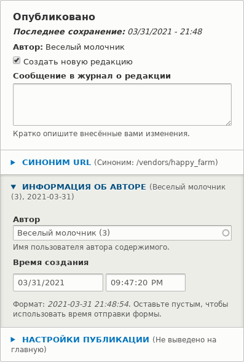

[[user-content]]

=== Назначение авторов для материалов

[role="summary"]
Как назначить авторство материалов аккаунту пользователя.

(((Автор,назначение)))
(((Контент,назначение автора)))

==== Цель

Назначить материалы Производителя Весёлый молочник и Алтайский мёд соответствующим
пользовательским аккаунтам Производителя, чтобы они могли редактировать свои собственные профили Производителя на сайте.

==== Необходимые знания

* <<user-concept>>

==== Требования к сайту

* Тип материала Производитель должен существовать, и на вашем сайте должно быть не менее двух
материалов Производителя. Смотрите <<structure-content-type>>, <<structure-fields>>, и
<<content-create>>.

* Должны существовать пользовательские аккаунты как минимум для двух производителей. Смотрите <<user-new-user>>.

==== Шаги

. В _Управлении_ административного меню перейдите в _Содержимое_ (_admin/content_).

. Найдите материал Производителя Весёлый молочник в списке. Если его не видно сразу,
вы можете отфильтровать список по _Статусу публикации_, _Типу материала_ (Производитель),
_Заголовку_ или _Языку_. Нажмите _Редактировать_ для материала Производителя, для которого вы хотите
назначить автора.

. В разделе _Информация об авторе_ начните вводить имя пользователя Производителя
Весёлый молочник в поле _Автор_. В поле будут перечислены подходящие имена пользователей.
Выберите имя пользователя Производителя из списка.
+
--
// Authoring information section of content edit page.

--

. Нажмите _Сохранить_.

. Вы получите уведомление о том, что материал Производителя был обновлен.
+
--
// Confirmation message after content update.

--

. Повторите эти шаги, чтобы назначить материал Производителя Алтайский мёд
пользовательскому аккаунту Производителя Алтайский мёд.

// ==== Расширьте своё понимание

// ==== Связанные темы

==== Видео

// Video from Drupalize.Me.
video::https://www.youtube-nocookie.com/embed/yx9u2SCgono[title="Assigning Authors to Content"]

//==== Дополнительные ресурсы

*Авторы*

Написано https://www.drupal.org/u/dianalakatos[Diána Lakatos] в
https://pronovix.com/[Pronovix].

Переведено https://www.drupal.org/u/MishaIsmajlov[Михаил Исмайлов].
