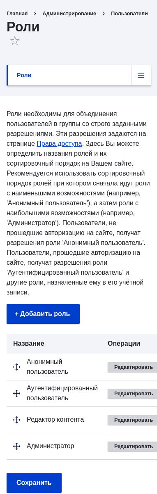
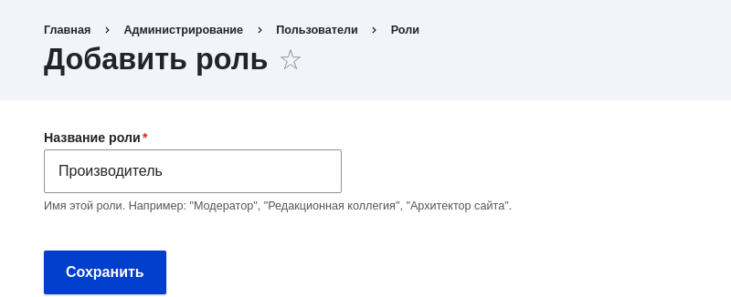

[[user-new-role]]

=== Создание роли

[role="summary"]
Как создать новую роль.

(((Роль пользователя,создание)))
(((Роль,создание)))
(((Роль,анонимный пользователь)))
(((Роль,авторизованный пользователь)))
(((Роль,администратор)))

==== Цель

Создайте роль Производитель, чтобы разрешить некоторым — но не всем — пользователям выполнять определённые задачи.

==== Необходимые знания

<<user-concept>>

// ==== Site prerequisites

==== Шаги

. В _Управлении_ административного меню перейдите в _Пользователи_ > _Роли_
(_admin/people/roles_).

. Вы увидите, что роли по умолчанию _Anonymous user_,
_Authenticated user_ и _Administrator_ уже присутствуют.
+
--
// Roles page (admin/people/roles).

--

. Нажмите _Добавить роль_, чтобы добавить новую пользовательскую роль.

. Введите Производитель в поле _Название роли_. Нажмите _Сохранить_.
+
--
// Add role page (admin/people/roles/add).

--

. Вы увидите сообщение «Роль Производитель была добавлена.», оно появится вверху
страницы.
+
--
// Confirmation message after adding new role.

--

==== Расширьте своё понимание

* <<user-permissions>>
* <<user-roles>>

//==== Related concepts

==== Видео

// Video from Drupalize.Me.
video::https://www.youtube-nocookie.com/embed/JdNxJKWAi8Q[title="Creating a Role"]

==== Дополнительные ресурсы

https://www.drupal.org/docs/7/managing-users/user-roles[_Drupal.org_ страница документации сообщества "User Roles"]

*Авторы*

Адаптировано и отредактировано https://www.drupal.org/u/JackProbst[Jack Probst],
https://www.drupal.org/u/batigolix[Boris Doesborg], и
https://www.drupal.org/u/eojthebrave[Joe Shindelar] от
https://www.drupal.org/docs/7/managing-users/user-roles["User Roles"], авторские права 2000-copyright_upper_year
за отдельными участниками https://www.drupal.org/documentation[Drupal
Community Documentation]

Переведено https://www.drupal.org/u/MishaIsmajlov[Михаил Исмайлов].
