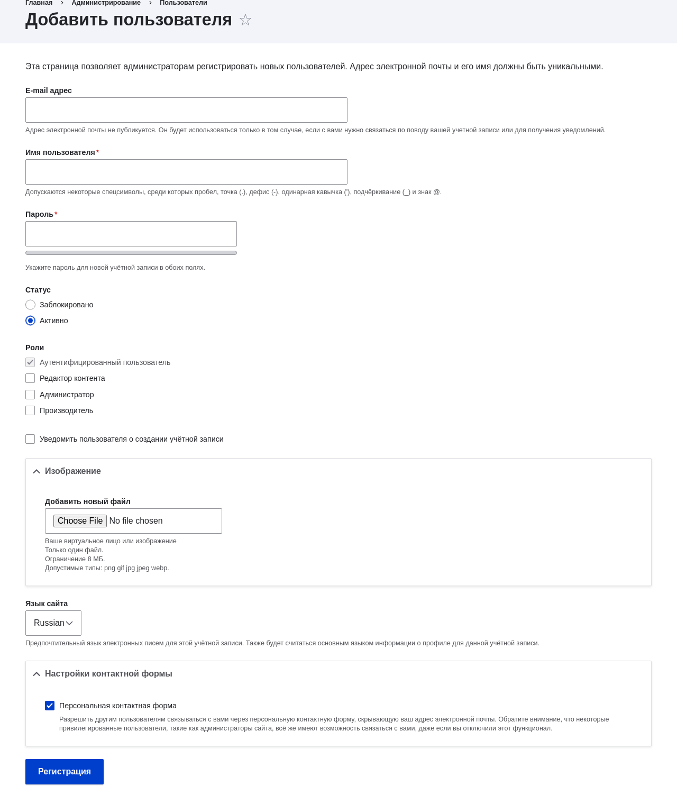
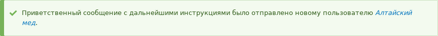

[[user-new-user]]

=== Создание аккаунта пользователя

[role="summary"]
Как создать аккаунт пользователя.

(((Пользователь,создание аккаунта)))

==== Цель

Создайте пользовательские аккаунты Производитель для производителей Алтайский мёд и Веселый молочник.

==== Необходимые знания

* <<user-concept>>
* <<user-admin-account>>
* <<user-new-role>>

==== Требования к сайту

Роль Производитель должна существовать на вашем сайте. Смотрите <<user-new-role>>.

==== Шаги

. В _Управлении_ административного меню перейдите в _Пользователи_ (_admin/people_).

. Нажмите _Добавить пользователя_.
+
--
// Add new user form (/admin/people/create).

--

. Заполните поля формы. Смотрите таблицу ниже.
+
[width="100%",frame="topbot",options="header"]
|================================
|Название поля |Описание |Пример значения
|Email адрес |Действительный адрес электронной почты для производителя. Все письма из системы будут отправляться на этот адрес. Адрес не публикуется. | honey@example.com
|Имя пользователя |Имя пользователя для производителя, которое он будет использовать для входа или создания материалов. Пробелы разрешены; пунктуация не разрешена, кроме точек, дефисов, апострофов и подчеркиваний. |Алтайский мёд
|Пароль |Пароль, который производитель будет использовать для входа на сайт. Вы увидите уровень надежности пароля на индикаторе _Надежность пароля_. Также будут даны рекомендации по его усилению.  |(Придумайте надёжный пароль)
|Повторите пароль |Введите тот же пароль для предотвращения опечаток. |(Повторите пароль)
|Статус |Установите статус аккаунта пользователя. _Заблокированные_ пользователи не смогут войти. |Активный
|Роли |Укажите роль для аккаунта пользователя.|Производитель
|Уведомить пользователя о создании аккаунта |Нужно ли отправить уведомление на email производителя. |Выбрано
|Фото |Нажмите _Выбрать файл_ и загрузите фото. Следите за ограничениями по размеру файла. | Фото производителя
|Настройки контакта |Включить или отключить отображение контактной формы для аккаунта. |Выбрано
|================================

. Нажмите _Создать новый аккаунт_. Вы получите уведомление о создании аккаунта пользователя.
+
--
// Confirmation message after adding new user.

--

. Создайте второй аккаунт Производитель для Веселого молочника, выполнив действия, описанные выше.

==== Расширьте своё понимание

Создайте аккаунт пользователя для себя.

//==== Related concepts

==== Видео

// Video from Drupalize.Me.
video::https://www.youtube-nocookie.com/embed/2UtEtY9Cgaw[title="Creating a User Account"]

//==== Additional resources

*Авторы*

Написано https://www.drupal.org/u/dianalakatos[Diána Lakatos]
в https://pronovix.com/[Pronovix].

Переведено https://www.drupal.org/u/MishaIsmajlov[Михаил Исмайлов].
