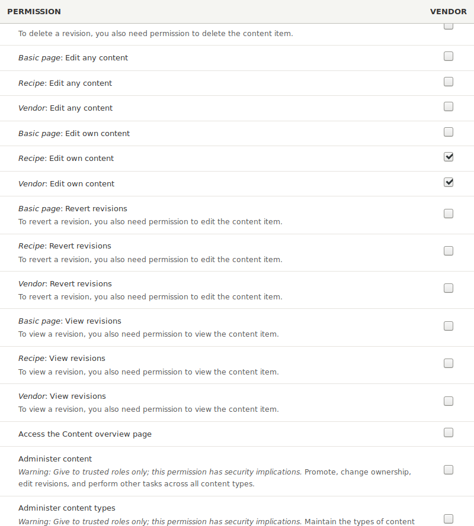

[[user-permissions]]

=== Назначение прав доступа для роли

[role="summary"]
Как назначить права доступа для роли.

(((Права доступа,изменение)))
(((Права доступа,разрешение)))
(((Права доступа,запрет)))
(((Роль,изменение прав доступа)))
(((Безопасность,назначение прав доступа)))

==== Цель

Измените права доступа для роли Производитель так, чтобы пользователи могли создавать, редактировать,
и удалять материалы Рецепт и Производитель, форматировать контент и связываться друг с другом.

==== Необходимые знания

* <<user-concept>>

==== Требования к сайту

Роль Производитель должна существовать на вашем сайте. Смотрите <<user-new-role>>.

==== Шаги

. В _Управлении_ административного меню перейдите в _Пользователи_ > _Роли_
(_admin/people/roles_). Появится страница _Роли_.

. Нажмите _Редактировать права доступа_ в выпадающем меню для роли Производитель.
Появится страница _Редактирование роли_, где можно увидеть все доступные
действия для сайта, такие как, например, _Добавление комментариев_ или _Управление
блоками_. Доступные права зависят от установленных модулей.
Примечание: некоторые права доступа могут повлиять на безопасность сайта. Будьте внимательны
при назначении прав доступа ролям.

. Отметьте галочками следующие права доступа, сгруппированные по модулям:
+
[width="100%",frame="topbot",options="header"]
|================================
| Модуль | Право доступа
| Contact | Использование персональных контактных форм пользователей
| Filter | Использование текстового формата Ограниченный HTML
| Node | Рецепт: Создание новых материалов
| Node | Рецепт: Редактирование собственных материалов
| Node | Рецепт: Удаление собственных материалов
| Node | Производитель: Редактирование собственных материалов
|================================
+
--
// Permissions page for Vendor (admin/people/permissions/vendor).

--

. Нажмите _Сохранить права доступа_. Вы увидите сообщение о том, что ваши изменения были
сохранены.
+
--
// Confirmation message after updating permissions.

--

==== Улучшите своё понимание

* Войдите на сайт под одним из новых пользователей, созданных в <<user-new-user>>. Проверьте,
есть ли у него нужные права доступа.

* <<user-roles>>

==== Связанные концепции

<<user-admin-account>>

==== Видео

// Video from Drupalize.Me.
video::https://www.youtube-nocookie.com/embed/IlVh9f4BHVw[title="Assigning Permissions to a Role"]

==== Дополнительные материалы

https://www.drupal.org/docs/7/managing-users[_Drupal.org_ страница документации сообщества "Managing Users"]

*Авторы*

Адаптировано и отредактировано https://www.drupal.org/u/batigolix[Boris Doesborg],
https://www.drupal.org/u/bemery987[Brian Emery],
и https://www.drupal.org/u/jojyja[Jojy Alphonso] из
http://redcrackle.com[Red Crackle],
и https://www.drupal.org/u/eojthebrave[Joe Shindelar] из
https://drupalize.me[Drupalize.Me], из
https://www.drupal.org/docs/7/managing-users/user-roles["User Roles"],
авторские права 2000-copyright_upper_year за отдельными участниками
https://www.drupal.org/documentation[Drupal Community Documentation].

Переведено https://www.drupal.org/u/levmyshkin[Абраменко Иван] из https://drupalbook.org/ru[DrupalBook].
