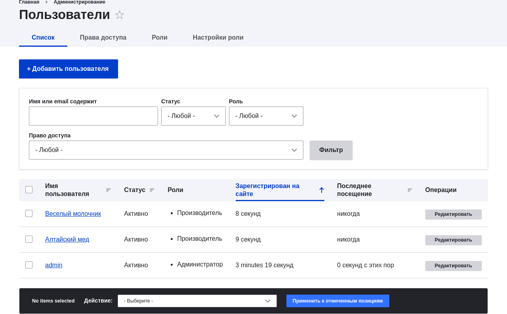
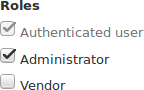
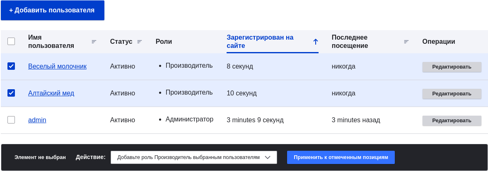

[[user-roles]]
=== Изменение ролей пользователя

[role="summary"]
Как изменить или добавить роль для пользователя.

(((Роль пользователя,изменение)))
(((Роль,изменение)))
(((Разрешение,изменение роли)))

==== Цель

Изменить или добавить роли для заданного пользователя, либо отредактировав одного пользователя, либо
используя массовую операцию.

==== Необходимые знания

<<user-concept>>

==== Требования к сайту

Учетная запись пользователя, которую вы хотите обновить, и роль, которую вы хотите назначить, должны
уже существовать. Смотрите <<user-new-user>>,  <<user-new-role>>, и
<<user-permissions>>.

==== Шаги

===== Обновление ролей через редактирование одного пользователя

. В _Управлении_ административного меню перейдите в _Пользователи_
(_admin/people_).

. Найдите аккаунт пользователя 1 (с именем "admin"), чтобы назначить ему роль _Администратор_.
Если он не сразу виден, используйте фильтр _Имя или email содержит_,
или другие фильтры, чтобы сузить список.

.  Нажмите _Редактировать_ для обновления учетной записи пользователя.
+
--
// People page (admin/people), with user 1's Edit button outlined.

--

.  На странице _Редактировать_ прокрутите вниз до раздела _Роли_. Отметьте роль _Администратор_
для этой учетной записи пользователя.
+
--
// Roles area on user editing page.

--

.  Нажмите _Сохранить_ для обновления учетной записи пользователя. Вы вернетесь на
страницу _Пользователи_ и увидите сообщение о том, что изменения сохранены.
+
--
// Confirmation message after updating user.

--

===== Обновление ролей методом массового редактирования

. Если у пользователей Весёлый молочник и Алтайский мёд ещё нет роли Производитель,
вот как добавить эту роль. В _Управлении_ административного меню перейдите в
_Пользователи_ (_admin/people_).

. Найдите учетные записи производителей _Алтайский мёд_ и _Веселый молочник_ и отметьте их. Если
они не сразу видны, используйте фильтр _Имя или email содержит_,
или другие фильтры, чтобы сузить список.

. Выберите _Добавить роль Производитель для выбранных пользователей_ из списка _Действие_.
+
--
// Bulk editing form on People page (admin/people).

--

. Нажмите _Применить к выбранным элементам_. Вы увидите сообщение о том, что
нужные изменения были произведены.
+
--
// Confirmation message after bulk user update.

--

// ==== Expand your understanding

// ==== Related concepts

==== Видео

// Video from Drupalize.Me.
video::https://www.youtube-nocookie.com/embed/hd7Sr3-n9ME[title="Changing a User's Roles"]

// ==== Additional resources

*Авторы*

Написано https://www.drupal.org/u/chris-dart[Chris Dart]
и https://www.drupal.org/u/jhodgdon[Jennifer Hodgdon]

Переведено https://www.drupal.org/u/MishaIsmajlov[Михаил Исмайлов].
